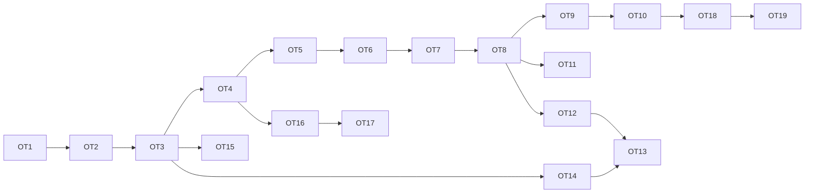

# blended — Backlog: ops vocabulary as the agent tool surface

**Date:** 2026-09-10
**Baseline:** `main` @ `5764504`, per `docs/2026-09-10-specification-and-requirements.md`
**Problem being solved:** OPS-1 says all sanctioned construction goes through `blended.ops` and callers are never handed raw `bpy`. AGT-1 hands the agent `run_python(source)`. The verified construction vocabulary is not the agent's ACI; the escape hatch is. This backlog closes that gap.

## How to read this document

- One item per row block. `MUST` / `SHOULD` / `MAY` are RFC 2119.
- Every item names the requirement rows it amends or adds so the spec can be updated in the same change (§8.1 of the spec).
- **Done means** is the acceptance test. An item with no automated check is marked `(unverified)` and must not be closed as shipped.
- Phases are ordered by dependency, not by size. Phase 1 must land before any measurement in Phase 3 is meaningful.
- Item IDs are `OT-n` (ops-as-tools). They are stable.
- **When an item closes, move its block verbatim from this file to `BACKLOG_DONE.md`** in the same change, with the closing commit, gating tests, and date. This file lists only open work.

## Measured starting point

| Fact | Value | Source |
|---|---|---|
| Agent tools | 8 hand-written service tools + 42 generated op tools = 50 in `TOOL_SCHEMAS`, fingerprint `t:1fe7f62007ef` pinned (OT-3, closed) | `src/blended/agent/tools.py`, `tests/pure/test_tool_schemas.py` |
| Construction path in the ACI | 42 generated op tools, bound, gated, plan-required; `run_python(source, reason)` is the escape hatch (OT-3–OT-7, closed) | AGT-1, AGT-3, AGT-21 |
| Ops facade completeness | whole — every public op re-exported, builders import the facade only (OT-1, closed) | `tests/pure/test_one_path_ops.py` |
| Op signature contract | enforced — names in, names out, units on quantities, no bpy types (OT-2, closed) | `tests/pure/test_ops_signature_contract.py` |
| Shipped builders | 3 (crate, barrel, pallet) | OPS-15 |
| Manifest generation | introspects ops modules for prose AND for tool schemas (OT-3, closed) | PRM-2, `src/blended/manifest.py`, `src/blended/agent/tool_schemas.py` |
| Bench incumbent | `deepseek-v4-pro:cloud`, 6 rolls, 120/120 exec, `cd_pca` 0.0252 | `docs/2026-09-06-bench-panel-preregistration.md` |
| Transcript schema | `TRANSCRIPT_SCHEMA_VERSION` 2: structured `tool_event` per call, `IterationRecord.tool_events` (OT-8, closed) | AGT-17, `src/blended/agent/tool_event.py` |
| Retry / turn caps in the loop | gate-failure cap per object, 3 consecutive (OT-16); 1.7M-token budget per turn at the seam (OT-17, re-derived on the 50-tool lane); both closed | AGT-20, AGT-9 |

---

## Phase 1 — Prerequisites (the vocabulary has to be one thing before it can be a surface)

All Phase 1 items (OT-1, OT-2, OT-3) are closed — see `BACKLOG_DONE.md`.

---

## Phase 2 — The surface

All Phase 2 items (OT-4 through OT-8) are closed — see `BACKLOG_DONE.md`.

---

## Phase 3 — Measurement (no claim without a paired roll)

### OT-9 Pre-register the ops-lane benchmark roll

**What:** Before OT-4 ships, append a pre-registration to `docs/2026-09-06-bench-panel-preregistration.md` naming the comparison (ops tools + hatch vs incumbent `run_python`-only), the writer (`deepseek-v4-pro:cloud`, unchanged), the instance set (dev, then holdout only for ranking, BEN-8), the ranking rule (executability first, then `cd_pca`, BEN-4/5), the target (`TARGET_RELATIVE_IMPROVEMENT` on the incumbent's own mean, BEN-7), and the hypothesis.
**Why:** BEN-10 forbids single-roll claims; a pre-registration forbids post-hoc ones.
**Done means:** the pre-registration is committed with a date before the first ops-lane roll's directory timestamp.
**Status 2026-09-10:** pre-registration appended to `docs/2026-09-06-bench-panel-preregistration.md` (§ "Ops-lane pre-registration — 2026-09-10 (OT-9)") before OT-4 shipped, hypotheses H1–H3 stated; outcome line pending the first paired roll. Stays open until the outcome is filled from measurement (closing rule).
**Hypothesis to state:** executability stays at parity or better; `cd_pca` moves within noise on the cloud writer (the cloud writer already executes 120/120, so the gain there is expected to be small). The real gain is expected in OT-10.

### OT-10 Local-lane roll

**What:** Run the same paired roll on one local lane (`bmb` llama-swap or Ollama) for both ACIs.
**Why:** This is where the change is expected to pay: executability first (BEN-5) means a local model that emits valid op calls but poor `bpy` will rank differently under the two surfaces. It is also the readiness test for any future specialist model behind a tool call.
**Done means:** ≥ `MINIMUM_PAIRED_ROLLS` rolls of ≥ `MINIMUM_INSTANCES_FOR_RANKING` instances each, reported on the panel with executability and `cd_pca`; the hypothesis (executability on the local lane improves by more than the per-roll noise band) is filled with an outcome. No paid lane (NFR-27).

### OT-11 Chat E2E on op tools

**What:** `make chat-e2e` scenarios MUST pass with `run_python` disabled entirely, for every scenario the vocabulary claims to cover (object, material, iterative edit at minimum; rig, weights, animation as the facade covers them).
**Why:** The E2E suite is the only headless proof that the surface is usable from the UI (NFR-18).
**Done means:** a `--no-hatch` flag on `scripts/chat_e2e.py`; scenarios that require the hatch are listed by name in the output as missing-op evidence for OT-12.

---

## Phase 4 — Growing the vocabulary (the hatch tells you what to build)

### OT-12 Missing-op mining

**What:** `scripts/mine_candidate_ops.py` MUST read v2 transcripts and iteration logs, group `run_python` events by `reason` and by normalized source shape, and emit a dated markdown report ranking candidate ops by frequency × gate-pass rate.
**Why:** Vocabulary growth should be driven by measured demand, not guessed. Every hatch use is a vote.
**Done means:** the script is self-checking (fails on a v1 transcript rather than silently reading nothing) and produces a report on the existing five-brief runs after OT-8 lands.

### OT-13 First vocabulary expansion, from the five briefs

**What:** Implement the ops the five briefs (`planter_box`, `three_leg_stool`, `uv_crate`, `ribbed_column`, `crate_with_lid`) need to reach gate-pass with zero hatch calls. Expected from the brief contents, to be confirmed by OT-12: hollow-out with named wall thickness, bevel by edge selector, radial array, inset faces, mirror across a named plane, edge-selector primitives (by angle, by material, by name pattern).
**Why:** These are the briefs the convergence loop and the goldens already exercise; closing them first means every downstream instrument keeps working.
**Amends:** adds one `OPS-n` row per op, each with a fixture that trips its validation (GATE-18 discipline applied to ops).
**Done means:** `make converge` on each brief reaches structural + form gate pass with `run_python` disabled.

### OT-14 Selection as a first-class parameter type

**What:** Ops that act on a subset of geometry MUST accept a typed `EdgeSelector` / `FaceSelector` (by dihedral angle, by material slot, by axis-aligned face normal, by name pattern) rather than indices.
**Why:** Vertex indices are not something a model can reason about from a manifest; selectors are. This is the difference between an op vocabulary a 7B model can drive and one it cannot.
**Done means:** selector round-trips through the schema generator (OT-3) with an enum of selector kinds; `tests/blender/test_selectors.py` covers each kind against a fixture mesh.

---

## Phase 5 — Bounding cost (cheap, and the ops lane makes it safe to do)

Both Phase 5 items (OT-16, OT-17) are closed — see `BACKLOG_DONE.md`.

---

## Phase 6 — The flywheel (only after Phase 3 shows the surface is better on a local lane)

### OT-18 Dataset export

**What:** `scripts/export_traces.py` MUST emit, from v2 transcripts, one record per gate-passing turn: brief or user ask, scene context, op-call sequence with arguments, final analyzer report, `cd_pca` where a reference exists. Records MUST be filtered by a named pass threshold and MUST exclude any turn that used the hatch.
**Why:** This is the rejection-sampled corpus for a specialist model behind a tool call. It does not exist until OT-8 exists, and it is not worth building until OT-10 shows the surface helps a small model.
**Done means:** the exporter is self-checking (refuses to emit a record missing a gate verdict) and the record schema is versioned.

### OT-19 Specialist-model lane (deferred; not scheduled)

**What:** A transport lane whose model is a fine-tuned small coder trained on OT-18 output, wired behind one or more op tools, with the frontier writer as fallback on a failing gate.
**Why:** Recorded so the dependency chain is explicit. Not scheduled: the decision to build it MUST be made on OT-10 and OT-18 numbers, not on this document.
**Done means:** `(unverified)` — no acceptance test until the item is scheduled.

---

## Corrections to closed items

Entries in `BACKLOG_DONE.md` are never edited; a measured correction to a closed item is recorded here with the mechanism and the commit.

| Item | Correction | Measured | Commit |
|---|---|---|---|
| OT-17 (`2922411`) | `MAXIMUM_TURN_TOKENS` re-derived 750,000 → 1,700,000. The 750k figure came from the 8-tool lane (25,851 tokens per call); with 50 op tools the Claude Code lane bills 58,241 per call (91 % cache reads), and the budget stopped iteration 68 (planter_box, v12) at call 16 of 24. Mistake memory: `a-budget-derived-before-the-surface-changed-stops-honest-turns`. | iteration 68: 931,851 tokens / 16 calls | (this correction's commit) |

## Not in this backlog, and why

| Item | Why it is excluded |
|---|---|
| Examiner licence (spec §7.1) | Orthogonal to the tool surface; `--examiner none` keeps the loop usable. Worth its own backlog. |
| Lane skill-module selection (PRM-14) | Prompt tuning has the smallest ceiling of the levers here. Revisit after OT-9/OT-10 show what the prompt still needs to say. |
| Organic / character asset generation | Not a code-gen problem. Belongs to the ingest lane (ING-*) plus cleanup, not to this surface. |
| Retopology | Algorithmic or dedicated-model, not an op an LLM should author. May become a service tool later. |

## Dependency graph

## Closing rule

An item closes only when its **Done means** test is in the tree and green in both layers (`make test`), the spec rows it amends are updated in the same change (§8.1), and — for OT-9 through OT-11 — the pre-registered hypothesis has an outcome filled from measurement. A single roll closes nothing.
