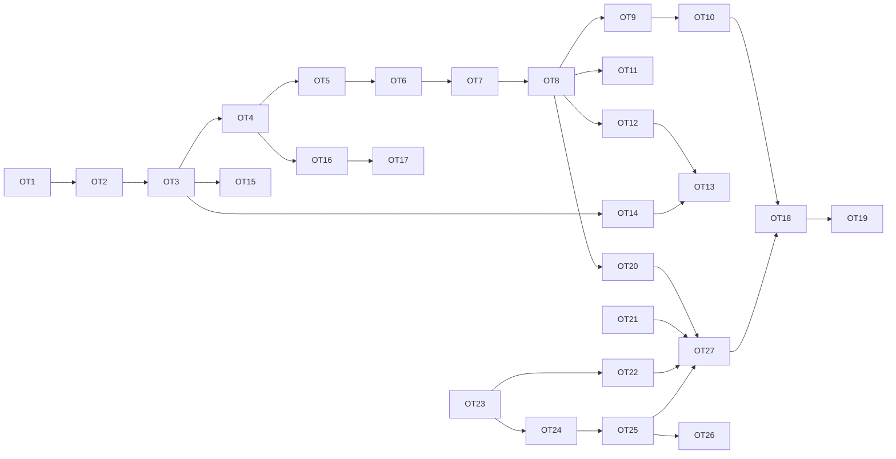

# blended — Backlog: ops vocabulary as the agent tool surface

**Date:** 2026-09-10
**Baseline:** `main` @ `5764504`, per `docs/2026-09-10-specification-and-requirements.md`
**Problem being solved:** OPS-1 says all sanctioned construction goes through `blended.ops` and callers are never handed raw `bpy`. AGT-1 hands the agent `run_python(source)`. The verified construction vocabulary is not the agent's ACI; the escape hatch is. This backlog closes that gap.

## How to read this document

- One item per row block. `MUST` / `SHOULD` / `MAY` are RFC 2119.
- Every item names the requirement rows it amends or adds so the spec can be updated in the same change (§8.1 of the spec).
- **Done means** is the acceptance test. An item with no automated check is marked `(unverified)` and must not be closed as shipped.
- Phases are ordered by dependency, not by size. Phase 1 must land before any measurement in Phase 3 is meaningful.
- Item IDs are `OT-n` (ops-as-tools). They are stable.
- **When an item closes, move its block verbatim from this file to `BACKLOG_DONE.md`** in the same change, with the closing commit, gating tests, and date. This file lists only open work.

## Measured starting point

| Fact | Value | Source |
|---|---|---|
| Agent tools | 8 hand-written service tools + 42 generated op tools = 50 in `TOOL_SCHEMAS`, fingerprint `t:1fe7f62007ef` pinned (OT-3, closed) | `src/blended/agent/tools.py`, `tests/pure/test_tool_schemas.py` |
| Construction path in the ACI | 42 generated op tools, bound, gated, plan-required; `run_python(source, reason)` is the escape hatch (OT-3–OT-7, closed) | AGT-1, AGT-3, AGT-21 |
| Ops facade completeness | whole — every public op re-exported, builders import the facade only (OT-1, closed) | `tests/pure/test_one_path_ops.py` |
| Op signature contract | enforced — names in, names out, units on quantities, no bpy types (OT-2, closed) | `tests/pure/test_ops_signature_contract.py` |
| Shipped builders | 3 (crate, barrel, pallet) | OPS-15 |
| Manifest generation | introspects ops modules for prose AND for tool schemas (OT-3, closed) | PRM-2, `src/blended/manifest.py`, `src/blended/agent/tool_schemas.py` |
| Bench incumbent | `deepseek-v4-pro:cloud`, 6 rolls, 120/120 exec, `cd_pca` 0.0252 | `docs/2026-09-06-bench-panel-preregistration.md` |
| Transcript schema | `TRANSCRIPT_SCHEMA_VERSION` 2: structured `tool_event` per call, `IterationRecord.tool_events` (OT-8, closed) | AGT-17, `src/blended/agent/tool_event.py` |
| Retry / turn caps in the loop | gate-failure cap per object, 3 consecutive (OT-16); 1.7M-token budget per turn at the seam (OT-17, re-derived on the 50-tool lane); both closed | AGT-20, AGT-9 |

---

## Phase 1 — Prerequisites (the vocabulary has to be one thing before it can be a surface)

All Phase 1 items (OT-1, OT-2, OT-3) are closed — see `BACKLOG_DONE.md`.

---

## Phase 2 — The surface

All Phase 2 items (OT-4 through OT-8) are closed — see `BACKLOG_DONE.md`.

---

## Phase 3 — Measurement (no claim without a paired roll)

### OT-9 Pre-register the ops-lane benchmark roll

**What:** Before OT-4 ships, append a pre-registration to `docs/2026-09-06-bench-panel-preregistration.md` naming the comparison (ops tools + hatch vs incumbent `run_python`-only), the writer (`deepseek-v4-pro:cloud`, unchanged), the instance set (dev, then holdout only for ranking, BEN-8), the ranking rule (executability first, then `cd_pca`, BEN-4/5), the target (`TARGET_RELATIVE_IMPROVEMENT` on the incumbent's own mean, BEN-7), and the hypothesis.
**Why:** BEN-10 forbids single-roll claims; a pre-registration forbids post-hoc ones.
**Done means:** the pre-registration is committed with a date before the first ops-lane roll's directory timestamp.
**Status 2026-09-10:** pre-registration appended to `docs/2026-09-06-bench-panel-preregistration.md` (§ "Ops-lane pre-registration — 2026-09-10 (OT-9)") before OT-4 shipped, hypotheses H1–H3 stated; outcome line pending the first paired roll. Stays open until the outcome is filled from measurement (closing rule).
**Launched 2026-09-10 12:17 CDT (user: "launch now"):** three holdout rolls on the frozen candidate tree `/Users/ladvien/blended-bench` (worktree at `68a124f`), writer `deepseek-v4-pro:cloud`, eye `kimi-k2.7-code:cloud` (the incumbent's), model dirs `blended-deepseek-v4-pro-ops-roll{1,2,3}` under the bench's `results/text_to_3D_agent/`; each roll is scored by the bench's own `executability.py` and `shape_chamfer.py`, then `diagnose_3dcode.py` into `outputs/bench/diagnose_<dir>.json`. Chain: `outputs/bench/logs/ot9_cloud_chain.sh` (detached; progress in `outputs/bench/logs/ot9_chain.log`; resumable by re-running). Measured pace: instance 6/20 of roll 1 after 50 min (≈ 2.8 h per roll). To finish once `ot9_chain.log` says ALL DONE:

```
python3 scripts/bench_panel.py \
  --group "deepseek-v10=outputs/bench/diagnose_blended-deepseek-v4-pro.json,outputs/bench/diagnose_blended-deepseek-v4-pro-iter1.json,outputs/bench/diagnose_blended-deepseek-v4-pro-iter2.json,outputs/bench/diagnose_blended-deepseek-v4-pro-iter3.json,outputs/bench/diagnose_blended-deepseek-v4-pro-chat1.json,outputs/bench/diagnose_blended-deepseek-v4-pro-chat1-roll2.json" \
  --group "ops-v12=outputs/bench/diagnose_blended-deepseek-v4-pro-ops-roll1.json,outputs/bench/diagnose_blended-deepseek-v4-pro-ops-roll2.json,outputs/bench/diagnose_blended-deepseek-v4-pro-ops-roll3.json" \
  --instances-file bench_sets/instances_holdout.txt
```

Then fill the **Outcome** line of the ops-lane pre-registration (H1 executability, H2 `cd_pca` within 0.0021) from that panel, and move this item.
**STOPPED 2026-09-10 ~13:50 CDT, roll 1 complete but VOID:** two bridge defects, found by reading the roll before scoring it. (1) `scripts/run_3dcode_instance.py` builds the standalone script from `run_python` chunks only, so every op-tool call is absent from what the bench re-bakes — in roll 1 the writer made 34 op calls on Bottle, 37 on Pillar, 14 on Tap. (2) The chain never ran the bench's bake (`core/render.py`, which writes `renders/render_log.json` and the GLBs the scorers read), so `executability.py` reported "no render_log.json" for 20/20. Fixed by OT-20 and OT-21 below; the rolls are re-launched after both land. Roll 1's scripts stay on disk as the record of the defect.
**Hypothesis to state:** executability stays at parity or better; `cd_pca` moves within noise on the cloud writer (the cloud writer already executes 120/120, so the gain there is expected to be small). The real gain is expected in OT-10.

### OT-10 Local-lane roll

**What:** Run the same paired roll on one local lane (`bmb` llama-swap or Ollama) for both ACIs.
**Why:** This is where the change is expected to pay: executability first (BEN-5) means a local model that emits valid op calls but poor `bpy` will rank differently under the two surfaces. It is also the readiness test for any future specialist model behind a tool call.
**Done means:** ≥ `MINIMUM_PAIRED_ROLLS` rolls of ≥ `MINIMUM_INSTANCES_FOR_RANKING` instances each, reported on the panel with executability and `cd_pca`; the hypothesis (executability on the local lane improves by more than the per-roll noise band) is filled with an outcome. No paid lane (NFR-27).
**Launched 2026-09-10 12:17 CDT:** paired holdout rolls on bmb's llama-swap, writer `qwen3.8-27b` as its own eye (big's GPU is under a `coding` claim and is not touched), alternating the ops surface (frozen `/Users/ladvien/blended-bench`, model dirs `blended-local-qwen38-ops-roll{1,2,3}`) and the `run_python`-only incumbent (worktree `/Users/ladvien/blended-bench-old` at `4277aa3`, the OT-1 close, model dirs `blended-local-qwen38-hatch-roll{1,2,3}`), per-instance timeout 3000 s, scored the same way. Chain: `outputs/bench/logs/ot10_local_chain.sh`; progress in `outputs/bench/logs/ot10_chain.log`. The incumbent's own local noise band comes from the `hatch` rolls.
Measured pace: instance 2/20 after 50 min (≈ 25 min per instance, ≈ 8 h per sweep, six sweeps ≈ 2 days). To finish: `bench_panel.py --group "local-hatch=<the three diagnose_blended-local-qwen38-hatch-roll*.json>" --group "local-ops=<the three ...ops-roll*.json>" --instances-file bench_sets/instances_holdout.txt`; H3 (executability on the local lane improves by more than the hatch rolls' own per-roll band) is read off that panel. If two days is too long, one paired roll each (`roll1` only) is reported, never ranked (BEN-6), and the chain can be stopped after `blended-local-qwen38-hatch-roll1 scored` appears in `ot10_chain.log`.
**STOPPED with OT-9 (same two defects), plus a third seen on the local lane:** AquariumTank timed out inside `urllib` at the lane's 900 s per-request ceiling (`LLAMA_SWAP_REQUEST_TIMEOUT_SECONDS`), and CabinetDoorIkea finished in one 794 s turn with one chunk. The local roll was measuring the request ceiling and the bridge, not the surface. Re-launch after OT-20, OT-21 and OT-22.

---

## Phase 4 — Growing the vocabulary (the hatch tells you what to build)

All Phase 4 items (OT-12, OT-13, OT-14) are closed — see `BACKLOG_DONE.md`.

---

## Phase 5 — Bounding cost (cheap, and the ops lane makes it safe to do)

Both Phase 5 items (OT-16, OT-17) are closed — see `BACKLOG_DONE.md`.

---

## Phase 7 — Context proportional to the task (the surface must fit the lanes it was built for)

**Measured 2026-09-10 (bmb's own `qwen3.8-27b` tokenizer, via llama-server `/tokenize`):** a fresh call carries 7,569 tokens of system prompt (working agreement v12 1,770; manifest 5,843, of which the ops section is 3,074) plus 7,407 tokens of tool schemas (48 op tools 6,254; 8 service tools 1,155): **15.0k static tokens before any scene or history, and every op described twice.** On the Claude Code lane the same surface billed 58,241 tokens per harness call against 25,851 with eight tools (91 % cache reads). The five briefs that pass with the hatch withheld used 4–8 distinct ops each (planter 5, stool 8, column 4, crate_with_lid 5, uv_crate 7), 15 distinct in all, out of 48. bmb serves `qwen3.8-27b` at 65,536 context; the Ollama-native lane sends `num_ctx` 32,768; no lane preflights the prompt against either. Two dependencies come first, because the benchmark cannot measure the surface until they land.

### OT-24 One description per op: drop the manifest's ops section

**What:** the manifest MUST stop rendering the operations section into the prompt (3,074 tokens); the generated schema is the one description of each op. Conventions, gate fields, budget knobs and the drift catalog stay. Register the prompt change with a hypothesis before the run.
**Why:** "nothing is written twice" applies to the context window as much as to source.
**Amends:** PRM-1, PRM-2; a new prompt revision is NOT needed (the `.j2` does not change) but the assembled fingerprint moves and is re-pinned.
**Done means:** the five briefs still pass with the hatch withheld; `tests/pure/test_manifest.py` asserts no op signature appears in the assembled prompt.

### OT-25 Progressive disclosure of op tools

**What:** the loop MUST offer the service tools, the readers and a CORE set of op tools on every call, and expose the rest through `search_ops` (which already returns the schema). The core set MUST be derived from `tool_events` frequency across gate-passing runs, never listed by hand, and the offered set MUST be fingerprinted per turn so the pin tests see a change.
**Why:** 15 of 48 ops carried all five briefs; the other 33 cost 4k+ tokens per call on every lane and a `oneOf` variant each on the CLI lane.
**Hypothesis to register before the roll:** executability on the local lane rises, per-call tokens fall below the 8-tool baseline (25,851 on the CLI lane), and hatch calls per gate-passing brief do not change.
**Done means:** `tests/pure/test_tool_disclosure.py` covers the derivation, the per-turn fingerprint and a search-then-call round trip; the five briefs pass no-hatch on the disclosed set.

### OT-26 Cache-friendly prefix order

**What:** on lanes with prefix caching (Claude Code, OpenRouter) the static content — working agreement, conventions, tool set — MUST precede everything that changes per turn (scene block, history), and the cache-read fraction MUST be reported per run.
**Why:** measured today on the CLI lane: 89 % of input tokens were already cache reads (iteration 74: 331,796 of 372,080), so the remaining lever is the last 11 %; this item is ranked last for that reason and is closed by measurement, not by reordering on faith.
**Done means:** `TurnCost` cache-read fraction per run is in the record; a paired comparison shows the fraction did not fall.

### OT-27 Re-run OT-9 and OT-10 on the disclosed surface

**What:** after OT-20–OT-25, re-launch both chains from fresh frozen worktrees against the same incumbent, under a new pre-registration that names the disclosed surface.
**Why:** the rolls stopped today measured the full-surface bridge before it carried op calls; nothing from them ranks.

---

## Phase 6 — The flywheel (only after Phase 3 shows the surface is better on a local lane)

### OT-18 Dataset export

**What:** `scripts/export_traces.py` MUST emit, from v2 transcripts, one record per gate-passing turn: brief or user ask, scene context, op-call sequence with arguments, final analyzer report, `cd_pca` where a reference exists. Records MUST be filtered by a named pass threshold and MUST exclude any turn that used the hatch.
**Why:** This is the rejection-sampled corpus for a specialist model behind a tool call. It does not exist until OT-8 exists, and it is not worth building until OT-10 shows the surface helps a small model.
**Done means:** the exporter is self-checking (refuses to emit a record missing a gate verdict) and the record schema is versioned.

### OT-19 Specialist-model lane (deferred; not scheduled)

**What:** A transport lane whose model is a fine-tuned small coder trained on OT-18 output, wired behind one or more op tools, with the frontier writer as fallback on a failing gate.
**Why:** Recorded so the dependency chain is explicit. Not scheduled: the decision to build it MUST be made on OT-10 and OT-18 numbers, not on this document.
**Done means:** `(unverified)` — no acceptance test until the item is scheduled.

---

## Corrections to closed items

Entries in `BACKLOG_DONE.md` are never edited; a measured correction to a closed item is recorded here with the mechanism and the commit.

| Item | Correction | Measured | Commit |
|---|---|---|---|
| OT-17 (`2922411`) | `MAXIMUM_TURN_TOKENS` re-derived 750,000 → 1,700,000. The 750k figure came from the 8-tool lane (25,851 tokens per call); with 50 op tools the Claude Code lane bills 58,241 per call (91 % cache reads), and the budget stopped iteration 68 (planter_box, v12) at call 16 of 24. Mistake memory: `a-budget-derived-before-the-surface-changed-stops-honest-turns`. | iteration 68: 931,851 tokens / 16 calls | `6fdd91a` |

## Not in this backlog, and why

| Item | Why it is excluded |
|---|---|
| Examiner licence (spec §7.1) | Orthogonal to the tool surface; `--examiner none` keeps the loop usable. Worth its own backlog. |
| Lane skill-module selection (PRM-14) | Prompt tuning has the smallest ceiling of the levers here. Revisit after OT-9/OT-10 show what the prompt still needs to say. |
| Organic / character asset generation | Not a code-gen problem. Belongs to the ingest lane (ING-*) plus cleanup, not to this surface. |
| Retopology | Algorithmic or dedicated-model, not an op an LLM should author. May become a service tool later. |

## Dependency graph



## Closing rule

An item closes only when its **Done means** test is in the tree and green in both layers (`make test`), the spec rows it amends are updated in the same change (§8.1), and — for OT-9 through OT-11 — the pre-registered hypothesis has an outcome filled from measurement. A single roll closes nothing.
