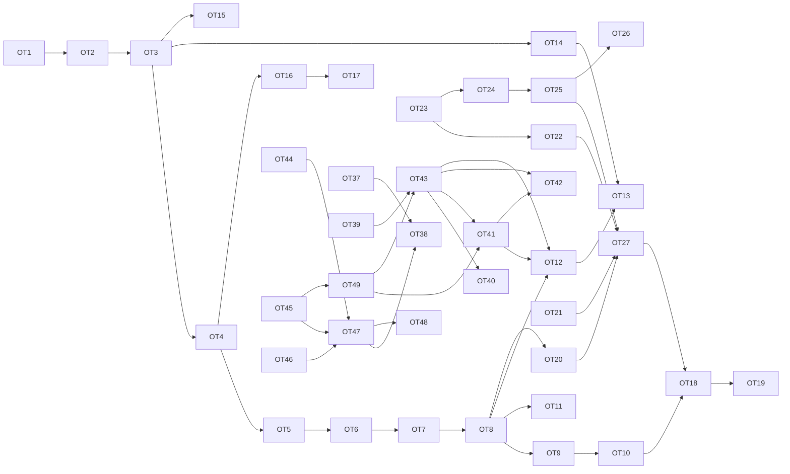

# blended — Backlog: ops vocabulary as the agent tool surface

**Date:** 2026-09-10
**Baseline:** `main` @ `5764504`, per `docs/2026-09-10-specification-and-requirements.md`
**Problem being solved:** OPS-1 says all sanctioned construction goes through `blended.ops` and callers are never handed raw `bpy`. AGT-1 hands the agent `run_python(source)`. The verified construction vocabulary is not the agent's ACI; the escape hatch is. This backlog closes that gap.

## How to read this document

- One item per row block. `MUST` / `SHOULD` / `MAY` are RFC 2119.
- Every item names the requirement rows it amends or adds so the spec can be updated in the same change (§8.1 of the spec).
- **Done means** is the acceptance test. An item with no automated check is marked `(unverified)` and must not be closed as shipped.
- Phases are ordered by dependency, not by size. Phase 1 must land before any measurement in Phase 3 is meaningful.
- Item IDs are `OT-n` (ops-as-tools). They are stable.
- **When an item closes, move its block verbatim from this file to `BACKLOG_DONE.md`** in the same change, with the closing commit, gating tests, and date. This file lists only open work.

## Measured starting point

| Fact | Value | Source |
|---|---|---|
| Agent tools | 8 hand-written service tools + 42 generated op tools = 50 in `TOOL_SCHEMAS`, fingerprint `t:1fe7f62007ef` pinned (OT-3, closed) | `src/blended/agent/tools.py`, `tests/pure/test_tool_schemas.py` |
| Construction path in the ACI | 42 generated op tools, bound, gated, plan-required; `run_python(source, reason)` is the escape hatch (OT-3–OT-7, closed) | AGT-1, AGT-3, AGT-21 |
| Ops facade completeness | whole — every public op re-exported, builders import the facade only (OT-1, closed) | `tests/pure/test_one_path_ops.py` |
| Op signature contract | enforced — names in, names out, units on quantities, no bpy types (OT-2, closed) | `tests/pure/test_ops_signature_contract.py` |
| Shipped builders | 3 (crate, barrel, pallet) | OPS-15 |
| Manifest generation | introspects ops modules for prose AND for tool schemas (OT-3, closed) | PRM-2, `src/blended/manifest.py`, `src/blended/agent/tool_schemas.py` |
| Bench incumbent | `deepseek-v4-pro:cloud`, 6 rolls, 120/120 exec, `cd_pca` 0.0252 | `docs/2026-09-06-bench-panel-preregistration.md` |
| Transcript schema | `TRANSCRIPT_SCHEMA_VERSION` 2: structured `tool_event` per call, `IterationRecord.tool_events` (OT-8, closed) | AGT-17, `src/blended/agent/tool_event.py` |
| Retry / turn caps in the loop | gate-failure cap per object, 3 consecutive (OT-16); 1.7M-token budget per turn at the seam (OT-17, re-derived on the 50-tool lane); both closed | AGT-20, AGT-9 |

---

## Phase 12 — Proportion first: the top of the order (2026-09-21)

**Why this phase leads.** G2 — right kind, wrong proportions or placement — is 97 of 111
archived residual failures (`docs/research/2026-09-19-finetune-decision/REPORT.md`, Phase A).
The oracle per-axis rescale lifts holdout F@0.05 0.4531 → 0.7017 and dev 0.2725 → 0.4673
(`docs/2026-09-06-bench-panel-preregistration.md`, "Proportion headroom under F@0.05"): the
built shape is mostly right and its extents are wrong. The writer invents world-typical
dimensions (`disclosed2-roll1/Bottle_seed0`: "a typical bottle … total height ~0.25m").
Text cannot supply the ratios (stated 0.406/0.683 against built 0.455/0.675 mean |log2
error|), a text-free prior is destructive (−0.21), and the reference views can (the eye
read them at 0.224/0.488). This phase is worked BEFORE every open item in Phases 3 and 6–11;
Phase 11's attack order stands behind it.

**Not gated on ISSUES M1–M3:** those defects are in the local llama-server lane, and every
roll here runs on the cloud lane. **Gated on credits** for OT-46, OT-47 and OT-49: the
cloud lane ran out on 2026-09-11 and stopped OT-38 before its first roll.

### OT-44 Silhouette-fit simulation (offline, zero model calls)

**What:** `scripts/bench_silhouette_fit.py`. For each dev instance with built assets
(`blended-deepseek-v4-pro-dev-iter3`, 12 instances) and rendered reference views, search
per-axis scale factors on the built mesh that maximise mean alpha-mask IoU over the four
reference views, rendering each candidate with `core/render.py`'s camera function
(azimuths 45/135/225/315°, `cam_r = 1.8·extent`, `cam_h = 0.6·extent`, 50 mm, 512 px,
transparent film) recomputed from the CANDIDATE's own extent. Score the rescaled mesh with
the bench's F@0.05. Three arms on the same 12 instances: **oracle** (the true reference
extents — `bench_proportion_headroom.py`'s rescale, the ceiling), **eye rescale** (the eye
probe's stated ratios, `bench_proportion_probe.py --images-root`), **silhouette fit**. Two
fit variants: unconstrained, and constrained (X and Y tied when the built mesh is
rotationally symmetric about Z within a named tolerance; correction bounded to a named
band).
**Why:** The oracle is a per-axis rescale, so its ceiling is reachable by any method that
recovers that rescale from legal inputs. The four views are the image track's input and
are rendered by the bench's own code, so camera parity is exact. This measures how much of
the ceiling the recovery captures before any credits are spent.
**PARTLY MEASURED — 2026-09-21, in a numpy re-implementation of `core/render.py`'s camera,
not yet in Blender:** all four azimuths are
diagonals, so for an axis-aligned object the silhouette's bounding-box width is (X+Y)/√2 in
every view, and bounding-box matching cannot separate X from Y. The split appears only in
the outline — where the top face's near and far corners land, mirrored between 45° and
135°. Fit on full-mask IoU, never on bounding boxes. Also: the longest axis spans a few
hundred pixels, so ratios below roughly 1–2% of it sit near the pixel floor (Auger and
KitchenIsland are the expected casualties). The measurement removes this banner or
falsifies the claim in place.
Measured on an axis-aligned box (Z = 1.2, perspective, 50 mm, 512 px): footprints 1.0×0.3 and
0.65×0.65 — the same X+Y — differ by 3 px in silhouette bounding-box width (317 against 314)
in every view, while full-mask IoU between them is 0.811; swapping X and Y gives IoU 0.682;
a 0.05-step grid search over X and Y on full-mask IoU recovered the true footprint exactly
(IoU 1.0, next best 0.968). Still unmeasured: the same test through `core/render.py` in
Blender (the camera-parity gate below), and bias when the built SHAPE differs from the
reference — a same-shape box cannot show the fit trading shape error for scale error, and
silhouettes constrain only the visual hull (Laurentini, DOI 10.1109/34.273735).
**Camera-parity gate first:** render one instance's ground-truth mesh through the fit's
renderer and assert mean IoU against its stored reference views at or above a named
tolerance. If this fails, nothing downstream is interpretable.
**Pre-register** in a stdlib-only thresholds module BEFORE the first fit is scored: the
fraction of the dev oracle's gain the fit must capture; the per-instance harm margin and
the number of instances allowed past it; the scale search bounds and step; the symmetry
tolerance and correction band. One confirmation on the holdout afterwards (BEN-8); the
holdout tunes nothing.
**Home-still (consulted 2026-09-21 through `paper_search`; distill search still down):**
fitting a few shape parameters to silhouettes by render-and-compare is established — Soft
Rasterizer (DOI 10.1109/iccv.2019.00780) and primitive-parameter fitting from images (Lu et
al., DOI 10.1109/icra48891.2023.10161066). No LLM-for-CAD paper found uses it: that
literature feeds VLM judgments back instead (CADCodeVerify, DOI 10.48550/arXiv.2410.05340,
a 7.3% point-cloud-distance reduction). The method has precedent; the size of its gain in
this setting has none, so OT-44's simulation is the only evidence there will be.
**Done means:** the camera-parity gate is a Blender-tier test and green; a regenerated
report carries the three arms' F@0.05 on dev, per-instance deltas, the pre-registered
verdict and the one holdout confirmation; the PROPOSED banner above is removed or the claim
falsified in place.

### OT-45 Record the prompt identity in every roll

**What:** `.agent_meta.json` gains the working agreement's `PromptRevision.identity` and
the assembled-prompt fingerprint. `run_3dcode_instance.py` gains `--prompt-revision`,
passed straight to `build_system_prompt` (one path; the default stays the active
revision). `bench_chain.sh` logs it.
**Why:** Read 2026-09-21: `disclosed2-roll1/Bottle_seed0/.agent_meta.json` records writer,
eye and model but no prompt identity, so which text a roll ran is inferred from code, not
read from the record — the same class of blindness that made the published hatch share an
instrument reading (`phaseA/hatch_mechanism.md`). OT-37's rule, that the commit a roll ran
is in both the path and the log, extends to the prompt.
**Done means:** a pure test runs the meta writer and asserts both fields are present and
equal to `get_revision(n).identity` for the requested revision; an unknown revision raises
before any model call.

### OT-46 Verify, and if needed complete, `disclosed3`

**What:** Count scored 20/20 rolls in group `disclosed3`. The hatch-mechanism table lists
only `disclosed3-roll1` (20 attempts, 15 instrumented), and the OT-38 pre-registration
records the cloud lane running out of credits during that set. If fewer than three rolls
rank under §P8a, run the missing rolls from the SAME freeze (`b26d6cf`) into new model
directories.
**Why:** `disclosed3` is OT-38's registered incumbent. Without three rankable rolls OT-38's
outcome line cannot be filled.
**Gated on:** credits and the user's word.
**Done means:** `bench_panel.py` lists three rankable `disclosed3` rolls, or this item
records why the group cannot be completed and OT-38's pre-registration gets an appended
launch-record note — never an edit.

### OT-47 Image-track rolls: OT-38 as registered, plus the fit

**What:** Launch OT-38's pre-registered set unchanged (views → eye → blind writer). If and
only if OT-44 cleared its bar, append a NEW pre-registration (never an edit to OT-38's)
with two further image-track arms on the same freeze, writer, eye and holdout: **image +
fit** — OT-38's configuration with the fitted scale applied as a pure-`bpy` epilogue to
the baked script, the way `canonical_orientation_epilogue()` is — and **fit only** — the
views go to the fit and not to the eye or the writer. Three rolls each, 20/20.
**Why:** OT-38 tests whether better information makes the writer build better; the fit
corrects whatever it built. They stack, and "fit only" measures how much of the gain
needs the writer at all.
**Cross-track caution:** "fit only" consumes the views, so it is an image-track
configuration. Its gap over `disclosed3` (text track) is reported, never ranked as a
text-track result.
**Gated on:** OT-44's verdict (for the two fit arms only), OT-45, OT-46, credits and the
user's word.
**Done means:** OT-38's outcome line filled from `bench_panel.py`; the new
pre-registration's outcome lines filled the same way, with instance-clustered intervals
beside every mean; each epilogue's scale literals traceable per instance to the fit's log.

### OT-48 Reference comparison as an inspection tool (the product path)

**What:** A service tool `compare_to_reference_views` returning, for the current scene,
per-view mask IoU and the fitted per-axis scale factors as MEASUREMENTS; the writer
decides. Inside the correction band the fit may be applied; beyond it the delta is a gate
failure the writer rebuilds against.
**Why:** A post-hoc per-axis rescale turns round features into ellipses — invisible to
F@0.05, a regression for a game asset. Inspection, not construction, is where published
agentic CAD systems spend their tool budget (CAD-Assistant, ICCV 2025, DOI
10.1109/iccv51701.2025.00684 — its tools are a sketch parameterizer, renderers and a 2D
cross-section generator). A user's own reference image arrives without the bench's calibrated cameras,
so the product version must degrade to what a single uncalibrated view supports.
**Gated on:** OT-47 showing the fit pays on the bench.
**Done means:** `(unverified)` — no acceptance test until scheduled.

### OT-49 Test the pinned prompt's contradictions

**What:** Paired disclosed-surface rolls at the pinned v10 against v12 (the
`run_python`-first opener fixed) and v14 (the "listed below / do not search" contradiction
fixed), selected through OT-45's flag and instrumented with OT-43's per-attempt metrics.
**Why (PROPOSED — read from the code 2026-09-21, not measured):**
`ACTIVE_PROMPT_REVISION` is 10. v10 opens "You build game assets in Blender by writing
small Python chunks and running them through `run_python`" and says every operation is
"listed below … do not search for it" — but OT-24 removed that list from the rendered
prompt, and OT-25 made 41 of 48 ops reachable only through `search_ops`. v12–v14 fix all
three sentences and have never reached a bench roll (v12's own outcome: "Still a
candidate: the frozen-20 paired rolls"). This may be the entry mechanism OT-41 is looking
for; `claude-code:sonnet` ignoring the same prose single-shot (A1, 92.7% ops) would make
it writer-dependent. The literature is consistent with this and does not test this exact
case: system-message following fails through constraint violation and multi-turn
instability (SysBench, DOI 10.48550/arXiv.2408.10943), and models differ in how they
resolve conflicting instructions (IHEval, DOI 10.18653/v1/2025.naacl-long.425). **Not an
accuracy item:** archived failing attempts use ops MORE than
passing ones (70.4% against 90.4% hatch share), so this is ordered after the proportion
work.
**Gated on:** OT-45, credits and the user's word.
**Done means:** the first-geometry-call split per revision with instance-clustered
intervals; OT-41 updated with the mechanism named or the hypothesis falsified in place;
the v12 and v14 `outcome` fields in `prompt_versions.py` filled from the rolls.

---

## Phase 1 — Prerequisites (the vocabulary has to be one thing before it can be a surface)

All Phase 1 items (OT-1, OT-2, OT-3) are closed — see `BACKLOG_DONE.md`.

---

## Phase 2 — The surface

All Phase 2 items (OT-4 through OT-8) are closed — see `BACKLOG_DONE.md`.

---

## Phase 3 — Measurement (no claim without a paired roll)

### OT-9 Pre-register the ops-lane benchmark roll

**What:** Before OT-4 ships, append a pre-registration to `docs/2026-09-06-bench-panel-preregistration.md` naming the comparison (ops tools + hatch vs incumbent `run_python`-only), the writer (`deepseek-v4-pro:cloud`, unchanged), the instance set (dev, then holdout only for ranking, BEN-8), the ranking rule (executability first, then `cd_pca`, BEN-4/5), the target (`TARGET_RELATIVE_IMPROVEMENT` on the incumbent's own mean, BEN-7), and the hypothesis.
**Why:** BEN-10 forbids single-roll claims; a pre-registration forbids post-hoc ones.
**Done means:** the pre-registration is committed with a date before the first ops-lane roll's directory timestamp.
**Status 2026-09-10:** pre-registration appended to `docs/2026-09-06-bench-panel-preregistration.md` (§ "Ops-lane pre-registration — 2026-09-10 (OT-9)") before OT-4 shipped, hypotheses H1–H3 stated; outcome line pending the first paired roll. Stays open until the outcome is filled from measurement (closing rule).
**Launched 2026-09-10 12:17 CDT (user: "launch now"):** three holdout rolls on the frozen candidate tree `/Users/ladvien/blended-bench` (worktree at `68a124f`), writer `deepseek-v4-pro:cloud`, eye `kimi-k2.7-code:cloud` (the incumbent's), model dirs `blended-deepseek-v4-pro-ops-roll{1,2,3}` under the bench's `results/text_to_3D_agent/`; each roll is scored by the bench's own `executability.py` and `shape_chamfer.py`, then `diagnose_3dcode.py` into `outputs/bench/diagnose_<dir>.json`. Chain: `outputs/bench/logs/ot9_cloud_chain.sh` (detached; progress in `outputs/bench/logs/ot9_chain.log`; resumable by re-running). Measured pace: instance 6/20 of roll 1 after 50 min (≈ 2.8 h per roll). To finish once `ot9_chain.log` says ALL DONE:

```
python3 scripts/bench_panel.py \
  --group "deepseek-v10=outputs/bench/diagnose_blended-deepseek-v4-pro.json,outputs/bench/diagnose_blended-deepseek-v4-pro-iter1.json,outputs/bench/diagnose_blended-deepseek-v4-pro-iter2.json,outputs/bench/diagnose_blended-deepseek-v4-pro-iter3.json,outputs/bench/diagnose_blended-deepseek-v4-pro-chat1.json,outputs/bench/diagnose_blended-deepseek-v4-pro-chat1-roll2.json" \
  --group "ops-v12=outputs/bench/diagnose_blended-deepseek-v4-pro-ops-roll1.json,outputs/bench/diagnose_blended-deepseek-v4-pro-ops-roll2.json,outputs/bench/diagnose_blended-deepseek-v4-pro-ops-roll3.json" \
  --instances-file bench_sets/instances_holdout.txt
```

Then fill the **Outcome** line of the ops-lane pre-registration (H1 executability, H2 `cd_pca` within 0.0021) from that panel, and move this item.
**STOPPED 2026-09-10 ~13:50 CDT, roll 1 complete but VOID:** two bridge defects, found by reading the roll before scoring it. (1) `scripts/run_3dcode_instance.py` builds the standalone script from `run_python` chunks only, so every op-tool call is absent from what the bench re-bakes — in roll 1 the writer made 34 op calls on Bottle, 37 on Pillar, 14 on Tap. (2) The chain never ran the bench's bake (`core/render.py`, which writes `renders/render_log.json` and the GLBs the scorers read), so `executability.py` reported "no render_log.json" for 20/20. Fixed by OT-20 and OT-21 below; the rolls are re-launched after both land. Roll 1's scripts stay on disk as the record of the defect.
**Hypothesis to state:** executability stays at parity or better; `cd_pca` moves within noise on the cloud writer (the cloud writer already executes 120/120, so the gain there is expected to be small). The real gain is expected in OT-10.

### OT-10 Local-lane roll

**What:** Run the same paired roll on one local lane (`bmb` llama-swap or Ollama) for both ACIs.
**Why:** This is where the change is expected to pay: executability first (BEN-5) means a local model that emits valid op calls but poor `bpy` will rank differently under the two surfaces. It is also the readiness test for any future specialist model behind a tool call.
**Done means:** ≥ `MINIMUM_PAIRED_ROLLS` rolls of ≥ `MINIMUM_INSTANCES_FOR_RANKING` instances each, reported on the panel with executability and `cd_pca`; the hypothesis (executability on the local lane improves by more than the per-roll noise band) is filled with an outcome. No paid lane (NFR-27).
**Launched 2026-09-10 12:17 CDT:** paired holdout rolls on bmb's llama-swap, writer `qwen3.8-27b` as its own eye (big's GPU is under a `coding` claim and is not touched), alternating the ops surface (frozen `/Users/ladvien/blended-bench`, model dirs `blended-local-qwen38-ops-roll{1,2,3}`) and the `run_python`-only incumbent (worktree `/Users/ladvien/blended-bench-old` at `4277aa3`, the OT-1 close, model dirs `blended-local-qwen38-hatch-roll{1,2,3}`), per-instance timeout 3000 s, scored the same way. Chain: `outputs/bench/logs/ot10_local_chain.sh`; progress in `outputs/bench/logs/ot10_chain.log`. The incumbent's own local noise band comes from the `hatch` rolls.
Measured pace: instance 2/20 after 50 min (≈ 25 min per instance, ≈ 8 h per sweep, six sweeps ≈ 2 days). To finish: `bench_panel.py --group "local-hatch=<the three diagnose_blended-local-qwen38-hatch-roll*.json>" --group "local-ops=<the three ...ops-roll*.json>" --instances-file bench_sets/instances_holdout.txt`; H3 (executability on the local lane improves by more than the hatch rolls' own per-roll band) is read off that panel. If two days is too long, one paired roll each (`roll1` only) is reported, never ranked (BEN-6), and the chain can be stopped after `blended-local-qwen38-hatch-roll1 scored` appears in `ot10_chain.log`.
**NOT SCHEDULED as of 2026-09-10 16:23 (user decision: "I don't really want a local arm right now. I want to iterate on our harness."):** the OT-27 relaunch's local arm was stopped after two instances, both `ERR_MODEL_CALL` with zero turns (AquariumTank 1,736 s, Beetle 1,714 s) — the writer's planning turn cut at the 16,384-token completion ceiling, twice, so the roll was measuring the writer's thinking budget and not the surface; at ~25 min per instance the six pre-registered sweeps are ~2 days. H3'/H4 (executability on a local lane) is **unmeasured**; it moves to the metered lane (OT-30) or stays unmeasured, and no local claim may be made until it is. This item stays open, unranked, and gates nothing.
**STOPPED with OT-9 (same two defects), plus a third seen on the local lane:** AquariumTank timed out inside `urllib` at the lane's 900 s per-request ceiling (`LLAMA_SWAP_REQUEST_TIMEOUT_SECONDS`), and CabinetDoorIkea finished in one 794 s turn with one chunk. The local roll was measuring the request ceiling and the bridge, not the surface. Re-launch after OT-20, OT-21 and OT-22.

---

## Phase 4 — Growing the vocabulary (the hatch tells you what to build)

All Phase 4 items (OT-12, OT-13, OT-14) are closed — see `BACKLOG_DONE.md`.

---

## Phase 5 — Bounding cost (cheap, and the ops lane makes it safe to do)

Both Phase 5 items (OT-16, OT-17) are closed — see `BACKLOG_DONE.md`.

---

## Phase 7 — Context proportional to the task (the surface must fit the lanes it was built for)

**Measured 2026-09-10 (bmb's own `qwen3.8-27b` tokenizer, via llama-server `/tokenize`):** a fresh call carries 7,569 tokens of system prompt (working agreement v12 1,770; manifest 5,843, of which the ops section is 3,074) plus 7,407 tokens of tool schemas (48 op tools 6,254; 8 service tools 1,155): **15.0k static tokens before any scene or history, and every op described twice.** On the Claude Code lane the same surface billed 58,241 tokens per harness call against 25,851 with eight tools (91 % cache reads). The five briefs that pass with the hatch withheld used 4–8 distinct ops each (planter 5, stool 8, column 4, crate_with_lid 5, uv_crate 7), 15 distinct in all, out of 48. bmb serves `qwen3.8-27b` at 65,536 context; the Ollama-native lane sends `num_ctx` 32,768; no lane preflights the prompt against either. Two dependencies come first, because the benchmark cannot measure the surface until they land.

### OT-27 Re-run OT-9 and OT-10 on the disclosed surface

**What:** after OT-20–OT-25, re-launch both chains from fresh frozen worktrees against the same incumbent, under a new pre-registration that names the disclosed surface.
**Why:** the rolls stopped today measured the full-surface bridge before it carried op calls; nothing from them ranks.
**Launched 2026-09-10 15:23 CDT** under the "Disclosed-surface rolls" pre-registration (`89583ce`): candidate worktree `/Users/ladvien/blended-bench-v2` (frozen at `89583ce`), local incumbent worktree `/Users/ladvien/blended-bench-incumbent` (branch `incumbent-ot27` = `4277aa3` + the 2,000 s ceiling, `f6d7116`). Cloud chain `outputs/bench/logs/ot27_cloud_chain.sh` (three rolls `blended-deepseek-v4-pro-disclosed-roll{1,2,3}`; first launch void — the Ollama lane's fixed 32,768 window refused the third call — relaunched 15:32 from v3 at `8d05411`, void again at the `num_predict` cap, relaunched 15:35 CDT from `/Users/ladvien/blended-bench-v4` at `c6e4bfc`; see the pre-registration's launch record), local chain `ot27_local_chain.sh` (paired `blended-local-qwen38-disclosed-roll{1,2,3}` / `blended-local-qwen38-hatch-roll{1,2,3}`), both through `scripts/bench_chain.sh`; progress in `outputs/bench/logs/ot27_chain.log` and `chain_<model dir>.log`. To finish: `scripts/bench_panel.py --group "deepseek-v10=<the six incumbent diagnose files>" --group "disclosed=<the three cloud diagnose files>" --instances-file bench_sets/instances_holdout.txt`, then the local panel `--group "local-hatch=<three>" --group "local-disclosed=<three>"`; fill the pre-registration's outcome line from the panels; move OT-9, OT-10 and this item together.

---

## Phase 8 — The iteration lane (a loop cheap enough to run on every change)

**Why now (measured 2026-09-10):** the five-brief no-hatch chain that gates every Phase 7
item costs $0.15–$2.87 per brief of Claude subscription and the account stood at 68 % of
its 7-day window; the local alternative on bmb produced zero turns in 1,732 s twice and was
dropped. `deepseek/deepseek-v4.1-flash` on OpenRouter, read from the provider's own
catalogue: tools, structured outputs, text **and** image input (its own eye), a 1,048,576
context, $0.15/M prompt and $0.60/M completion — the same chain for ~$0.35. The lane exists
in the harness already; what it could not do was say how wide it is or what it cost.

### OT-30 Paired bench rolls on the metered writer (gated)

**What:** three paired holdout rolls, disclosed tree against the incumbent tree, writer and
eye `deepseek/deepseek-v4.1-flash`, under a new pre-registration naming the spend cap.
**Why:** a new writer is a new experiment and ranks nothing against the `deepseek-v10`
group; H3'/H4 (executability on a small model) is unmeasured since the local arm was
dropped, and this is where it could be measured instead.
**Gated on:** OT-28 and OT-29, and the user's word. `scripts/bench_chain.sh` already takes
`WRITER` and `EYE`, so no chain work is needed. ~$10 for six rolls at the measured price.

---

## Phase 9 — A rankable roll and a reading that tells the truth (2026-09-11)

**Measured 2026-09-11:** OT-27's three cloud rolls finished 18/20, 18/20 and 13/20. §P8a
needs 20/20 on every roll, so none ranks. Roll 3's seven losses are one cause — `HTTP 502`
from `ollama.com` through the local daemon, `connection reset by peer`, zero retries, five on
the first call, 20:52–23:24 CDT — and the mechanism is the git graph: the frozen tree
`blended-bench-v4` is `c6e4bfc`, the bounded retry is `179ab11`, later. The plan of
2026-09-10 assumed the retry was in the tree; it was not. Two more facts from mapping the
machinery: the `orient:` line the writer reads is computed from `object.dimensions`
(rotation-blind) while the op that acts on it reads `matrix_world @ bound_box`; and the
retry exists on only one of the two transport paths.

### OT-37 Record roll 3, freeze HEAD, relaunch three rolls

**What:** the OT-27 launch record gets roll 2 (19:53, 18/20) and roll 3 (01:47, 13/20, the
mechanism above) and the set is marked void under §P8a with H1'/H2' "not measured".
`scripts/bench_chain.sh` refuses a `WORKTREE` outside `$FREEZE_ROOT` and logs the freeze's
commit, so the commit a roll ran is in both the path and the log. The idle
`blended-bench-v4` worktree and the `incumbent-ot27` branch are removed (user decision).
Then `WORKTREE=$(scripts/freeze_worktree.sh HEAD)` and three cloud rolls
`blended-deepseek-v4-pro-disclosed2-roll{1,2,3}`, writer `deepseek-v4-pro:cloud`, eye
`kimi-k2.7-code:cloud`, via `outputs/bench/logs/ot37_cloud_chain.sh`.
**Why:** a roll that runs from a tree missing the fix it was meant to carry measures the
missing fix. The guard makes that impossible to do silently.
**Done means:** a pure test runs the chain script with a `WORKTREE` outside the freeze root
and asserts a non-zero exit; after the rolls, `bench_panel.py` ranks or refuses and the
outcome lines of the second-set and OT-33 sections are filled from it.

---

## Phase 10 — Proportion is where F@0.05 is lost, and the text does not hold it (2026-09-11)

**Measured 2026-09-11** (`docs/2026-09-06-bench-panel-preregistration.md`, "Proportion headroom
under F@0.05"): an oracle per-axis rescale lifts holdout F@0.05 from 0.4531 to 0.7017 over
160 instance rolls; 0 of 160 generated assets has a floating part (3DCodeBench's Finding 1 is
not ours); a text-free prior is destructive (−0.21); the writer's STATED ratios from the text
are as wrong as its BUILT ones (0.406/0.683 vs 0.455/0.675 log2 error, middle/thin), so the
proportion contract was not built; an EYE given the bench's four reference views states them
at 0.224/0.488. The knowledge is in the views, not the text.

### OT-38 Reference-image grounding: the bench's image-to-3D track

**What:** `scripts/bench_render_references.py` renders each instance's four turntable views
with the bench's own renderer; `run_3dcode_instance.py --reference-images-root` hands them
to `AgentSession.send(reference_images=)` where the eye reads them for the blind writer;
`bench_chain.sh REFERENCE_IMAGES=<root>` refuses a roll missing any instance's views before
the sweep. One definition of the views: `blended.evaluate.bench_reference_views`.
**Why:** RESP (`10.48550/arXiv.2604.11082`): a relevant reference lifts recall by +0.30–0.49;
the eye probe above says the same of proportions on this bench. The writer itself answers
HTTP 400 to images through the daemon, so the eye-describes-the-views path is the only one.
**Done means:** the pure tests for the view definition and the chain's refusal are green;
one dev instance run with views shows the `reference` event and the eye's words in its
transcript; the pre-registered set "Disclosed surface with reference views" (three rolls,
20/20 each, against `disclosed3` as the text-only arm of the same surface) fills its outcome
line from `bench_panel.py`; close or falsify in place.
**Not built, and why (measured):** the proportion contract (declare extents, refuse "done"
on a mismatch) — the text probe found nothing for it to hold the writer to; relational
assembly ops — zero floating parts in 160 rolls.

## Phase 11 — What the fine-tune decision left open (2026-09-19)

**Measured** (`docs/research/2026-09-19-finetune-decision/REPORT.md`): §3 rule 1 fired —
`F_geom` 98.2% of 111 archived failures, `F_syntax` 1.8% — so no fine-tune. Phase C makes it
independent of the deltas: 302 execution-verified pairs over only **32 distinct
instructions** against the 1–3k a first SFT run needs. Five things the run could not settle,
in the order they should be attacked. **Behind Phase 12 (2026-09-21), which is worked
first.**

### OT-39 Enlarge the ranked instance set

**What:** Rank on `bench_sets/instances_dev_all.txt` (145 instances) rather than the
20-instance holdout, or on a frozen enlargement of it, and re-derive the panel's SE.
**Why:** Every cross-arm shape comparison in the fine-tune report except Δ_tune sits inside
its own interval: instance-clustered 95% half-widths on a ~45% pass rate are ±17–19 pp, so
A1 (42.5% [25.8, 59.2]), A4 (45.0% [25.7, 64.3]) and A5 (48.8% [29.8, 67.7]) are mutually
indistinguishable. Four draws per instance do not fix this — they are correlated, and the
effective N is the instance count.
**Done means:** a ranked roll on ≥ 100 instances with its clustered interval reported beside
the mean, and `scripts/bench_thresholds.MINIMUM_INSTANCES_FOR_RANKING` re-derived from it or
deliberately left where it is with the measurement quoted.

### OT-43 Op format against raw in full agentic mode, with abandonment instrumented

**What:** Run the production writer twice on the enlarged instance set from OT-39, full
agentic mode, identical except for the answer format: an op-facade arm against a raw-bpy
arm. **Primary output is per-turn abandonment instrumentation**, not the pass rate: for
every attempt, the type of the FIRST geometry-emitting call, the per-turn op-versus-chunk
split, the dispatched-minus-baked drop rate on each path, and the offered-tools fingerprint
the turn carried. `scripts/finetune_hatch_mechanism.py` already computes every one of those
from `.agent_transcript.txt` plus the baked script, so the analysis is written; the roll
only has to produce the artifacts. **Secondary arm:** the same op format with the
`run_python` chunk bullet REMOVED (`blended.evaluate.bench_task_prompt.CHUNK_RULE`), which
tests whether the mandate is what puts a chunk first. One model, no new weights.
**Why:** The cheap precondition ran first and shrank this item (`phaseA/hatch_mechanism.md`,
2026-09-19). Measured there: the archive's op path is MORE reliable than A1's (7.0% of
dispatched scene-op calls never reach the bake, against A1's 26.3%), 93.8% of instrumented
attempts make a chunk their FIRST geometry call, 96 of 144 chunk-using attempts never call
a scene-changing op at all, and of the 16 that do see an op fail, 11 had already switched.
So the facade is not driven out by its own errors — it is never entered, and an arm that
only reports pass rates cannot tell those apart. What remains unexplained is the gap
between regimes: single-shot A1 chose ops for 92.7% of its geometry calls and baked 91.1%
with all 56 schemas offered, disclosed multi-turn rolls bake 14.0–23.9%, and the
pre-disclosure rolls cannot be read at all.
**Done means:** paired rolls on the OT-39 set for both formats with the instrumentation
above reported per attempt; `cd_pca` pass with its instance-clustered interval, tokens and
wall clock per passing asset beside it; an explicit verdict on whether the facade pays for
its prompt cost; and, for the secondary arm, the first-geometry-call split with and without
the chunk mandate.

### OT-40 Cost per passing asset, frontier raw arm against a single-shot specialist

**What:** Measure tokens, wall clock and dollars per PASSING asset for the frontier model on
the RAW answer format — A5's configuration — in full agentic mode, against a single-shot
specialist plus a cheap deterministic verifier.
**Why:** This is the argument the fine-tune experiment was not built to test and the one the
choice actually turns on. The comparator is **A5, not A1**: same task, same raw format, no
schema overhead on either side. Measured single-shot: A4 (BlenderLLM, 7B) spent **1,652
tokens and 124 s per passing asset** against A5's **9,488 tokens and 90 s** — a **5.7×**
token advantage, and A5 is FASTER per passing asset despite A4's four-way queue
contamination, while also holding the higher point-estimate pass rate (48.8% against 45.0%).
Scoring the specialist against A1 instead inflates that ratio several-fold on tokens A1
spends re-sending 56 tool schemas every call, which is the op format's cost, not the model's.
"Do not fine-tune" and "do not use a small specialist" are different conclusions and only the
first is supported — a released checkpoint needs no training. Wall clock in the report is
contaminated by four-way GPU queueing, so latency has to be re-measured single-stream.
**OT-43 runs first**: it is the cheaper experiment and it may remove the op format from
consideration entirely.
**Done means:** a paired table of tokens / wall clock / dollars per passing asset for both
configurations on the OT-39 instance set, latency measured with one request in flight, and
the verifier's own cost counted on the specialist's side.

### OT-41 Why multi-turn attempts never enter the facade

**What:** Explain the entry behaviour — why an agentic turn reaches for `run_python` before
it reaches for an op — and fix whichever cause it is.
**Why (restated on measurement, 2026-09-19 — `phaseA/hatch_mechanism.md`):** the previously
quoted 95.1% was partly an instrument reading. Counted off the BAKED script instead of
`.agent_meta.json`, and restricted to rolls whose bridge could record an op call at all,
passing attempts are **90.4%** hatch (321 chunks against 34 scene-changing ops, 17 of 72
attempts using any op) and failing attempts **70.4%**. The old number counted the 14 reader
ops as geometry-emitting, numbered chunks with a counter that advances on op calls, and
averaged in 82 of 154 passing attempts from rolls whose script CANNOT hold an op call
(measured: `ops-roll1/Tap_seed0` dispatched 13 scene-changing ops, every one `ok`, and baked
none). Two hypotheses are now dead: op-failure feedback (the archive's op path is more
reliable than A1's, and abandonment precedes failure) and "the ops were never offered a
path" as a complete story (A1 carries the same chunk mandate and still bakes 91.1% ops).
What survives: the offered set (every disclosed roll bakes 14.0–23.9% ops, fingerprint
`t:6b6093efb569`) and whatever the multi-turn loop itself rewards. Settle it BEFORE the
candidate-op miner (OT-12/OT-13) proposes more ops, or the miner grows a surface nothing
enters.
**Done means:** the entry mechanism named with evidence from OT-43's instrumentation, and a
change that moves the first-geometry-call split in an agentic roll, measured before and
after.

### OT-42 Do not re-run the facade arm as specified

**What:** Either drop the facade-versus-raw arm or reconfigure the bench so facade ops are
genuinely the geometry path before running it again.
**Why:** A2 − A3 measured nothing about the facade. Both arms floored (A2 reached a scorable
script on 1.2% of completions, A3 executed 2.5%), so Δ_facade = −2.5 pp is two completions
wide with an arbitrary sign, and the spec's §9 stop condition missed it because that
condition reads SCHEMA CONFORMANCE (A2: 73.8%, above the 20% bar) rather than the funnel
stage that mattered. Worse, the construct was wrong: the op arms' task text still mandates
`run_python` chunks, so A2 was writing bpy inside a tool-call envelope, which makes A2 − A3
bpy against bpy-plus-an-envelope. Spec Q2 — how much the facade closes — is **unanswered**.
**Done means:** either this item is closed as dropped with the reason recorded, or OT-41's
fix lands first and a facade arm runs where ops are the only geometry path.
**Superseded in part by OT-43:** if OT-43 removes the chunk mandate and bakes op calls as the
geometry path, that IS the reconfiguration this item asks for, and all that remains here is
the decision to drop the arm or run it against that configuration.

## Phase 6 — The flywheel (only after Phase 3 shows the surface is better on a local lane)

### OT-18 Dataset export

**What:** `scripts/export_traces.py` MUST emit, from v2 transcripts, one record per gate-passing turn: brief or user ask, scene context, op-call sequence with arguments, final analyzer report, `cd_pca` where a reference exists. Records MUST be filtered by a named pass threshold and MUST exclude any turn that used the hatch.
**Why:** This is the rejection-sampled corpus for a specialist model behind a tool call. It does not exist until OT-8 exists, and it is not worth building until OT-10 shows the surface helps a small model.
**Done means:** the exporter is self-checking (refuses to emit a record missing a gate verdict) and the record schema is versioned.

### OT-19 Specialist-model lane (deferred; not scheduled)

**What:** A transport lane whose model is a fine-tuned small coder trained on OT-18 output, wired behind one or more op tools, with the frontier writer as fallback on a failing gate.
**Why:** Recorded so the dependency chain is explicit. Not scheduled: the decision to build it MUST be made on OT-10 and OT-18 numbers, not on this document.
**Done means:** `(unverified)` — no acceptance test until the item is scheduled.

---

## Corrections to closed items

Entries in `BACKLOG_DONE.md` are never edited; a measured correction to a closed item is recorded here with the mechanism and the commit.

| Item | Correction | Measured | Commit |
|---|---|---|---|
| OT-17 (`2922411`) | `MAXIMUM_TURN_TOKENS` re-derived 750,000 → 1,700,000. The 750k figure came from the 8-tool lane (25,851 tokens per call); with 50 op tools the Claude Code lane bills 58,241 per call (91 % cache reads), and the budget stopped iteration 68 (planter_box, v12) at call 16 of 24. Mistake memory: `a-budget-derived-before-the-surface-changed-stops-honest-turns`. | iteration 68: 931,851 tokens / 16 calls | `6fdd91a` |
| OT-33 (`0635f6e`) | F@0.05 is now the ranking axis (`RANKING_METRIC = "fscore_005"`, higher is better), as that item's pre-registration registered for the next roll set; the panel carries precision and recall beside it and `cd_pca` is reported, not ranked. `bench_fscore.py`'s own F-score and alignment search moved to `scripts/bench_surface_metrics.py`, the one implementation `diagnose_3dcode.py` also writes per row. The nine rolls on disk were re-diagnosed; every re-derived `cd_pca` reproduced the stored value (OT-36). | disclosed rolls 1–2: cd_pca 0.0270/0.0289 vs F@0.05 0.4060/0.4454 — the metrics disagreed | `359ec63` |
| OT-22 (`6ef543c`) | Closed with two Blender tests red: the closing chain gated the commit on a `grep` that succeeded on the failure lines. The cause was real — the request estimate counted a contact sheet's base64 as text (~239k "tokens") and refused a turn that fit. Fixed the same hour: an attached image counts as `TOKENS_PER_IMAGE_ESTIMATE` (1,400, Anthropic's documented w×h/750 for a 1024² sheet), not as its bytes. | Blender 327/2 at the close; 329/0 after | `d7ed393` |

## Not in this backlog, and why

| Item | Why it is excluded |
|---|---|
| Examiner licence (spec §7.1) | Orthogonal to the tool surface; `--examiner none` keeps the loop usable. Worth its own backlog. |
| Lane skill-module selection (PRM-14) | Prompt tuning has the smallest ceiling of the levers here. Revisit after OT-9/OT-10 show what the prompt still needs to say. |
| Organic / character asset generation | Not a code-gen problem. Belongs to the ingest lane (ING-*) plus cleanup, not to this surface. |
| Retopology | Algorithmic or dedicated-model, not an op an LLM should author. May become a service tool later. |

## Dependency graph


```mermaid
flowchart LR
  OT1 --> OT2 --> OT3 --> OT4 --> OT5 --> OT6 --> OT7 --> OT8
  OT8 --> OT9 --> OT10
  OT8 --> OT11
  OT8 --> OT12 --> OT13
  OT3 --> OT14 --> OT13
  OT3 --> OT15
  OT4 --> OT16 --> OT17
  OT10 --> OT18 --> OT19
  OT8 --> OT20 --> OT27
  OT21 --> OT27
  OT23 --> OT22 --> OT27
  OT23 --> OT24 --> OT25 --> OT27
  OT25 --> OT26
  OT27 --> OT18
  OT37 --> OT38
  OT39 --> OT43
  OT43 --> OT40
  OT43 --> OT41
  OT43 --> OT42
  OT43 --> OT12
  OT41 --> OT12
  OT41 --> OT42
  OT44 --> OT47
  OT45 --> OT47
  OT46 --> OT47
  OT47 --> OT38
  OT47 --> OT48
  OT45 --> OT49
  OT49 --> OT41
  OT49 --> OT43
```

## Closing rule

An item closes only when its **Done means** test is in the tree and green in both layers (`make test`), the spec rows it amends are updated in the same change (§8.1), and — for OT-9 through OT-11 — the pre-registered hypothesis has an outcome filled from measurement. A single roll closes nothing.
