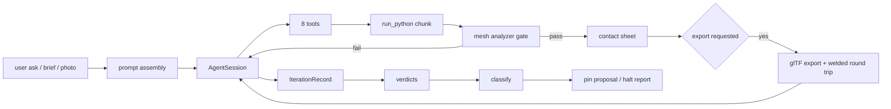

# blended — Specification and Requirements

**Date:** 2026-09-10
**Repository state reviewed:** `main` @ `5764504` (clean tree)
**Scope:** the whole repository — `src/blended/`, `blender_addon/`, `scripts/`, `tests/`, `docs/`, `bench_sets/`, `_evaluate/`.
**Basis:** direct reading of the source at the commit above. Every requirement carries a `path:line` evidence reference; the line was resolved from the file, not from memory.

## How to read this document

- **Specification** (§1–§2) states what the system *is*: its commitments, decomposition, interfaces, and file contracts.
- **Requirements** (§3–§4) states what it *must do*, one normative statement per row, each with evidence and the mechanism that verifies it.
- `MUST` / `MUST NOT` / `SHOULD` / `MAY` are RFC 2119. **A requirement with no verification mechanism is marked `(unverified)`; the eight of them are listed in §6.2.**
- Requirement IDs are stable: `AREA-n`. Areas: `EXE` execution, `GATE` mesh gate, `SCENE` scene-state gate, `FORM` acceptance gate, `REL` relations, `CAP` capture, `EXP` export, `ING` ingest, `OPS` ops vocabulary, `AGT` agent loop, `PRM` prompt system, `VIS` visual instruments, `CNV` convergence loop, `BEN` benchmark, `UI` in-Blender UI. Platform-wide rules are the `NFR-n` rows.
- Where a constant's value matters to a requirement, the value is quoted from its definition line and additionally listed in the register (§5).

## Measured state at this revision

| Fact | Value | Evidence |
|---|---|---|
| Blender series pin | `(5, 2)`, skew only via `BLENDED_ALLOW_VERSION_SKEW=1` | `src/blended/version.py:15,20,34` |
| Pure test layer | 425 passed, 1 skipped, 1 xfailed (4.4 s) | `make test-pure`, run 2026-09-10 |
| Blender test layer | 308 passed, 3 skipped, inside Blender 5.2.0 LTS (hash `fbe6228777e7`) | `make test-blender-app`, run 2026-09-10 |
| Test files | 41 pure, 42 blender | `tests/pure/`, `tests/blender/` |
| Briefs | 5 (`planter_box`, `three_leg_stool`, `uv_crate`, `ribbed_column`, `crate_with_lid`); `validate_briefs() == []` | `src/blended/evaluate/briefs.py:1108,1210` |
| Mistake-memory records | 79; `validate_memory() == []` | `src/blended/evaluate/mistake_memory.py:42,2966` |
| Prompt pins | working agreement `v10:b6627b38f4c1`; assembled prompt `a10:f13911deb826`; `PINNED == ACTIVE == 10`, latest registered revision 11 | `_evaluate/golden/pinned_identity.txt`, `_evaluate/golden/pinned_assembled_fingerprint.txt`, `src/blended/agent/prompt_versions.py:495,547` |
| Examiner licence | **NOT licensed today.** `_evaluate/eye_calibration.json` is identity `claude-code:sonnet+examiner:4bc67293e36c`, file hash `995eebffa3d4`, and `problems()` returns one failure: cross-run control specificity 0.75 < 1.0 | measured 2026-09-10; `src/blended/evaluate/examiner.py:196,288` |
| Pixel visual gate licence | `_evaluate/visual_gate_calibration.json` present: `minimum_silhouette_iou 0.998`, `maximum_shading_rmse 0.01`, capture 512 px, Blender series `5.2`, revision 10 | `_evaluate/visual_gate_calibration.json` |
| Benchmark rankable rolls | 1 group, 6 rolls, 120/120 exec, `cd_pca` mean 0.0252 | `docs/2026-09-06-bench-panel-preregistration.md` |

---

# 1. Specification

## 1.1 What the system is

`blended` is a harness for **agentic modeling of game assets inside Blender**. Its artifact is not a mesh but a **program** — a `*Parameters` dataclass plus a `*Builder` class, or a chunk of agent-written bpy code — which is executed, measured, and judged.

The harness's stated job is to **make the environment tell the truth**: structured tracebacks annotated with known API-drift fixes, a deterministic mesh analyzer as the hard acceptance gate, and multi-view captures for inspection. Rendered critique advises; the analyzer decides (`README.md:1-11`, `src/blended/harness.py:1-19`).

## 1.2 Design commitments

These are the fixed premises the rest of the document is written against.

| # | Commitment | Where enforced |
|---|---|---|
| D1 | **Program-as-artifact**: the agent emits Python, never a bare mesh. Programs are deterministic, diffable, editable, re-runnable. | `docs/2026-08-21-harness-roadmap.md:10` |
| D2 | **One core, two frontends**: identical behavior headless (`blender --background`) and in a live GUI, behind one interface. | `docs/2026-08-21-harness-roadmap.md:11` |
| D3 | **The environment is the teacher**: effort goes into feedback fidelity (tracebacks, measurements, framed renders), not into making the agent smarter. | `docs/2026-08-21-harness-roadmap.md:12` |
| D4 | **The mesh analyzer is the hard gate; render critique is advisory.** A screenshot critic is never an acceptance gate. | `src/blended/harness.py:8-10`, `src/blended/evaluate/examiner.py:1-20` |
| D5 | **Version pinned, drift cataloged**: the pin is asserted before any geometry; every instructive traceback lands in the catalog. | `src/blended/version.py:1-9`, `src/blended/drift/catalog.py:30` |
| D6 | **Bounded iteration, then the human**: refinement is capped and escalates with the contact sheet. | `src/blended/task.py:27` |
| D7 | **`bpy` imports live inside functions**: the pure layer (config, budgets, reports, drift catalog, briefs, examiner logic) imports and tests with no Blender present. | `src/blended/__init__.py:3-5`; 41 test files under `tests/pure/` |
| D8 | **Data API over `bpy.ops`**: operators are context-dependent and drift; the data API is deterministic and headless-safe. Two exceptions are documented, not hidden. | `src/blended/manifest.py:49` (`CONVENTIONS`), `src/blended/ops/uv.py:3-6`, `src/blended/ops/rigging.py:9-11` |
| D9 | **A gate must be able to fail**: every validator ships with a fixture that trips it. | `docs/2026-08-21-harness-roadmap.md:18`; e.g. `scripts/calibrate_visual_gate.py:181` |
| D10 | **No unmeasured claim as doctrine**: a decision earns a row only with a DOI and a code path, and a measured outcome. | `CLAUDE.md:15`, `docs/harness_design.md` (30 rows), rule text at its foot |

## 1.3 Decomposition

| Package | Responsibility | Needs `bpy` |
|---|---|---|
| `blended.harness` | the one-call loop: execute → gate → capture → optional verified export | yes (inside functions) |
| `blended.task` | the 3-round agent task loop and gate feedback written for an agent | yes |
| `blended.version` / `blended.reset` | Blender-series pin; wipe-to-canonical-scene with an asserted postcondition | yes |
| `blended.run` | executor (in-process, subprocess), retry loop, JSONL session log, batch | partly |
| `blended.drift` | API-drift catalog + traceback matching | no |
| `blended.analyze` | the mesh analyzer (hard gate), pair checks, metamorphic relations | mixed |
| `blended.evaluate` | briefs, acceptance gate, mistake memory, examiner, visual diff, digest, iteration log, replay, object identity | mixed (examiner pure) |
| `blended.capture` / `blended.export` / `blended.ingest` | contact sheets and views; glTF export with round-trip verification; GLB import + bounded cleanup | yes |
| `blended.ops` / `blended.builders` | the sanctioned construction vocabulary; three shipped Parameters+Builder pairs | yes |
| `blended.agent` | tools, transports, session loop, prompt assembly, planning, scene context, transcript | mixed |
| `blended.ui` / `blender_addon` | in-Blender panels, GPU transcript overlay, previews, turn undo, workspace arrangement | yes |
| `scripts/` | operational entry points: convergence loop, benchmark sweep, calibrations, packaging | host Python mostly |

## 1.4 Data flow

Two lanes converge on the same gates: the **program lane** (prompt → Parameters+Builder → executed bpy) and the **ingest lane** (image/text → generated GLB → import + cleanup → executed bpy). Everything downstream of "executed bpy" is lane-agnostic (`docs/2026-08-21-harness-roadmap.md:20-40`).

## 1.5 Instrument hierarchy and licensing

| Tier | Instrument | Authority | Licence to act |
|---|---|---|---|
| 1 | Deterministic structural gate (`analyze_object`, `MeshBudget`) | decides pass/fail, blocks export | none needed |
| 2 | Deterministic form gate (`evaluate_brief` against an `AssetBrief`) | decides pass/fail for a specified asset | none needed |
| 3 | Deterministic relations (`probe`, `NoInterpenetrationSpec`, `DistinctMaterialSpec`) | decides pass/fail with no reference artefact in some cases | none needed |
| 4 | Pixel visual gate (`compare_view_files` vs pinned golden) | decides drift against the pinned revision | `_evaluate/visual_gate_calibration.json` |
| 5 | VLM examiner (`examine_asset`) | **describes**; produces tags, never a pass | `_evaluate/eye_calibration.json`, `problems()` must be empty |
| 6 | Human | applies a pin; is the judge when no machine is licensed | `make pin` |

The examiner *describes* rather than adjudicates (D4). Its tags are split into those a deterministic probe already owns (`MEASURED_DEVIATION_TAGS`, `src/blended/evaluate/examiner.py:70`) and those that halt the loop and demand a new numeric probe (`HALTING_DEVIATION_TAGS`, `:80`).

## 1.6 Two references, two questions

The visual gate asks "did the render move from the accepted state?" and compares against the **pinned** revision. The examiner asks "does this deliver the brief?" and compares against an **exemplar of the configuration under test**. Pointing the examiner at the pinned reference returned every incidental choice of that writer as a deviation (`scripts/run_agent_task.py:150-160`, `docs/harness_design.md` row 28).

---

# 2. Interfaces

## 2.1 Python API (the library front door)

| Entry point | Signature | Effect |
|---|---|---|
| `run_builder` | `(builder, settings=HarnessSettings()) -> HarnessResult` | build via a Parameters+Builder object, then gate, capture, optionally export (`src/blended/harness.py:397`) |
| `run_chunk` | `(source_code, object_name, fix_source=None, settings=..., chunk_label="<agent>") -> HarnessResult` | execute agent source with the drift-annotated retry loop, then gate (`src/blended/harness.py:341`) |
| `run_agent_task` | `(task: AgentTask, write_code, settings=None, maximum_rounds=3) -> TaskResult` | 3-round loop with agent-shaped failure feedback (`src/blended/task.py:174`) |
| `run_batch` | `(items, settings=None) -> dict[str, HarnessResult]` | many chunks in one Blender process, factory reset per item (`src/blended/run/batch.py:28`) |
| `analyze_object` | `(blender_object) -> MeshReport` | measure the evaluated mesh (`src/blended/analyze/mesh_checks.py:595`) |
| `analyze_pair` | `(first_object, second_object) -> PairReport` | interpenetration and separation (`src/blended/analyze/pair_checks.py:136`) |
| `probe` | `(build, parameters, relations) -> MetamorphicReport` | the reference-free gate (`src/blended/analyze/metamorphic.py:235`) |
| `evaluate_brief` / `refine_brief` | `(brief) -> AcceptanceReport` / `(brief, step) -> AssetBrief` | the form gate and its refinement step (`src/blended/evaluate/acceptance.py:573,849`) |
| `export_glb` | `(blender_object, output_path) -> ExportReport` | export and re-import verification (`src/blended/export/gltf.py:133`) |
| `build_manifest` | `(include_drift_catalog=True) -> str` | the agent capability manifest, generated from live code (`src/blended/manifest.py:107`) |
| `build_system_prompt` | `(include_operations=True, revision=None, lane=None) -> str` | assembled system prompt (`src/blended/agent/system_prompt.py:38`) |

`blended.ops.__init__` re-exports the sanctioned construction vocabulary; callers build through it rather than raw `bpy` (`src/blended/ops/__init__.py`).

## 2.2 Agent tool surface (the ACI)

`TOOL_SCHEMAS` (`src/blended/agent/tools.py`) is the eight hand-written **service tools** below plus one **generated op tool per facade op** (`OP_TOOL_SCHEMAS`, built by `blended.agent.tool_schemas.build_tool_schemas()` from the OPS-21 signatures: parameters are the signature, quantities carry their unit in the name, object references are names, config dataclasses become object schemas). The whole set is fingerprinted `t:{hex12}` (`TOOL_SCHEMAS_FINGERPRINT`), pinned in `_evaluate/golden/pinned_tool_schemas_fingerprint.txt`, and written into every `IterationRecord`. Service tools are executed by `dispatch_tool`'s own branches; an op tool is bound, run and — when its return names an object — gated by `blended.agent.op_call.call_op` (AGT-21, AGT-3), and any other name is refused before bpy is touched. Every tool returns a `ToolOutcome` (text, images, and the scene effects the loop's intermediate ledger reads).

| Tool | Parameters | Purpose |
|---|---|---|
| `run_python` | `source`, `reason` (both required), `object_name`, `plan_step` | the escape hatch: execute a chunk for what the op tools cannot express and gate the named object; omitting `object_name` runs ungated; a blank `reason` is refused |
| `inspect_object` | `object_name` (required), `plan_step` | the analyzer report for one object |
| `inspect_domain` | `object_name`, `domain` in `rig`/`weights`/`animation`/`material` | non-mesh state |
| `render_views` | `object_name`, `xray`, `look_for`, `plan_step` | contact sheet of the named views |
| `search_ops` | `query` | closest ops by signature |
| `list_scene` | — | mesh objects with triangle counts and dimensions |
| `export_asset` | `object_name`, `path`, `plan_step` | .glb export with re-import verification |
| `declare_plan` | `steps: [str]` | declare the numbered plan once per scene-changing turn |

## 2.3 Model transport lanes

| Lane | Model-id form | Endpoint | Timeout |
|---|---|---|---|
| local Ollama daemon | bare id | `http://localhost:11434` (`src/blended/agent/loop.py:47`) | 300 s (`:65`) |
| Ollama cloud | `:cloud` suffixed | `https://ollama.com` (`src/blended/agent/loop.py:48`) | 300 s |
| bmb llama-swap | ids in `BMB_MODEL_IDS` | `http://[IP_ADDRESS]:9292` (`src/blended/agent/loop.py:54`) | 900 s (`:77`) |
| big llama-swap | `qwen3-vl` | `http://[IP_ADDRESS]:8081` (`src/blended/agent/loop.py:64`) | 900 s |
| OpenRouter | `vendor/model` | `https://openrouter.ai/api` (`src/blended/agent/loop.py:124`) | 300 s |
| Claude Code CLI | `claude-code:opus`, `:sonnet`, `:haiku` (`src/blended/agent/claude_code.py:54`) | `claude-code://cli` | 900 s (`src/blended/agent/claude_code.py:81`) |

Routing is by model id (`src/blended/agent/loop.py:337-360`); credentials come from files, not the shell environment, because a Finder-launched Blender inherits none (`src/blended/agent/loop.py:95,125`).

## 2.4 CLI / Make targets

| Target | Runs | Proves |
|---|---|---|
| `make test` | `test-pure` + `test-blender-app` | both layers (`Makefile:12`) |
| `make test-pure` | `.venv/bin/python -m pytest tests/pure -q` | the Blender-free layer (`Makefile:15`) |
| `make test-blender-app` | installed Blender + `scripts/run_tests_in_blender.py` | the environment the addon ships into (`Makefile:25`) |
| `make test-repro` | `scripts/rebuild_twice.py` | two fresh Blenders, different `PYTHONHASHSEED`, identical digests (`Makefile:35`) |
| `make converge` | `scripts/run_agent_task.py --brief --revision --iteration` | one gated, rendered, logged iteration (`Makefile:44`) |
| `make converge-local` | same driver, local writer+eye, `outputs/local_pair` | the fully local pair, kept out of `_evaluate/` (`Makefile:59`) |
| `make converge-auto` | `scripts/converge_auto.py --revision` | the unattended loop; ends in a pin proposal or a halt report (`Makefile:113`) |
| `make pin` | `scripts/pin_revision.py --revision` | the one human act: applying a pin (`Makefile:120`) |
| `make replay` | `scripts/replay_iteration.py --iteration` | rebuild a scored iteration from its own log (`Makefile:70`) |
| `make calibrate-eye` | `scripts/calibrate_examiner.py` | writes the eye licence (`Makefile:80`) |
| `make calibrate-visual-gate` | `scripts/calibrate_visual_gate.py --revision` | writes the pixel-gate thresholds (`Makefile:89`) |
| `make pin-golden-views` | `scripts/pin_golden_views.py --revision` | mints per-view golden references (`Makefile:97`) |
| `make bench-3dcode` | `scripts/sweep_3dcode.py --bench-root --instances-file` | the external benchmark sweep (`Makefile:129-132`) |
| `make chat-e2e` | `scripts/chat_e2e.py` | six interactive scenarios, hard-asserted (`Makefile:142`) |
| `make photo-to-model` | `scripts/photo_to_model.py` | photo in, gated model out (`Makefile:151`) |
| `make provider-smoke` | `scripts/provider_smoke.py` | one text + one image call per lane (`Makefile:160`) |

## 2.5 File and artifact contracts

| Path | Role | Committed? |
|---|---|---|
| `_evaluate/iterations.jsonl` | append-only record of every iteration (`src/blended/evaluate/iteration_log.py:20`); since OT-8 each record carries `tool_events`, the structured tool sequence | yes — the golden tests replay from it |
| `_evaluate/verdicts.jsonl` | judgements, separate from measurements (`src/blended/evaluate/iteration_log.py:21`) | yes |
| `_evaluate/golden/` | pinned per-view references and their `manifest.json` | yes |
| `_evaluate/eye_calibration.json`, `_evaluate/visual_gate_calibration.json` | the two licences (`src/blended/evaluate/examiner.py:119`; `src/blended/evaluate/visual_diff.py:154`) | yes |
| `_evaluate/pin_proposal.json` / `_evaluate/halt_report.md` | the loop's two terminal artifacts (`scripts/converge_auto.py:45,46`) | yes |
| `_evaluate/renders/**/*.png`, `**/*.glb` | per-iteration renders and exports | **no** — regenerated by `make replay` (`.gitignore:12-18`) |
| `outputs/` | local-model run artifacts | **no** — regenerable, large (`.gitignore:20-21`) |
| `logs/*` | chat transcripts JSONL/Markdown | **no** (`.gitignore:25`) |
| `_renders/harness/` | default contact-sheet directory (`src/blended/harness.py:28`) | not ignored; scratch |

The benchmark checkout (`/Users/ladvien/3dcodebench`) is **read-only** except `results/text_to_3D_agent/<new dirs>`; benchmark runs MUST NOT write to `_evaluate/` (`scripts/run_3dcode_instance.py:22`).

---

# 3. Functional requirements

Each row is one normative statement with its evidence and the mechanism that verifies it. `(unverified)` marks a requirement with no automated check in the tree.

## 3.1 Execution, retry, and session logging (`EXE`)

| ID | Requirement | Evidence | Verified by |
|---|---|---|---|
| EXE-1 | The harness MUST execute agent source **in-process** against the live `bpy` and return a `RunResult` carrying the full traceback on failure. | `src/blended/run/executor.py:78` | `tests/blender/test_executor.py` |
| EXE-2 | A chunk's returned stdout MUST be bounded to `MAXIMUM_STDOUT_CHARACTERS` (2000), keeping the tail. | `src/blended/run/executor.py:39` | `tests/blender/test_executor.py` |
| EXE-3 | A failed traceback MUST be matched against the drift catalog and the matched entries attached to the result. | `src/blended/run/executor.py:78-110`, `src/blended/drift/catalog.py:30` | `tests/pure/test_drift_catalog.py` |
| EXE-4 | The retry loop MUST cap at `MAXIMUM_RETRIES_DEFAULT` (2) and MUST NOT retry past it. | `src/blended/run/retry.py:23,78` | `tests/blender/test_retry.py` |
| EXE-5 | The retry prompt MUST contain the exact source that ran, the full traceback, and every matched drift fix. | `src/blended/run/retry.py:51` | `tests/pure/test_retry_prompt.py` |
| EXE-6 | `run_chunk` and an op-tool call MUST report `stage_reached` as one of `execute`, `locate`, `gate`, `export`, `done` — defined once in `blended.stages` — and MUST NOT claim success past the stage that failed. | `src/blended/stages.py`, `src/blended/harness.py:41-58`, `src/blended/agent/op_call.py` | `tests/blender/test_harness.py`, `tests/pure/test_agent_dispatch.py` |
| EXE-7 | `run_builder` MUST report a builder exception as `stage_reached="execute"` with the traceback, and MUST NOT apply the retry loop (no `fix_source` exists on that path). | `src/blended/harness.py:397` | `tests/blender/test_harness.py` |
| EXE-8 | The session log MUST be append-only JSONL, one line per attempt, at `LOG_SCHEMA_VERSION` 1, with a 12-character source hash. | `src/blended/run/session_log.py:19,20` | `tests/pure/test_session_log.py` |
| EXE-9 | The subprocess executor MUST time out at `SUBPROCESS_TIMEOUT_SECONDS` (240) and MUST take the Blender binary from the `BLENDER` environment variable. | `src/blended/run/executor.py:32,33` | `tests/blender/test_executor.py` |
| EXE-10 | `run_batch` MUST factory-reset the scene between items so results stay independent, and MUST evaluate every item even when one fails. | `src/blended/run/batch.py:28` | `tests/blender/test_walking_skeleton.py` |
| EXE-11 | The Blender series MUST be asserted against `TARGET_BLENDER_SERIES` (5, 2) before any geometry is built; skew MUST be allowed only via `BLENDED_ALLOW_VERSION_SKEW=1` and MUST print a warning. | `src/blended/version.py:15,20,34` | `tests/blender/test_reset.py`, `tests/pure/test_import_integrity.py` |
| EXE-12 | A rebuild MUST start from a wiped scene, and the wipe MUST be asserted, listing leftover datablocks by name (capped at `LEFTOVER_NAMES_REPORTED` = 10). | `src/blended/reset.py:30,54,59,66,105` | `tests/blender/test_reset.py`, `tests/blender/test_rebuild_in_session.py` |
| EXE-13 | The clean-scene assertion MUST NOT require materials or images to be empty, because a live GUI holds an unremovable `Render Result` / `Viewer Node` image. | `src/blended/reset.py:54` | `tests/blender/test_reset.py` |
| EXE-14 | `CANONICAL_FPS` MUST be 24 and MUST be restored around any import that rewrites `scene.render.fps`. | `src/blended/reset.py:26` | `tests/blender/test_reset.py` |
| EXE-15 | A metamorphic or digest rebuild MUST call the assertion, not only the wipe. | `src/blended/reset.py:1-20` | `tests/blender/test_metamorphic.py` |

## 3.2 The structural gate (`GATE`)

The analyzer is the hard gate. It measures the **evaluated** mesh (modifiers applied) and reports each failure as a measurement, never a bare boolean.

| ID | Requirement | Evidence | Verified by |
|---|---|---|---|
| GATE-1 | A mesh MUST be rejected when its triangle count exceeds `MeshBudget.maximum_triangle_count` (default `DEFAULT_PROP_TRIANGLE_BUDGET` = 2000). | `src/blended/analyze/mesh_checks.py:31,35` | `tests/blender/test_analyzer_fixtures.py` |
| GATE-2 | With `require_manifold` (default true), non-manifold edges MUST fail the gate. | `src/blended/analyze/mesh_checks.py:35` | `tests/blender/test_analyzer_fixtures.py` |
| GATE-3 | With `allow_boundary_edges` false (default), an open mesh MUST fail. | `src/blended/analyze/mesh_checks.py:35` | `tests/blender/test_analyzer_fixtures.py` |
| GATE-4 | Zero-area faces (below `ZERO_AREA_EPSILON_M2` = 1e-9) and non-finite coordinates MUST fail **unconditionally**, with no budget flag. | `src/blended/analyze/mesh_checks.py:24` | `tests/blender/test_analyzer_fixtures.py` |
| GATE-5 | Connected-component count MUST be gated by `maximum_component_count` (default 1). | `src/blended/analyze/mesh_checks.py:35` | `tests/blender/test_analyzer_fixtures.py` |
| GATE-6 | Duplicate vertex pairs within `DUPLICATE_VERTEX_DISTANCE_M` (1e-5 m) MUST fail. | `src/blended/analyze/mesh_checks.py:27` | `tests/blender/test_analyzer_fixtures.py` |
| GATE-7 | Self-intersecting face pairs MUST fail unless `allow_self_intersections`, counted by BVH self-overlap with pairs sharing a vertex excluded. | `src/blended/analyze/mesh_checks.py:35` | `tests/blender/test_pair_checks.py` |
| GATE-8 | Inward-facing triangles MUST be counted by **ray parity** (one epsilon step along the normal, crossings counted, odd = flipped), capped at `PARITY_MAXIMUM_CASTS` (64) casts per triangle; the count is meaningful only on a closed manifold. | `src/blended/analyze/mesh_checks.py:221,222` | `tests/blender/test_flipped_normals.py` |
| GATE-9 | Inverted facets — a triangle disagreeing with its own vertex normals — MUST be counted unconditionally, with no epsilon (a zero-area facet is not counted). | `src/blended/analyze/mesh_checks.py:55` | `tests/pure/test_inverted_facets.py`, `tests/blender/test_analyzer_fixtures.py` |
| GATE-10 | UV checks MUST run when `require_uv_layer`: layer presence, overlapping pairs, out-of-bounds faces, island count against `maximum_uv_island_count`. | `src/blended/analyze/mesh_checks.py:35` | `tests/blender/test_uv.py` |
| GATE-11 | UV overlap MUST be counted with a uniform-grid broadphase at resolution `UV_BROADPHASE_GRID_RESOLUTION` (32), because `BVHTree.overlap` silently returns nothing for exactly-coplanar triangles. | `src/blended/analyze/mesh_checks.py:434` | `tests/blender/test_analyzer_fixtures.py` |
| GATE-12 | `uv_coverage_fraction` MUST be the **sum** of UV triangle areas over the unit square, so a value near 1.0 with non-zero overlap reads as stacking, not packing. | `src/blended/analyze/mesh_checks.py:55` | `tests/blender/test_uv.py` |
| GATE-13 | `MeshReport` MUST carry `volume_m3` (signed) and `surface_area_m2`; nothing MUST gate on volume, which is meaningful only on a closed manifold. | `src/blended/analyze/mesh_checks.py:55` | `tests/blender/test_metamorphic.py` |
| GATE-14 | The gate MUST produce a **contact sheet on FAIL as well as PASS** — a failure you cannot review is a failure you will repeat. | `src/blended/harness.py:8-10,264` | `tests/blender/test_harness.py` |
| GATE-15 | Export MUST run only on a gate-passing mesh. | `src/blended/harness.py:264` | `tests/blender/test_export_round_trip.py` |
| GATE-16 | A pair's `intersecting_face_pair_count` MUST be reported only when the AABB penetration depth exceeds `CONTACT_DEPTH_TOLERANCE_M` (0.002 m), so resting contact reads zero; the residual MUST be exposed as `aabb_penetration_depth_m` and gated opt-in by `NoInterpenetrationSpec.maximum_aabb_penetration_depth_m`. | `src/blended/analyze/pair_checks.py:39,43,136` | `tests/blender/test_pair_checks.py` |
| GATE-17 | Pair separation MUST be measured vertex-to-**surface** in both directions and reported as the minimum, sampling at most `PAIR_SEPARATION_SAMPLE_LIMIT` (512) vertices per direction; it MUST be documented as an upper bound, not the true separation. | `src/blended/analyze/pair_checks.py:33,136` | `tests/blender/test_pair_checks.py` |
| GATE-18 | Every check MUST have a fixture that trips it and a clean fixture that does not. | `docs/2026-08-21-harness-roadmap.md:18` | `tests/blender/test_analyzer_fixtures.py` |

## 3.3 The scene-state gate (`SCENE`)

The analyzer reads the mesh datablock, so it cannot see an object nobody can see, or a transform that poisons every world-space number.

| ID | Requirement | Evidence | Verified by |
|---|---|---|---|
| SCENE-1 | The view layer MUST be synchronised (`bpy.context.view_layer.update()`) before any evaluated state is read, because a freshly linked object and a freshly assigned scale are otherwise absent from `view_layer.objects` / `matrix_world`. | `src/blended/harness.py:202` | `tests/blender/test_harness.py` |
| SCENE-2 | An object MUST fail when it is unlinked, in an excluded collection, hidden, or `hide_render`; the message MUST name the cause to fix, walking coarsest to finest. | `src/blended/harness.py:112` | `tests/blender/test_harness.py` |
| SCENE-3 | A non-finite object transform MUST fail, because every world-space measurement printed from it is meaningless and glTF export raises. | `src/blended/harness.py:181` | `tests/blender/test_harness.py` |
| SCENE-4 | A collapsed transform MUST be detected by **scale-length anisotropy** below `COLLAPSED_SCALE_RATIO` (1e-6), not by determinant, so a legitimately tiny uniformly-scaled object passes. | `src/blended/harness.py:199` | `tests/blender/test_harness.py` |
| SCENE-5 | The scene-state check MUST run before the analyzer, because with a NaN matrix "can it be seen" is not a meaningful question. | `src/blended/harness.py:252,264` | `tests/blender/test_harness.py` |
| SCENE-6 | `world_extents_m` MUST be carried on every result from the gate onward, including the gate-FAIL result, and MUST NOT gate anything. | `src/blended/harness.py:41-58,264` | `tests/blender/test_observation_channel.py` |

## 3.4 The form gate (`FORM`)

The form gate answers "does the object deliver the brief", deterministically, before any visual token is spent.

| ID | Requirement | Evidence | Verified by |
|---|---|---|---|
| FORM-1 | Dimensions MUST be measured against the brief's `DimensionSpec` within `DIMENSION_TOLERANCE_M` (0.02 m), and every failure MUST be reported as measurement + delta. | `src/blended/evaluate/briefs.py:49`, `src/blended/evaluate/acceptance.py:573` | `tests/blender/test_acceptance_gate.py` |
| FORM-2 | A solidity probe MUST count surface crossings by ray parity (odd = inside) and MUST raise when a probe crosses more than `PARITY_MAXIMUM_CROSSINGS` (128) surfaces. | `src/blended/evaluate/acceptance.py:42,46` | `tests/blender/test_acceptance_gate.py` |
| FORM-3 | A through-hole MUST be verified as an unobstructed line of sight along the axis, not by a single parity ray. | `src/blended/evaluate/acceptance.py:573` | `tests/blender/test_acceptance_gate.py` |
| FORM-4 | Ground contact MUST be measured as the area of faces within `SOLE_PLANARITY_TOLERANCE_M` (0.0005 m) of z=0 near each foot, and MUST require at least `MINIMUM_SOLE_CONTACT_AREA_M2` (1e-4 m²). | `src/blended/evaluate/briefs.py:61,70` | `tests/blender/test_acceptance_gate.py` |
| FORM-5 | Foot placement MUST be checked against `FOOT_SEARCH_RADIUS_M` (0.07 m), `FOOT_RADIUS_TOLERANCE_M` (0.01 m) and `FOOT_ANGLE_TOLERANCE_DEG` (5.0°). | `src/blended/evaluate/briefs.py:66,77,78` | `tests/blender/test_acceptance_gate.py` |
| FORM-6 | A part with `require_base_at_ground` MUST sit within the brief's `grounding_tolerance_m` (`GROUNDING_TOLERANCE_M` = 0.002 m) of z=0. | `src/blended/evaluate/briefs.py:53` | `tests/blender/test_acceptance_gate.py` |
| FORM-7 | With `require_material` true, every part MUST have at least one **assigned** material slot; slots and assigned materials MUST be counted separately. | `src/blended/evaluate/acceptance.py:235` | `tests/blender/test_acceptance_gate.py` |
| FORM-8 | Any MESH object in the scene not named by the brief MUST be reported as a stray and MUST fail the gate. | `src/blended/evaluate/acceptance.py:573` | `tests/blender/test_acceptance_gate.py` |
| FORM-9 | A `DistinctMaterialSpec` MUST fail when two parts' linear-RGB base colours are closer than `minimum_colour_distance_rgb` (`CRATE_LID_MINIMUM_COLOUR_DISTANCE_RGB` = 0.10) — a contrast requirement, never a pinned hue. | `src/blended/evaluate/briefs.py:176` | `tests/blender/test_acceptance_gate.py` |
| FORM-10 | A refinement MUST land its named dimensions on their new targets **and** leave every unnamed dimension within `PRESERVED_DIMENSION_TOLERANCE_M` (0.001 m) and every foot bearing within `PRESERVED_SOLE_BEARING_TOLERANCE_DEG` (1.0°). | `src/blended/evaluate/acceptance.py:845,846,885` | `tests/blender/test_acceptance_gate.py` |
| FORM-11 | The brief registry MUST hold exactly the five briefs, and an unknown name MUST raise rather than default. | `src/blended/evaluate/briefs.py:1108,1121` | `tests/pure/test_briefs_provenance.py` |
| FORM-12 | Every brief's provenance MUST validate: source in `SOURCES`, a citation for `literature`/`reference` rows, a symbol resolving to a module constant holding the claimed value within `PROVENANCE_VALUE_REL_TOL` (1e-9), a phrase that is a verbatim substring of the prompt text, ISO dates, and registry key equal to `brief.name`. | `src/blended/evaluate/briefs.py:424,430,1210` | `tests/pure/test_briefs_provenance.py`, `tests/pure/test_prompt_citations.py` |
| FORM-13 | A probe whose invariant set is read off the artefact under test MUST NOT be used — an invariant MUST be anchored outside the artefact. | `src/blended/analyze/metamorphic.py:1-60` | `tests/blender/test_metamorphic.py` |

## 3.5 Reference-free relations (`REL`)

| ID | Requirement | Evidence | Verified by |
|---|---|---|---|
| REL-1 | Every `Relation` MUST carry a non-blank `justification`, and `probe` MUST refuse to run one without it. | `src/blended/analyze/metamorphic.py:82,235` | `tests/blender/test_metamorphic.py` |
| REL-2 | `probe` MUST reset the scene before **every** build, source and follow-up alike. | `src/blended/analyze/metamorphic.py:235` | `tests/blender/test_metamorphic.py` |
| REL-3 | A relation that raises MUST be recorded as an error making the report not-ok; nothing may be swallowed. | `src/blended/analyze/metamorphic.py:73` | `tests/blender/test_metamorphic.py` |
| REL-4 | `all_of` MUST evaluate every outcome and MUST NOT short-circuit. | `src/blended/analyze/metamorphic.py:188` | `tests/blender/test_metamorphic.py` |
| REL-5 | Shipped relations MUST include: uniform scale scales every extent and changes no topology; a higher segment count adds triangles and does not resize; topology counts are scale-invariant. | `src/blended/analyze/metamorphic.py:128-171` | `tests/blender/test_metamorphic.py` |
| REL-6 | A relation's tolerance MUST be named at the call site or a module constant (`EXACT_REL_TOL` 1e-9, `STRICT_MARGIN` 1e-6); an absolute offset relation MUST express its offset (e.g. `grew_by(before*factor, after, BOOLEAN_EMBED_M)`), never a loosened tolerance. | `src/blended/analyze/metamorphic.py:65,69,143` | `tests/blender/test_metamorphic.py` |
| REL-7 | `measure_build` MUST be the only measurement path a relation speaks through, and MUST carry `volume_m3` / `surface_area_m2` so "same solid, different triangulation" is expressible. | `src/blended/analyze/metamorphic.py:198` | `tests/blender/test_metamorphic.py` |

## 3.6 Capture (`CAP`)

| ID | Requirement | Evidence | Verified by |
|---|---|---|---|
| CAP-1 | Capture MUST render the named views (front, right, top, three-quarter) and return a mapping of view name to path. | `src/blended/capture/views.py:47,93` | `tests/blender/test_capture_v2.py` |
| CAP-2 | Framing MUST use a named margin (`FRAME_MARGIN_FACTOR` 1.2) and perspective distance factor (`PERSPECTIVE_DISTANCE_FACTOR` 3.0); the capture camera MUST be a named, disposable object. | `src/blended/capture/views.py:18,39,40` | `tests/blender/test_capture_v2.py` |
| CAP-3 | The contact sheet MUST be composed without Pillow when Pillow is absent (numpy grid), and MUST degrade rather than fail. | `src/blended/capture/compose.py:23,50` | `tests/blender/test_capture_v2.py` |
| CAP-4 | The contact sheet MUST stamp the gate verdict taken from the analyzer, never from how the render looks. | `src/blended/capture/contact_sheet.py:26,84` | `tests/blender/test_harness.py` |
| CAP-5 | A UV atlas image MUST be renderable at `UV_IMAGE_SIZE_PX` (512) with per-island colour, and MUST raise when Pillow is unavailable. | `src/blended/capture/uv_layout.py:13,30` | `tests/blender/test_uv.py` |
| CAP-6 | A reference photo MUST be re-encoded to PNG capped at `MAXIMUM_PHOTO_EDGE_PX` (1024) on the long edge, MUST reject unsupported suffixes and undecodable images, and MUST remove the loaded datablock afterwards. | `src/blended/capture/reference_photo.py:24,28,36` | `tests/blender/test_reference_photo.py` |
| CAP-7 | A reference photo's EXIF orientation is NOT honoured — a sideways phone photo stays sideways. (Known limitation, §7.) | `src/blended/capture/reference_photo.py:1-30` | `(unverified)` |

## 3.7 Export (`EXP`)

| ID | Requirement | Evidence | Verified by |
|---|---|---|---|
| EXP-1 | Export MUST re-import the file it wrote and run the analyzer on what came back; the shipped file MUST be judged on position-welded topology. | `src/blended/export/gltf.py:31,133` | `tests/blender/test_export_round_trip.py` |
| EXP-2 | The round trip MUST fail on: pre-export gate failure; welded re-import gate failure; triangle-count drift; any dimension drift beyond `EXPORT_DIMENSION_TOLERANCE_M` (1e-4 m); file triangle count differing from the scene; boundary-edge disagreement between file and welded re-import; inverted facets when disallowed; root node name differing from the exported object name. | `src/blended/export/gltf.py:26,31` | `tests/blender/test_export_round_trip.py`, `tests/pure/test_export_report.py` |
| EXP-3 | A `.glb` MUST be inspectable without Blender: the pure reader MUST fail loudly on bad magic or length, on sparse accessors, on a POSITION accessor lacking min/max, and on any non-triangle primitive mode. | `src/blended/export/glb_report.py:46,365` | `tests/pure/test_glb_report.py`, `tests/blender/test_glb_file_report.py` |
| EXP-4 | Skin weights in the file MUST be checked against `WEIGHT_SUM_TOLERANCE_PER_INFLUENCE` (2e-7); more than one weight set MUST be reported as a portability risk, not a validity error. | `src/blended/export/glb_report.py:57` | `tests/pure/test_glb_report.py` |

## 3.8 Ingest and cleanup (`ING`)

| ID | Requirement | Evidence | Verified by |
|---|---|---|---|
| ING-1 | A GLB MUST be flattened into ONE mesh with world transforms baked, identity matrix, base at z=0, centred on X/Y, deterministically named; a missing file or a file with no mesh MUST raise. | `src/blended/ingest/import_glb.py:19` | `tests/blender/test_ingest_cleanup.py` |
| ING-2 | Cleanup MUST run in order: weld doubles (`DEGENERATE_DISSOLVE_DISTANCE_M` 1e-6), dissolve degenerate, delete loose, fill holes only up to `maximum_hole_perimeter_m` (0.15 m), recalc normals, decimate to budget in at most `MAXIMUM_DECIMATE_PASSES` (3) passes with `DECIMATE_UNDERSHOOT_FACTOR` 0.98. | `src/blended/ingest/cleanup.py:26,27,28,32,84` | `tests/blender/test_ingest_cleanup.py` |
| ING-3 | A hole fill that makes the mesh worse (introducing non-manifold edges or inverted facets) MUST be reverted, leaving the hole open and reported. | `src/blended/ingest/cleanup.py:84-170` | `tests/blender/test_ingest_cleanup.py` |
| ING-4 | Every cleanup MUST deliver a before/after `MeshReport` diff plus the list of actions, and MUST NOT blind-fill. | `src/blended/ingest/cleanup.py:32,84` | `tests/blender/test_ingest_cleanup.py` |

## 3.9 The ops vocabulary and builders (`OPS`)

| ID | Requirement | Evidence | Verified by |
|---|---|---|---|
| OPS-1 | All sanctioned construction MUST go through `blended.ops`; callers MUST NOT be handed raw `bpy`. The facade MUST re-export every public op defined under `src/blended/ops/*.py`, and builders MUST import from the facade only (OT-1). | `src/blended/ops/__init__.py` | `tests/pure/test_one_path_ops.py::test_every_public_op_is_reachable_from_the_facade`, `::test_builders_import_only_the_facade` |
| OPS-2 | Primitives MUST be built with the bmesh/data API, not `bpy.ops`. | `src/blended/ops/primitives.py:1-15,22,56` | `tests/pure/test_one_path_ops.py` |
| OPS-3 | Every constructor MUST be idempotent by name: remove any existing object and its data before rebuilding. | `src/blended/ops/primitives.py:22` | `tests/blender/test_transform_ops.py` |
| OPS-4 | Every created object MUST be linked into the scene before use, or the depsgraph has no instance and measurements silently return stored values. `link_into_scene` MUST be idempotent (a second link is a no-op), because the gate makes linking the first measured step (OT-5). | `src/blended/ops/primitives.py:56` | `tests/blender/test_transform_ops.py` |
| OPS-5 | A boolean MUST raise `UnlinkedOperand` when either operand is unlinked, and `BooleanNoOp` when it changes nothing. | `src/blended/ops/booleans.py:1-60` | `tests/blender/test_csg_ops.py` |
| OPS-6 | A boolean MUST consume its operand, heal its output (`weld_and_dissolve`), and use the EXACT solver by default (`BOOLEAN_SOLVER_DEFAULT`). | `src/blended/ops/booleans.py:15,123` | `tests/blender/test_csg_ops.py` |
| OPS-7 | Parts that will be unioned MUST overlap by a named embed before the boolean, never sit exactly coplanar (`BOOLEAN_EMBED_M` = 0.0005 in the pallet). | `src/blended/builders/pallet.py:16` | `tests/blender/test_pallet.py` |
| OPS-8 | Material assignment MUST set the Principled base colour **and** `diffuse_color` (Workbench), MUST be idempotent by name, and MUST reuse the datablock. | `src/blended/ops/materials.py:1-60` | `tests/blender/test_material_op.py` |
| OPS-9 | Weight assignment MUST reject weights outside `[MINIMUM_WEIGHT, MAXIMUM_WEIGHT]` (0.0–1.0). | `src/blended/ops/weights.py:14,15,71` | `tests/blender/test_rigging_ops.py` |
| OPS-10 | A rig report MUST count a mesh as bound only when its Armature modifier points at the armature **and** is enabled in viewport and render. | `src/blended/ops/rigging.py:225` | `tests/blender/test_rigging_ops.py` |
| OPS-11 | A bone shorter than `MINIMUM_BONE_LENGTH_M` (1e-6) MUST be rejected. | `src/blended/ops/rigging.py:19,82` | `tests/blender/test_rigging_ops.py` |
| OPS-12 | `set_frame_range` MUST reject an inverted or degenerate range, and pose-bone keyframing MUST force `rotation_mode='XYZ'`. | `src/blended/ops/animation.py:65,118` | `tests/blender/test_animation_ops.py` |
| OPS-13 | UV unwrap MUST clear existing UVs first for determinism, MUST restore the prior mode and selection, and MUST return an overlap count. | `src/blended/ops/uv.py:36,41,63` | `tests/blender/test_uv.py` |
| OPS-14 | Transform ops MUST refresh the depsgraph before anything reads `matrix_world`. | `src/blended/ops/transforms.py:79` | `tests/blender/test_transform_ops.py` |
| OPS-15 | A builder MUST validate its `Parameters` in its constructor, own the objects it creates, and expose a named build step. | `src/blended/builders/crate.py:16`, `src/blended/builders/barrel.py:14`, `src/blended/builders/pallet.py:16` | `tests/pure/test_crate_parameters.py`, `tests/pure/test_barrel_parameters.py`, `tests/pure/test_pallet_parameters.py` |
| OPS-16 | `Parameters` MUST be frozen, validated, bpy-free dataclasses with units in field names (`_m`, `_deg`). | `src/blended/builders/crate.py:16-60` | `tests/pure/test_import_integrity.py` |
| OPS-17 | The harness MUST orient the middle extent onto the depth axis (Blender +Y) using **world** extents, and `apply_canonical_depth_axis` MUST assert its own postcondition. | `src/blended/ops/canonical_orientation.py:53,211` | `tests/blender/test_canonical_orientation_op.py`, `tests/pure/test_canonical_orientation.py` |
| OPS-18 | The orientation reading MUST be a fact reported during the turn and MUST NOT gate anything. | `src/blended/ops/canonical_orientation.py:134` | `tests/pure/test_canonical_orientation.py` |
| OPS-19 | `bpy.ops` MUST appear in exactly two documented places — the UV unwrap solvers and heat-map skinning — each wrapped once with a documented `temp_override`. | `src/blended/ops/uv.py:1-10`, `src/blended/ops/rigging.py:1-20` | `tests/pure/test_one_path_ops.py` |
| OPS-20 | Every CSG result MUST be re-analyzed before it is treated as an asset; through the op tools this is automatic — `boolean_*` return `ObjectName` and are gated (OT-5). | `src/blended/ops/booleans.py:1-20`, `src/blended/agent/op_call.py` | `tests/blender/test_csg_ops.py`, `tests/blender/test_agent_loop.py::test_a_gate_failure_on_an_op_result_is_reported_at_gate` |
| OPS-21 | Every facade op MUST satisfy a machine-checkable signature contract: every parameter annotated, an explicit return annotation, a unit suffix on every numeric quantity (NFR-8) unless the name is in the declared unitless allowlist, a one-line docstring summary, and no `bpy` type anywhere in the signature — object references travel as names (`str`) and are resolved through `blended.ops._objects.object_by_name`, which raises `UnknownObject` / `WrongObjectType` rather than letting a bad reference surface as whichever attribute error bpy hits first (OT-2). | `src/blended/ops/_objects.py`, `src/blended/ops/primitives.py:28,53` | `tests/pure/test_ops_signature_contract.py::test_facade_op_satisfies_the_signature_contract`, `::test_the_contract_trips_on_a_seeded_defect` (NFR-15) |

## 3.10 The agent loop and its tools (`AGT`)

| ID | Requirement | Evidence | Verified by |
|---|---|---|---|
| AGT-1 | The tool surface MUST be `TOOL_SCHEMAS` = the hand-written service tools (`SERVICE_TOOL_SCHEMAS`: `run_python`, `inspect_object`, `inspect_domain`, `render_views`, `search_ops`, `list_scene`, `export_asset`, `declare_plan`) plus one generated tool per facade op (`OP_TOOL_SCHEMAS`, OT-3); no other tool may exist, service and op names MUST be disjoint, and the set MUST be fingerprinted `t:{hex12}` and pinned. | `src/blended/agent/tools.py:37`, `src/blended/agent/tool_schemas.py` | `tests/pure/test_tool_schemas.py::test_tool_schemas_is_the_service_tools_plus_every_facade_op`, `::test_the_tool_set_has_not_drifted`, `tests/pure/test_prompt_citations.py::test_every_other_registered_tool_is_a_facade_op` |
| AGT-2 | `dispatch_tool` MUST run on the main thread and MUST raise when called elsewhere. | `src/blended/agent/tools.py:295` | `tests/pure/test_agent_dispatch.py` |
| AGT-3 | `run_python` is the ESCAPE HATCH (OT-7): it MUST require a non-blank `reason` naming what the op vocabulary could not express, refused at the door before bpy (`RUN_PYTHON_REASON_REFUSAL`), and its outcome MUST carry the reason and a source hash for the candidate_op record (OT-8). It MUST gate the named object and return the gate verdict; omitting `object_name` MUST run ungated. Every op tool whose return names an object (`-> ObjectName`, OT-5) MUST run the same gate on that object — `gate_named_object`: scene state, then the analyzer for a mesh — and return the verdict in the result; a constructor marked `@op(gated=False)` (`add_box`, `add_cylinder`, `add_lathe`: unlinked intermediates) is exempt, the marker MUST appear in its schema description, and the loop MUST refuse to end the turn with an answer while such an intermediate is unresolved (`IntermediateLedger`). | `src/blended/agent/tools.py:37`, `src/blended/harness.py` (`GateVerdict`, `gate_object`), `src/blended/agent/op_call.py`, `src/blended/agent/intermediates.py` | `tests/blender/test_agent_loop.py`, `tests/blender/test_agent_loop.py::test_a_brief_reaches_gate_pass_with_op_tools_only`, `::test_an_unresolved_intermediate_blocks_the_answer_until_resolved`, `::test_a_gate_failure_on_an_op_result_is_reported_at_gate`, `tests/pure/test_intermediates.py`, `tests/pure/test_agent_dispatch.py::test_run_python_without_a_reason_is_refused_before_bpy`, `::test_the_run_python_schema_requires_the_reason` |
| AGT-4 | `declare_plan` MUST be handled without touching `bpy` and MUST echo the numbered plan back. | `src/blended/agent/tools.py:37`, `src/blended/agent/plan.py:32` | `tests/pure/test_turn_plan.py` |
| AGT-5 | A turn that changes the scene MUST declare a plan first: with `require_plan` on, `run_python` and every scene-changing op tool without a plan MUST be refused with the same refusal text. `PLAN_REQUIRED_TOOLS` is `run_python` plus every facade op not marked `@op(reads_only=True)` (the reports, readings and pure computations), derived from the facade, never listed by hand (OT-6). | `src/blended/agent/plan.py` (`PLAN_REQUIRED_TOOLS`), `src/blended/ops/_contract.py` (`op`, `changes_scene`) | `tests/pure/test_turn_plan.py::test_plan_required_tools_are_run_python_and_every_scene_changing_op`, `::test_an_op_tool_without_a_plan_is_refused_with_the_same_text`, `::test_a_reader_op_needs_no_plan` |
| AGT-6 | A plan MUST hold at most `MAXIMUM_PLAN_STEPS` (8) non-empty steps; a malformed plan MUST raise rather than truncate. | `src/blended/agent/plan.py:39,104` | `tests/pure/test_turn_plan.py` |
| AGT-7 | Plan progress MUST be reported as a clamped 0.0–1.0 fraction plus `step n/total`, and MUST survive an out-of-range step index without raising. Every plan-requiring tool — the service action tools and every generated scene-changing op tool — MUST accept `plan_step` (`PLAN_STEP_SCHEMA`, defined once); for an op tool it is stripped before binding, so the op never sees it (OT-6). | `src/blended/agent/plan.py` (`PLAN_STEP_SCHEMA`), `src/blended/agent/tool_schemas.py`, `src/blended/agent/tools.py` | `tests/pure/test_turn_plan.py`, `::test_an_op_tool_call_with_plan_step_reports_progress`, `::test_dispatch_strips_plan_step_before_binding`, `tests/pure/test_tool_schemas.py::test_the_parameter_set_equals_the_signature` |
| AGT-8 | `AgentSession.send` MUST run one turn to completion, executing tool calls until an answer is reached or the tool-call budget is exhausted. | `src/blended/agent/loop.py:1365,1420` | `tests/blender/test_agent_loop.py` |
| AGT-9 | A turn MUST be capped at `maximum_tool_calls_per_turn` (24), and exhaustion MUST be reported as text asking the user to narrow the task. | `src/blended/agent/loop.py:1333,1420` | `tests/blender/test_agent_loop.py` |
| AGT-10 | `cancel()` MUST stop the turn at the next seam, and the turn MUST be closed consistently: every issued tool call gets a result, and the cancelled answer is appended. | `src/blended/agent/loop.py:1356` | `tests/pure/test_agent_cancel.py` |
| AGT-11 | Streaming MUST emit typed events — `thinking`, `tool`, `result`, `answer`, `vision`, `plan`, `step`, `render`, `reference` — plus `content_delta` / `thinking_delta` when streaming is on. | `src/blended/agent/loop.py:1365` | `tests/pure/test_streaming.py` |
| AGT-12 | A half-received tool call MUST be dropped according to the lane's own rule (OpenAI: on stop; Ollama: only if the stream cut before `done`). | `src/blended/agent/loop.py:843` | `tests/pure/test_streaming.py`, `tests/pure/test_openai_transport.py` |
| AGT-13 | Multi-image delivery MUST use one labelled `[img]` placeholder per image **separated by text**, because consecutive same-size bitmaps are fused into a "video" by the qwen-vl renderer. | `src/blended/agent/loop.py:1208`, `src/blended/agent/claude_code.py:126` | `tests/pure/test_vision_transport.py`, `tests/pure/test_reference_images.py` |
| AGT-14 | The Claude Code lane MUST constrain tool calls with a JSON-schema envelope (`oneOf` per tool, `name` pinned by `const`) and MUST give the model no tools of its own. | `src/blended/agent/claude_code.py:301,492` | `tests/pure/test_claude_code_lane.py` |
| AGT-15 | The eye MUST describe, not adjudicate; a render-eye failure is recoverable with a named note, while a reference-photo eye failure MUST be fatal. | `src/blended/agent/loop.py:400,455` | `tests/pure/test_vision_transport.py`, `tests/blender/test_reference_photo.py` |
| AGT-16 | Scene context MUST be captured after a view-layer update as a frozen snapshot, capped at `MAXIMUM_SELECTED_OBJECTS_LISTED` (8) with an explicit overflow marker, and rendered as a `[scene]` block with dimensions at `DIMENSION_DECIMALS` (2). | `src/blended/agent/scene_context.py:30,34,86,174` | `tests/pure/test_scene_context.py`, `tests/blender/test_scene_context_live.py` |
| AGT-17 | A session MUST be transcribed append-as-you-go to both JSONL (full fidelity, `TRANSCRIPT_SCHEMA_VERSION` 2) and Markdown (truncated at `MARKDOWN_TRUNCATE_CHARACTERS` = 1200). Every tool call the loop dispatches or refuses MUST also be emitted as a structured `tool_event` (`agent.tool_event.ToolEvent`, schema 2): tool name, validated arguments (bound to the op signature, plan_step stripped), plan step, ok, `stage_reached`, gate verdicts with the analyzer fields when gated, wall time, images, and for `run_python` the reason and source hash; the JSONL row stores it decoded under `data`, the Markdown does not repeat it, and `IterationRecord.tool_events` carries the sequence (OT-8). | `src/blended/agent/transcript.py`, `src/blended/agent/tool_event.py`, `src/blended/agent/loop.py`, `src/blended/evaluate/iteration_log.py` | `tests/pure/test_transcript.py::test_schema_two_stores_the_tool_event_under_data`, `tests/pure/test_tool_event.py` |
| AGT-18 | `list_scene` MUST cap its listing at `MAXIMUM_SCENE_OBJECTS_LISTED` (40), `search_ops` at `MAXIMUM_SEARCH_RESULTS` (8), and a returned traceback at `MAXIMUM_TRACEBACK_CHARACTERS` (1500). | `src/blended/agent/tools.py:29,30,35` | `tests/pure/test_agent_dispatch.py` |
| AGT-19 | The session MUST NOT volunteer work: no proactive suggestions and no auto-continuation; a turn runs only from an explicit user act. | `docs/harness_design.md` row 22 | `(unverified)` |
| AGT-20 | There is **no enforced retry cap or turn cap in the agent loop**; the working agreement's "stop after three honest attempts" is prose to the model, not code. (Gap, §7.) | `src/blended/agent/loop.py:1365-1544` | `(unverified)` |
| AGT-21 | `dispatch_tool` MUST route a generated op tool to its facade function on the main thread (AGT-2); MUST bind the JSON arguments against the signature's type hints — the hints the schema was generated from — failing loud on an unknown, missing or mistyped parameter (NFR-13); MUST refuse a name that is neither a service tool nor a facade op before touching bpy; MUST run the op through the executor's one capture path; and MUST report `stage_reached` from `blended.stages` (`execute` on failure, `done` on return; gating is OT-5). (OT-4) | `src/blended/agent/op_call.py`, `src/blended/agent/tools.py` (`OP_FUNCTIONS`, `SERVICE_TOOL_NAMES`), `src/blended/run/executor.py` (`execute_captured`) | `tests/pure/test_agent_dispatch.py::test_an_op_tool_call_binds_runs_and_reports_done`, `::test_an_unregistered_tool_is_refused_at_the_door_without_bpy`, `::test_a_mistyped_argument_fails_at_execute_with_the_cause_and_no_traceback`, `::test_an_op_tool_off_the_main_thread_is_refused_like_any_tool`; `tests/blender/test_agent_loop.py::test_a_brief_reaches_gate_pass_with_op_tools_only` |

## 3.11 The prompt system (`PRM`)

| ID | Requirement | Evidence | Verified by |
|---|---|---|---|
| PRM-1 | The system prompt MUST be assembled from the versioned working agreement, the generated manifest (conventions + operations + gate fields + drift catalog), and optionally one lane's skill modules. | `src/blended/agent/system_prompt.py:38`, `src/blended/manifest.py:107` | `tests/pure/test_prompt_templates.py`, `tests/pure/test_manifest.py` |
| PRM-2 | The manifest MUST be **generated from live code** (introspecting the ops modules, `MeshBudget`/`MeshReport` fields, the drift catalog), never hand-written prose; the op tool schemas MUST be generated the same way from the facade signatures (`build_tool_schemas()`, OT-3), so prose and schema cannot drift apart. | `src/blended/manifest.py:22,44,107`, `src/blended/agent/tool_schemas.py` | `tests/pure/test_manifest.py`, `tests/pure/test_tool_schemas.py::test_adding_an_op_to_the_facade_adds_a_tool`, `::test_the_parameter_set_equals_the_signature` |
| PRM-3 | The manifest MUST state the pinned Blender series and that gate-passing, not error-free execution, is success. | `src/blended/manifest.py:107` | `tests/pure/test_manifest.py` |
| PRM-4 | The working agreement MUST be versioned as `PromptRevision` entries, each naming the one element it changed, a hypothesis **stated before the run**, and an outcome filled from measurement. | `src/blended/agent/prompt_versions.py:38,66` | `tests/pure/test_prompt_search.py` |
| PRM-5 | `validate_revisions` MUST flag: revisions not consecutive from 1; a template that fails to render; a revision identical to its predecessor; a revision changing more than one hunk (`MAXIMUM_CHANGED_HUNKS_PER_REVISION` = 1); a missing hypothesis; a superseded revision with no recorded outcome. | `src/blended/agent/prompt_versions.py:557,575` | `tests/pure/test_prompt_search.py` |
| PRM-6 | An unknown revision MUST raise, never fall back to the pinned one. | `src/blended/agent/prompt_versions.py:625` | `tests/pure/test_prompt_search.py` |
| PRM-7 | The prompt the model actually reads MUST be fingerprinted as `a{revision}:{hex12}` (sha256 of the assembled text), distinct from the working-agreement body's `v{revision}:{hex12}` identity. | `src/blended/agent/system_prompt.py:99,102` | `tests/pure/test_prompt_templates.py` |
| PRM-8 | The active revision MUST remain the pinned one until a pin is applied; a candidate revision MUST NOT be activated by a code edit alone. | `src/blended/agent/prompt_versions.py:495,547` | `tests/pure/test_prompt_search.py` |
| PRM-9 | A lane MUST load at most `MAXIMUM_MODULES_LOADED` (3) skill modules, each at most `MAXIMUM_MODULE_LINES` (60) lines, each with a hypothesis and evidence, and every registered module MUST be reachable from a lane. | `src/blended/agent/skill_modules.py:253,259,263,310` | `tests/pure/test_skill_modules.py` |
| PRM-10 | No lane MUST be selected by default: `build_system_prompt()` with no arguments MUST render exactly the pinned text and no module. | `src/blended/agent/skill_modules.py:292` | `tests/pure/test_skill_modules.py` |
| PRM-11 | A prompt body MUST NOT contain Jinja delimiters, undefined variables MUST raise (`StrictUndefined`), and whitespace MUST be treated as content (`keep_trailing_newline`, no block trimming). | `src/blended/agent/prompt_templates.py` | `tests/pure/test_prompt_templates.py` |
| PRM-12 | Every prompt claim that cites evidence MUST carry a resolvable DOI so a later reader can re-look it up. | `docs/harness_design.md` foot; `src/blended/agent/prompt_versions.py:66` | `tests/pure/test_prompt_citations.py` |
| PRM-13 | The prompt templates and the Jinja dependency MUST ship inside the addon zip, since Blender has no pip. | `scripts/package_addon.py:22,32` | `tests/pure/test_addon_packaging.py` |
| PRM-14 | Lane selection exists in the registry but **nothing selects lanes at runtime yet**; the loop passes no lane. (Gap, §7.) | `src/blended/agent/skill_modules.py:263` | `tests/pure/test_skill_modules.py` |
| PRM-15 | A change to the tool surface that changes how the writer is told to work MUST be registered as a prompt revision with its hypothesis BEFORE any run (PRM-4), one hunk (PRM-5): v12 rewrites the 'How you work' opening — a step is an op-tool call, `run_python` is the escape hatch with a required `reason` — with the hypothesis that escape-hatch calls per gate-passing brief fall below 1.0 on the five briefs within three paired rolls. v12 is a candidate; `ACTIVE_PROMPT_REVISION` stays at the pin until measured. (OT-7) | `src/blended/agent/prompt_versions.py` (revision 12), `src/blended/agent/prompts/working_agreement_v12.md.j2` | `tests/pure/test_prompt_templates.py::test_the_revision_history_is_disciplined`, `::test_each_revision_changes_exactly_one_place[12]` |

## 3.12 Visual instruments and their licences (`VIS`)

| ID | Requirement | Evidence | Verified by |
|---|---|---|---|
| VIS-1 | A machine visual verdict MUST be refused unless the calibration's `problems()` is empty: identity match, sensitivity ≥ `MINIMUM_FIXTURE_SENSITIVITY` (0.6), control specificity equal to `REQUIRED_CONTROL_SPECIFICITY` (1.0) and cross-run control specificity ≥ `CROSS_RUN_CONTROL_MINIMUM_SPECIFICITY`. | `src/blended/evaluate/examiner.py:94,98,114,196` | `tests/pure/test_examiner.py` |
| VIS-2 | The calibration file's own hash MUST be bound into every machine verdict, so an unlicensed verdict cannot be written as if licensed. | `src/blended/evaluate/examiner.py:288` | `tests/pure/test_examiner.py` |
| VIS-3 | The examiner identity MUST bind the model name **and** the examiner prompt hash; switching eyes or editing the prompt MUST invalidate the licence and require recalibration. | `src/blended/evaluate/examiner.py:361` | `tests/pure/test_examiner.py` |
| VIS-4 | Each of the five views MUST be examined twice (reference-first and test-first) and only order-consistent tags kept. | `src/blended/evaluate/examiner.py:87,380` | `tests/pure/test_examiner.py` |
| VIS-5 | The examiner MUST be restricted to the closed tag vocabulary, and any tag outside it or any malformed reply MUST raise rather than be salvaged. | `src/blended/evaluate/examiner.py:35,324` | `tests/pure/test_examiner.py` |
| VIS-6 | A tag a deterministic probe already owns (`wrong_proportion`, `material_missing`) MUST NOT be re-litigated by the eye; the remaining eight tags halt the loop. | `src/blended/evaluate/examiner.py:70,80` | `tests/pure/test_examiner.py` |
| VIS-7 | Order-consistent `cannot_tell` on any view MUST be recorded as an abstention, not a pass. | `src/blended/evaluate/examiner.py:449` | `tests/pure/test_examiner.py` |
| VIS-8 | The golden reference MUST be verified against its manifest (brief name + per-view sha256) before any comparison; a missing or mismatched reference MUST raise. | `src/blended/evaluate/examiner.py:410` | `tests/pure/test_examiner.py` |
| VIS-9 | The pixel gate MUST read its thresholds from `_evaluate/visual_gate_calibration.json` and MUST raise `VisualGateNotCalibrated` when the file is absent — no hardcoded thresholds. | `src/blended/evaluate/visual_diff.py:154` | `tests/pure/test_visual_gate_verdict.py` |
| VIS-10 | A frame whose subject pixel fraction falls outside `[MINIMUM_SUBJECT_FRACTION, MAXIMUM_SUBJECT_FRACTION]` (0.005–0.90) MUST raise `EmptyFrame` rather than score. | `src/blended/evaluate/visual_diff.py:37,38` | `tests/pure/test_visual_gate_verdict.py` |
| VIS-11 | Calibration of the pixel gate MUST include a control (golden vs itself = IoU 1.0, RMSE 0.0) and a Decimate mutation at `MUTATION_DECIMATE_RATIO` (0.25) that MUST fall outside the derived thresholds; either failure MUST abort non-zero. | `scripts/calibrate_visual_gate.py:55,57,58,181` | `scripts/calibrate_visual_gate.py` (self-checking) |
| VIS-12 | Determinism MUST be measured on quantized semantics, never on bytes or raw floats: positions on `POSITION_GRID_M` (1e-4), UV and matrix on 1e-5, weights on 1e-4, every component hashed separately so a failure names what drifted. | `src/blended/evaluate/digest.py:34,39,40,44,188` | `tests/blender/test_rebuild_in_session.py` |
| VIS-13 | Two fresh Blenders under different `PYTHONHASHSEED` MUST produce identical semantic digests, and a run that crashes or prints no digest MUST fail loudly rather than read as reproducible. | `scripts/rebuild_twice.py:62,66,68` | `make test-repro` |
| VIS-14 | An edit MUST be distinguishable from a rebuild by a UUID stamped on the object, and locality MUST remain evidence, never a gate. | `src/blended/evaluate/object_identity.py:38,60,122` | `tests/pure/test_object_identity.py` |

## 3.13 The convergence loop and its evidence (`CNV`)

| ID | Requirement | Evidence | Verified by |
|---|---|---|---|
| CNV-1 | One iteration MUST run a brief through the agent in a fresh scene, gate it structurally and by form before rendering, render it, and append exactly one `IterationRecord`. | `scripts/run_agent_task.py` | `tests/blender/test_golden_convergence.py` |
| CNV-2 | An iteration record MUST count as passed only when the structural, form and refinement gates passed, `visual_inspected` is true, and there are no visual deviations. | `src/blended/evaluate/iteration_log.py:70` | `tests/pure/test_convergence_rule.py` |
| CNV-3 | A machine verdict MUST name its `calibration_identity`; a machine verdict without one MUST be rejected. | `src/blended/evaluate/iteration_log.py:179` | `tests/pure/test_convergence_rule.py` |
| CNV-4 | Every failure MUST be classified into exactly one of `prompt`, `harness_code`, `harness_critique`, `bad_brief`, with a fixed classifier order (tool-raised → harness_code; gates passed with deviations → harness_critique; abstention → harness_critique; oscillation across ≥ 2 identities → bad_brief; only a clean-tool-call gate failure → prompt). | `src/blended/evaluate/iteration_log.py:49` | `tests/pure/test_convergence_rule.py` |
| CNV-5 | Only a `prompt`-class failure MUST be allowed to edit the prompt text. | `src/blended/evaluate/iteration_log.py:49` | `tests/pure/test_convergence_rule.py` |
| CNV-6 | The loop MUST end in exactly one of two states: `_evaluate/pin_proposal.json` (exit 0) or `_evaluate/halt_report.md` (non-zero), and the halt report MUST name the class, the evidence, and one concrete next action. | `scripts/converge_auto.py:45,46` | `_evaluate/halt_report.md` (produced artifact) |
| CNV-7 | The loop MUST refuse to run (preflight, exit 2) when the revision under test is not the latest registered revision, a writer or eye is unreachable, a golden reference is incomplete, or the examiner's `problems()` is non-empty. | `scripts/converge_auto.py` | `scripts/converge_auto.py` (self-checking) |
| CNV-8 | Oscillation MUST be detected at `OSCILLATION_REPEAT_LIMIT` (3) repeats across `OSCILLATION_IDENTITY_LIMIT` (2) identities, and a run MUST stop after `DEFAULT_MAXIMUM_RUNS` (30). | `scripts/converge_auto.py:52,53,54` | `scripts/converge_auto.py` (self-checking) |
| CNV-9 | A pin MUST be applied only by a human (`make pin`), and the proposal MUST match the registry on revision, prompt identity and a recorded outcome or be refused. | `scripts/pin_revision.py:47,79-116` | `scripts/pin_revision.py` (self-checking) |
| CNV-10 | A golden reference MUST NOT be minted from a run that did not execute the revision being stamped, or from the wrong text. | `scripts/pin_golden_views.py` | `scripts/pin_golden_views.py` (self-checking) |
| CNV-11 | A scored iteration MUST be replayable from its own recorded call sequence — `run_python` sources re-executed, op-tool calls re-bound and re-run through `call_op` with plan_step stripped, the non-changing service tools skipped — and a replay that leaves no named object MUST raise (OT-8). | `src/blended/evaluate/replay.py` (`calls_from`, `replay_record`) | `tests/blender/test_replay_op_calls.py`, `tests/blender/test_golden_convergence.py`, `scripts/replay_iteration.py` |
| CNV-12 | The mistake memory MUST be consulted before an adjustment, and every record MUST carry failure, cause, fix, a guarding assertion, and a scope from `SCOPES`. | `src/blended/evaluate/mistake_memory.py:26,30,2981` | `tests/pure/test_object_identity.py`, `validate_memory()` |
| CNV-13 | A gap discovered by an instrument MUST be closed by a **numeric probe** in `briefs.py` + `acceptance.py`, never by tuning the prompt to satisfy the instrument. | `_evaluate/halt_report.md` | `_evaluate/halt_report.md` |

## 3.14 The external benchmark (`BEN`)

| ID | Requirement | Evidence | Verified by |
|---|---|---|---|
| BEN-1 | The benchmark MUST emit one standalone `<inst>.py` per instance for 3DCodeBench's own unmodified scorers to bake and measure; blended's own gate MUST NOT veto a chunk that executed. | `scripts/run_3dcode_instance.py` | `scripts/sweep_3dcode.py` (self-checking) |
| BEN-2 | A benchmark run MUST NOT write to `_evaluate/`, and MUST write only inside the bench's `results/text_to_3D_agent/<new dir>` area and `outputs/bench/`. | `scripts/run_3dcode_instance.py:22` | `.gitignore:20-21` |
| BEN-3 | The sweep MUST be serial, resumable, skip an instance that already has a script unless `--overwrite`, and time out a single instance at `SWEEP_TIMEOUT_SECONDS` (1500). | `scripts/sweep_3dcode.py:28` | `scripts/sweep_3dcode.py` (self-checking) |
| BEN-4 | Ranking MUST be on `cd_pca` (pose-normalized); `cd_yawmin` and `delta_orient` MUST be reported on every panel and MUST rank nothing. | `scripts/bench_thresholds.py:23,27` | `tests/pure/test_bench_panel.py`, `tests/pure/test_paired_bench_delta.py` |
| BEN-5 | Executability MUST be lexicographically first: a group with lower executability MUST NOT rank above another, however good its `cd_pca`. | `docs/2026-09-06-bench-panel-preregistration.md` | `tests/pure/test_bench_panel.py` |
| BEN-6 | A candidate MUST be a mean over at least `MINIMUM_PAIRED_ROLLS` (3) paired rolls of the same set, each with at least `MINIMUM_INSTANCES_FOR_RANKING` (20) instances; an under-sized roll MUST be reported and never ranked. | `scripts/bench_thresholds.py:30,33` | `tests/pure/test_bench_panel.py` |
| BEN-7 | The target MUST be relative (`TARGET_RELATIVE_IMPROVEMENT` = 0.15 of the incumbent's own measured mean), and a regression MUST be a one-sided move beyond `REGRESSION_SIGMA` (2.0) of the ranking metric's standard error. No literal may be hardcoded. | `scripts/bench_thresholds.py:37,39` | `tests/pure/test_paired_bench_delta.py` |
| BEN-8 | The instance sets MUST be a frozen 20-instance holdout and a 145-instance dev set, with policies derived on dev only and the holdout touched for ranking. | `bench_sets/instances_holdout.txt`, `bench_sets/instances_dev_all.txt` | `scripts/bench_split.py` (self-checking) |
| BEN-9 | A roll MUST retain `glb/` and `renders/` so an unmeasured axis (image similarity) can be added later without a full re-sweep. | `docs/2026-09-06-bench-panel-preregistration.md` | `(unverified)` |
| BEN-10 | A single roll MUST NOT be used to claim an improvement: the per-roll noise band (`ORIENT_ARTIFACT_THRESHOLD` = 0.02, and the measured SDs) exceeds any single-roll delta. | `scripts/bench_thresholds.py:10`, `docs/2026-09-06-bench-panel-preregistration.md` | `tests/pure/test_bench_panel.py` |

## 3.15 In-Blender UI (`UI`)

| ID | Requirement | Evidence | Verified by |
|---|---|---|---|
| UI-1 | The chat MUST be two VIEW_3D sidebar panels under the `blended` tab: a pinned working surface (`BLENDED_PT_chat`, bl_order 0) and a record panel (`BLENDED_PT_history`, bl_order 1, `DEFAULT_CLOSED`). | `blender_addon/__init__.py:1897,2011` | `tests/blender/test_addon_registration.py`, `tests/blender/test_addon_draw.py` |
| UI-2 | The composer (prompt box + Send/Stop) MUST be drawn FIRST in the pinned surface, with everything after it fixed-height, so no unbounded content can push it out of reach. | `blender_addon/__init__.py:1897`, `_NARROW_SIDEBAR_PIXELS` = 300 at `:1384`, `_UI_ROW_HEIGHT_PX` = 20.0 at `:1305` | `tests/blender/test_addon_draw.py`, `tests/blender/test_chat_panel_heuristics.py` |
| UI-3 | Keyboard bindings MUST be printed on the controls that carry them (Send ⌘⏎; the composer placeholder advertises Ctrl+↑ recall). | `blender_addon/__init__.py:2525` | `tests/blender/test_chat_panel_heuristics.py` |
| UI-4 | Replies MUST be painted by a GPU+blf `POST_PIXEL` handler in the viewport, scoped to VIEW_3D areas whose sidebar shows the `blended` tab — not inside the panel region, which cannot scroll. | `src/blended/ui/transcript_overlay.py:87,193,324` | `tests/blender/test_transcript_overlay.py` |
| UI-5 | The transcript MUST lay out newest-first, cap a panel by rows rather than source lines, keep the streaming cursor visible with a truncation note holding one row, and reset scroll on a new message. | `src/blended/ui/transcript_layout.py:33`, `src/blended/ui/transcript_style.py:56,57` | `tests/pure/test_transcript_layout.py`, `tests/blender/test_transcript_overlay.py` |
| UI-6 | A wheel event MUST scroll the transcript only when the pointer is over the painted column, and MUST pass through everywhere else so viewport zoom still works; the hit test MUST share the draw's emptiness test. | `src/blended/ui/transcript_overlay.py:242`, `blender_addon/__init__.py:2503` | `tests/blender/test_transcript_overlay.py` |
| UI-7 | The overlay's own failure modes MUST be reported as alert rows on the pinned surface; the draw handler MUST swallow exceptions into a recorded error and MUST never raise into Blender. | `src/blended/ui/transcript_overlay.py:324`, `blender_addon/__init__.py:1897` | `tests/blender/test_transcript_overlay.py` |
| UI-8 | Code-band and other dependent colours MUST be derived from the colour they must contrast with (named contrast amount, `CODE_BAND_CONTRAST` = 0.10), never pinned independently. | `src/blended/ui/transcript_style.py:72` | `tests/pure/test_transcript_layout.py` |
| UI-9 | A turn MUST be exactly one undo step: a named restore point pushed before it starts and Blender's per-operator pushes suppressed for its duration, with `revert_turn` undoing the whole turn in one step. | `src/blended/ui/turn_undo.py:51,75,98,128` | `tests/blender/test_turn_undo.py` |
| UI-10 | The turn MUST run on a worker thread, and every bpy-touching tool call MUST be executed on the main thread through the queue + timer bridge. | `blender_addon/__init__.py:583,638` | `tests/blender/test_agent_loop.py` |
| UI-11 | The pinned surface MUST score the user's ability to **verify** what happened: each traffic event MUST be its own collapsed sub-panel whose header says what happened, with prose opt-in per item. | `blender_addon/__init__.py:1262,1602` | `tests/blender/test_chat_panel_heuristics.py` |
| UI-12 | The render the agent judged MUST be shown beside the previous one, labelled `before`/`now`, each with one-click enlarge; with no render this turn, no Renders card MUST appear. | `blender_addon/__init__.py:1765,1042`, `src/blended/ui/previews.py:136` | `tests/blender/test_render_previews.py`, `tests/pure/test_paired_render_paths.py` |
| UI-13 | The live selection MUST be captured into the prompt as a `[scene]` block, so "make this taller" resolves against Blender's own selection. | `src/blended/agent/scene_context.py:30,86,174` | `tests/pure/test_scene_context.py` |
| UI-14 | A reference photo MUST be normalized on the main thread before the turn starts, and an unreadable photo MUST cancel the send rather than start a blind turn. | `blender_addon/__init__.py:776` | `tests/blender/test_reference_photo.py` |
| UI-15 | Hot-reload MUST keep the conversation, plan, undo guard and tool queue; MUST remove the draw handler before purging library modules and re-install it after (including the failure path); MUST NOT unregister `BLENDED_Preferences`; MUST NOT fire mid-turn; and MUST refuse a send when disk and memory hold different libraries. | `blender_addon/__init__.py:324,381,532,1538,1564,2038` | `tests/pure/test_devreload.py`, `tests/blender/test_addon_registration.py` |
| UI-16 | A turn that would change the scene MUST show its declared plan with a progress bar over the steps, collapsible to header + bar when the turn ends; the plan MUST NOT be an approval gate. | `blender_addon/__init__.py:1279` | `tests/pure/test_turn_plan.py`, `tests/blender/test_chat_panel_heuristics.py` |
| UI-17 | The workspace MUST be a viewport + Image Editor split with `IMAGE_EDITOR_WIDTH_FRACTION` (0.3) and the chat sidebar open on the `blended` tab; arrangement MUST be deferred by a frame and retried at most `_WORKSPACE_TAB_ATTEMPTS` (10) times, and MUST refuse in `--background` before mutating anything. | `src/blended/ui/workspace.py:51,65,77,113`, `blender_addon/__init__.py:1072` | `tests/blender/test_workspace.py` |
| UI-18 | The UI MUST NOT offer prompt-engineering fields: one composer, plain words in. | `blender_addon/__init__.py:2403` | `tests/blender/test_chat_panel_heuristics.py` |
| UI-19 | `_panel_rows` MUST NOT decide anything (it exists for reporting and tests); the composer's visibility MUST NOT depend on a computed row count. | `blender_addon/__init__.py:1464` | `tests/blender/test_chat_panel_heuristics.py` |
| UI-20 | The wheel-scroll operator MUST remain `INTERNAL` and MAY be unadvertised; its handler MUST be registered idempotently by first removing pre-existing items with the same idnames. | `blender_addon/__init__.py:2503,2525` | `tests/blender/test_addon_registration.py` |

---

# 4. Non-functional requirements

## 4.1 Layering and testability

| ID | Requirement | Evidence | Verified by |
|---|---|---|---|
| NFR-1 | `bpy` MUST be imported inside functions, never at module top level, so the pure layer imports and tests with no Blender present. | `src/blended/__init__.py:3-5` | `tests/pure/test_import_integrity.py`; `make test-pure` runs with no Blender |
| NFR-2 | The pure layer MUST carry only harness concerns — config, budgets, reports, the drift catalog, briefs, examiner logic, layout arithmetic, style — and MUST import with no Blender present. | `src/blended/__init__.py:3-5` | `tests/pure/test_import_integrity.py`; 41 files under `tests/pure/` |
| NFR-3 | A Blender-tier test MUST run inside the installed Blender (bundled numpy, no Pillow, no pip), not only against a bpy wheel. | `Makefile:25` | `make test-blender-app` |
| NFR-4 | A test that collects nothing MUST NOT be reported as a pass (a bare `pytest tests/blender` with no bpy collects nothing and exits 5). | `README.md:65-68`, `Makefile:9-11` | `Makefile` `test` target |
| NFR-5 | Every operation that touches bpy MUST run on the main thread; the agent's tool dispatch MUST refuse otherwise. | `src/blended/agent/tools.py:295`, `blender_addon/__init__.py:583,638` | `tests/pure/test_agent_dispatch.py` |

## 4.2 Configuration discipline

| ID | Requirement | Evidence | Verified by |
|---|---|---|---|
| NFR-6 | All parameters MUST live in a serializable config dataclass; construction code MUST NOT define values. | `src/blended/builders/crate.py:16-60` | `tests/pure/test_crate_parameters.py` |
| NFR-7 | No magic numbers: every dimension, count, angle and tolerance MUST be a module-level named constant or a config field carrying the reason for its value. | `src/blended/manifest.py:49` (`CONVENTIONS`), repro recall in `src/blended/evaluate/mistake_memory.py:42` | §5 register; `(partially unverified — see §7)` |
| NFR-8 | Quantities MUST carry unit suffixes (`_m`, `_deg`, `_rad`, `_px`, `_s`); units MUST NOT be converted implicitly. | `src/blended/manifest.py:49` | `tests/pure/test_import_integrity.py` |
| NFR-9 | Assertions MUST reference named tolerance constants, never inline numbers. | `src/blended/evaluate/acceptance.py:845,846` | `tests/blender/test_acceptance_gate.py` |
| NFR-10 | Every step MUST declare a terminal state (names, dimensions, dependencies) and the next step's precondition MUST be the previous step's asserted terminal state. | `src/blended/harness.py:41-58` | `tests/blender/test_task_loop.py` |
| NFR-11 | Every assembly MUST declare its origin and frame; coordinate transforms MUST be asserted, not assumed. | `src/blended/ops/canonical_orientation.py:211` | `tests/blender/test_canonical_orientation_op.py` |
| NFR-12 | Code, identifiers and file names MUST use `snake_case`. | repository-wide convention (`CLAUDE.md`) | `(unverified)` |

## 4.3 Failure behavior

| ID | Requirement | Evidence | Verified by |
|---|---|---|---|
| NFR-13 | Fail loud: no fallbacks, no stubs, no legacy branches. When the primary path fails, it fails with the cause named. | `CLAUDE.md:11`, `src/blended/agent/loop.py:95,125` (key readers), `src/blended/export/glb_report.py:365` (loud parse) | `tests/pure/test_import_integrity.py`, `tests/pure/test_glb_report.py` |
| NFR-14 | One execution path per feature; a shipped feature's flag MUST be deleted rather than flipped. | `CLAUDE.md:11`, `docs/harness_design.md` row 24 | `tests/pure/test_one_path_ops.py`, `tests/blender/test_transcript_overlay.py` |
| NFR-15 | A gate MUST be able to fail, proven by a seeded-defect fixture; a control that cannot fail is not evidence. | `docs/2026-08-21-harness-roadmap.md:18`, `scripts/calibrate_visual_gate.py:181` | `scripts/calibrate_visual_gate.py` (self-checking), `tests/blender/test_analyzer_fixtures.py` |
| NFR-16 | Ground truth MUST come from outside the thing being gated; an instrument MUST be shown to vary before its readings are interpreted. | `CLAUDE.md:12`, `src/blended/evaluate/examiner.py:196` (`problems()`), `scripts/calibrate_examiner.py` | `make calibrate-eye`, `tests/pure/test_examiner.py` |
| NFR-17 | After every fix, the error + cause + fix MUST be captured in the in-package failure log, and that log MUST be consulted before the next adjustment. | `CLAUDE.md:10,33`, `src/blended/evaluate/mistake_memory.py:42,2981` | `validate_memory()`; 79 records |
| NFR-18 | A surface that cannot be verified headlessly MUST be verified in a real session (live Blender, real viewport) before it is called shipped. | `docs/2026-09-06-gpu-transcript-overlay.md` | `make chat-e2e`, `make photo-to-model` |
| NFR-19 | After a behavior is signed off in the viewport, it MUST be captured as a regression test immediately. | `CLAUDE.md:9` | `tests/blender/`, `_evaluate/golden/` |
| NFR-20 | A render settles art direction; a metric does not. Where a gate passes and a human says it looks wrong, the gate is wrong until proven otherwise. | `CLAUDE.md:13`, `docs/2026-09-06-gpu-transcript-overlay.md` | `(unverified)` |

## 4.4 Determinism, reproducibility and cost

| ID | Requirement | Evidence | Verified by |
|---|---|---|---|
| NFR-21 | Determinism MUST be measured on quantized semantics, never on `.blend` bytes or raw float positions. | `src/blended/evaluate/digest.py:34` | `make test-repro` |
| NFR-22 | A pinned prompt MUST carry both identities: the working-agreement body hash and the assembled-prompt fingerprint, recorded next to the golden references. | `_evaluate/golden/pinned_identity.txt`, `_evaluate/golden/pinned_assembled_fingerprint.txt` | `tests/pure/test_prompt_templates.py` |
| NFR-23 | A prompt pin MUST NOT be applied without a reproducibility check first. | `Makefile:29-37` | `make test-repro` |
| NFR-24 | Large, regenerable artifacts MUST live under `outputs/` (or `_evaluate/renders/`) and MUST be gitignored; logs, verdicts and goldens are source and MUST be committed. | `.gitignore:12-25` | `git status` |
| NFR-25 | Credentials MUST come from files with restrictive permissions, never from an inherited shell environment, and a malformed key MUST raise rather than be sent. | `src/blended/agent/loop.py:95,125` | `tests/pure/test_openai_transport.py` |
| NFR-26 | Request timeouts MUST be lane-specific: 300 s for cloud/local daemons, 900 s for the LAN llama-swaps, 900 s for the Claude Code CLI, with a bounded preflight. | `src/blended/agent/loop.py:65,77,85`, `src/blended/agent/claude_code.py:81` | `scripts/provider_smoke.py` |
| NFR-27 | A paid lane MUST NOT be used by the benchmark or the E2E suites; it MUST be exercised only by the smoke script with capped completion tokens. | `docs/2026-09-04-chat-harness-plan.md` (P1 spend guard), `scripts/provider_smoke.py` | `scripts/provider_smoke.py` |
| NFR-28 | The addon MUST package as one self-contained zip, vendoring `blended` plus its declared dependencies, so a user installs one file and configures nothing beyond keys. | `scripts/package_addon.py:22,32` | `tests/pure/test_addon_packaging.py` |
| NFR-29 | The analyzer SHOULD stay under ~1 s on a 15k-triangle mesh so the gate can run inside every agent turn. | `docs/2026-08-21-harness-roadmap.md` (Stage 3 acceptance) | `(unverified)` |
| NFR-30 | A design decision MUST name the DOI it rests on and the code path that implements it, with the DOI repeated in a comment at that code path. | `CLAUDE.md:15`, `docs/harness_design.md` (30 rows) | `tests/pure/test_prompt_citations.py` |

---

# 5. Constant and tolerance register

Every value below was resolved from its definition line in the tree at this revision.

## 5.1 Gates, tolerances and budgets

| Constant | Value | Defined at | Gates |
|---|---|---|---|
| `TARGET_BLENDER_SERIES` | `(5, 2)` | `src/blended/version.py:15` | every session |
| `COLLAPSED_SCALE_RATIO` | `1e-6` | `src/blended/harness.py:199` | transform anisotropy |
| `CANONICAL_FPS` | `24` | `src/blended/reset.py:26` | clean-scene assertion |
| `LEFTOVER_NAMES_REPORTED` | `10` | `src/blended/reset.py:59` | leftover report length |
| `DEFAULT_PROP_TRIANGLE_BUDGET` | `2000` | `src/blended/analyze/mesh_checks.py:31` | triangle budget default |
| `ZERO_AREA_EPSILON_M2` | `1e-9` | `src/blended/analyze/mesh_checks.py:24` | zero-area faces |
| `DUPLICATE_VERTEX_DISTANCE_M` | `1e-5` | `src/blended/analyze/mesh_checks.py:27` | duplicate vertices |
| `PARITY_MAXIMUM_CASTS` | `64` | `src/blended/analyze/mesh_checks.py:222` | flipped-normal parity |
| `UV_BROADPHASE_GRID_RESOLUTION` | `32` | `src/blended/analyze/mesh_checks.py:434` | UV overlap count |
| `PAIR_SEPARATION_SAMPLE_LIMIT` | `512` | `src/blended/analyze/pair_checks.py:33` | pair separation sampling |
| `CONTACT_DEPTH_TOLERANCE_M` | `0.002` | `src/blended/analyze/pair_checks.py:39` | face-pair count gate |
| `EXACT_REL_TOL` | `1e-9` | `src/blended/analyze/metamorphic.py:65` | exact relations |
| `STRICT_MARGIN` | `1e-6` | `src/blended/analyze/metamorphic.py:69` | strict increase |
| `EXPORT_DIMENSION_TOLERANCE_M` | `1e-4` | `src/blended/export/gltf.py:26` | exporter round trip |
| `POSITION_WELD_DECIMALS` | `6` | `src/blended/export/glb_report.py:46` | file-side welding |
| `WEIGHT_SUM_TOLERANCE_PER_INFLUENCE` | `2e-7` | `src/blended/export/glb_report.py:57` | skin weight sanity |
| `MAXIMUM_DECIMATE_PASSES` | `3` | `src/blended/ingest/cleanup.py:27` | decimate to budget |
| `DECIMATE_UNDERSHOOT_FACTOR` | `0.98` | `src/blended/ingest/cleanup.py:28` | decimate target |
| `maximum_hole_perimeter_m` | `0.15` | `src/blended/ingest/cleanup.py:32` | hole fill limit |

## 5.2 Form gate (briefs and acceptance)

| Constant | Value | Defined at |
|---|---|---|
| `DIMENSION_TOLERANCE_M` | `0.02` | `src/blended/evaluate/briefs.py:49` |
| `GROUNDING_TOLERANCE_M` | `0.002` | `src/blended/evaluate/briefs.py:53` |
| `SOLE_PLANARITY_TOLERANCE_M` | `0.0005` | `src/blended/evaluate/briefs.py:61` |
| `FOOT_SEARCH_RADIUS_M` | `0.07` | `src/blended/evaluate/briefs.py:66` |
| `MINIMUM_SOLE_CONTACT_AREA_M2` | `1e-4` | `src/blended/evaluate/briefs.py:70` |
| `FOOT_RADIUS_TOLERANCE_M` | `0.01` | `src/blended/evaluate/briefs.py:77` |
| `FOOT_ANGLE_TOLERANCE_DEG` | `5.0` | `src/blended/evaluate/briefs.py:78` |
| `CRATE_LID_MINIMUM_COLOUR_DISTANCE_RGB` | `0.10` | `src/blended/evaluate/briefs.py:176` |
| `PROVENANCE_VALUE_REL_TOL` | `1e-9` | `src/blended/evaluate/briefs.py:430` |
| `PARITY_MAXIMUM_CROSSINGS` | `128` | `src/blended/evaluate/acceptance.py:42` |
| `PARITY_RAY_LENGTH_M` | `100.0` | `src/blended/evaluate/acceptance.py:46` |
| `PRESERVED_DIMENSION_TOLERANCE_M` | `0.001` | `src/blended/evaluate/acceptance.py:845` |
| `PRESERVED_SOLE_BEARING_TOLERANCE_DEG` | `1.0` | `src/blended/evaluate/acceptance.py:846` |

## 5.3 Visual instruments

| Constant | Value | Defined at |
|---|---|---|
| `DEVIATION_TAGS` | 10 tags, `missing_part` … `material_missing` | `src/blended/evaluate/examiner.py:35` |
| `MEASURED_DEVIATION_TAGS` | `(wrong_proportion, material_missing)` | `src/blended/evaluate/examiner.py:70` |
| `HALTING_DEVIATION_TAGS` | the other 8 | `src/blended/evaluate/examiner.py:80` |
| `EXAMINED_VIEW_NAMES` | front, right, top, bottom, three_quarter | `src/blended/evaluate/examiner.py:87` |
| `MINIMUM_FIXTURE_SENSITIVITY` | `0.6` | `src/blended/evaluate/examiner.py:94` |
| `REQUIRED_CONTROL_SPECIFICITY` | `1.0` | `src/blended/evaluate/examiner.py:98` |
| `CROSS_RUN_CONTROL_MINIMUM_SPECIFICITY` | `1.0` | `src/blended/evaluate/examiner.py:114` |
| `CALIBRATION_PATH` | `_evaluate/eye_calibration.json` | `src/blended/evaluate/examiner.py:119` |
| `SILHOUETTE_BACKGROUND_EPSILON` | `0.02` | `src/blended/evaluate/visual_diff.py:33` |
| `MINIMUM_SUBJECT_FRACTION` | `0.005` | `src/blended/evaluate/visual_diff.py:37` |
| `MAXIMUM_SUBJECT_FRACTION` | `0.90` | `src/blended/evaluate/visual_diff.py:38` |
| `POSITION_GRID_M` | `1e-4` | `src/blended/evaluate/digest.py:34` |
| `UV_GRID` | `1e-5` | `src/blended/evaluate/digest.py:39` |
| `MATRIX_GRID` | `1e-5` | `src/blended/evaluate/digest.py:40` |
| `WEIGHT_GRID` | `1e-4` | `src/blended/evaluate/digest.py:44` |
| `CLASSIFICATIONS` | `prompt`, `harness_code`, `harness_critique`, `bad_brief` | `src/blended/evaluate/iteration_log.py:49` |
| `SCOPES` | `prompt`, `harness_code`, `brief`, `process` | `src/blended/evaluate/mistake_memory.py:26` |
| pixel thresholds | IoU `0.998`, RMSE `0.01`, margins `0.002`/`0.010` | `_evaluate/visual_gate_calibration.json` (not in code) |

## 5.4 Agent loop and prompts

| Constant | Value | Defined at |
|---|---|---|
| `maximum_tool_calls_per_turn` | `24` | `src/blended/agent/loop.py:1333` |
| `REQUEST_TIMEOUT_SECONDS` | `300` | `src/blended/agent/loop.py:65` |
| `LLAMA_SWAP_REQUEST_TIMEOUT_SECONDS` | `900` | `src/blended/agent/loop.py:77` |
| `PREFLIGHT_TIMEOUT_SECONDS` | `90` | `src/blended/agent/loop.py:85` |
| `MAXIMUM_SCENE_OBJECTS_LISTED` | `40` | `src/blended/agent/tools.py:29` |
| `MAXIMUM_SEARCH_RESULTS` | `8` | `src/blended/agent/tools.py:30` |
| `MAXIMUM_TRACEBACK_CHARACTERS` | `1500` | `src/blended/agent/tools.py:35` |
| `MAXIMUM_PLAN_STEPS` | `8` | `src/blended/agent/plan.py:39` |
| `PLAN_STEP_SCHEMA` / `PLAN_REQUIRED_TOOLS` | `{type: integer}` / `run_python` + 32 scene-changing op tools (derived) | `src/blended/agent/plan.py` |
| `RUN_PYTHON_REASON_REFUSAL` / `SOURCE_DIGEST_CHARACTERS` | the door refusal for a reason-less hatch call / `12` | `src/blended/agent/tools.py` |
| `MAXIMUM_SELECTED_OBJECTS_LISTED` | `8` | `src/blended/agent/scene_context.py:30` |
| `DIMENSION_DECIMALS` | `2` | `src/blended/agent/scene_context.py:34` |
| `PINNED_PROMPT_REVISION` / `ACTIVE_PROMPT_REVISION` | `10` / `10` | `src/blended/agent/prompt_versions.py:495,547` |
| `MAXIMUM_CHANGED_HUNKS_PER_REVISION` | `1` | `src/blended/agent/prompt_versions.py:557` |
| `CONVERGENCE_WRITER_MODEL` | `deepseek-v4-pro:cloud` | `src/blended/agent/prompt_versions.py:519` |
| `CONVERGENCE_VISION_MODEL` | `claude-code:sonnet` | `src/blended/agent/prompt_versions.py:541` |
| `CONVERGENCE_TOOL_CALL_BUDGET` | `24` | `src/blended/agent/prompt_versions.py:542` |
| `MAXIMUM_MODULES_LOADED` / `MAXIMUM_MODULE_LINES` | `3` / `60` | `src/blended/agent/skill_modules.py:253,259` |
| `ASSEMBLED_FINGERPRINT_DIGEST_CHARACTERS` | `12` | `src/blended/agent/system_prompt.py:99` |
| `TOOL_SCHEMAS_FINGERPRINT_PREFIX` / `JSON_TYPE_FOR_SCALAR` | `"t"` / `{str, float, int, bool}` → `string, number, integer, boolean` | `src/blended/agent/tool_schemas.py` |
| `GATED_DESCRIPTION` / `UNGATED_DESCRIPTION` | the gating sentence appended to every object-returning op tool's description (OT-5) | `src/blended/agent/tool_schemas.py` |
| `UNRESOLVED_INTERMEDIATES_REFUSAL` | the message that blocks an answer while an unlinked intermediate is pending | `src/blended/agent/intermediates.py` |
| `TRANSCRIPT_SCHEMA_VERSION` / `TOOL_EVENT_SCHEMA_VERSION` | `2` / `2` | `src/blended/agent/transcript.py`, `src/blended/agent/tool_event.py` |
| `MARKDOWN_TRUNCATE_CHARACTERS` | `1200` | `src/blended/agent/transcript.py:27` |
| `CLAUDE_CODE_REQUEST_TIMEOUT_SECONDS` | `900` | `src/blended/agent/claude_code.py:81` |

## 5.5 Ops, builders and UI

| Constant | Value | Defined at |
|---|---|---|
| `BOOLEAN_SOLVER_DEFAULT` | `"EXACT"` | `src/blended/ops/booleans.py:15` |
| `MAXIMUM_HEAL_PASSES` / `DEGENERATE_EDGE_DISTANCE_M` | `3` / `1e-6` | `src/blended/ops/heal.py:18,19` |
| `MINIMUM_BONE_LENGTH_M` | `1e-6` | `src/blended/ops/rigging.py:19` |
| `MINIMUM_WEIGHT` / `MAXIMUM_WEIGHT` | `0.0` / `1.0` | `src/blended/ops/weights.py:14,15` |
| `DEFAULT_LEG_SEGMENT_COUNT` | `12` | `src/blended/ops/legs.py:45` |
| `DEFAULT_SOLE_CLEARANCE_MARGIN_M` | `0.005` | `src/blended/ops/legs.py:50` |
| `ISLAND_MARGIN_FRACTION` | `1/512` | `src/blended/ops/uv.py:36` |
| `DEPTH_AXIS_EXTENT_RANK` | `1` (middle extent), `DEPTH_AXIS_INDEX` = Blender Y | `src/blended/ops/canonical_orientation.py:53` |
| `POST_CONDITION_TOLERANCE_RATIO` | `1e-6` | `src/blended/ops/canonical_orientation.py:56` |
| `UNIT_SUFFIXES` / `UNITLESS_NUMERIC_NAMES` / `FORBIDDEN_TYPE_TOKENS` / `MAXIMUM_SUMMARY_CHARACTERS` (OPS-21 contract) | `("_m", "_deg", "_rad", "_px", "_s", "_m2", "_m3")` / 14 names / `("bpy", "Object", "Mesh", "Scene", "Material", "Any")` / `120` | `tests/pure/test_ops_signature_contract.py:28,33,56,75` |
| `MAXIMUM_BEVEL_FRACTION_OF_SMALLEST_DIMENSION` | `0.25` | `src/blended/builders/crate.py:16` |
| `BOOLEAN_EMBED_M` / `STRINGER_COUNT` | `0.0005` / `3` | `src/blended/builders/pallet.py:16,17` |
| `HOOP_POSITION_FRACTIONS` | `(0.2, 0.8)` | `src/blended/builders/barrel.py:14` |
| `_TIMER_INTERVAL_SECONDS` | `0.15` | `blender_addon/__init__.py:75` |
| `_MAXIMUM_TRANSCRIPT_LINES` | `400` | `blender_addon/__init__.py:76` |
| `_AUTO_RELOAD_INTERVAL_SECONDS` | `1.0` | `blender_addon/__init__.py:92` |
| `_UI_ROW_HEIGHT_PX` / `_NARROW_SIDEBAR_PIXELS` | `20.0` / `300` | `blender_addon/__init__.py:1305,1384` |
| `_WORKSPACE_TAB_ATTEMPTS` | `10` | `blender_addon/__init__.py:1072` |
| `COLUMN_WIDTH_FRACTION` / `COLUMN_MINIMUM_WIDTH_PX` | `0.34` / `320` | `src/blended/ui/transcript_style.py:32,33` |
| `MAXIMUM_MESSAGES` / `MAXIMUM_LINES_NEWEST` | `12` / `40` | `src/blended/ui/transcript_style.py:56,57` |
| `SCROLL_STEP_PX` / `CODE_BAND_CONTRAST` | `60` / `0.10` | `src/blended/ui/transcript_style.py:59,72` |
| `DEFAULT_UI_SCALE` | `1.0` | `src/blended/ui/transcript_style.py:112` |
| `IMAGE_EDITOR_WIDTH_FRACTION` | `0.3` | `src/blended/ui/workspace.py:65` |
| `BLENDED_WORKSPACE_NAME` | `"blended"` | `src/blended/ui/workspace.py:51` |

## 5.6 Benchmark rule

| Constant | Value | Defined at |
|---|---|---|
| `ORIENT_ARTIFACT_THRESHOLD` | `0.02` | `scripts/bench_thresholds.py:10` |
| `RANKING_METRIC` | `"cd_pca"` | `scripts/bench_thresholds.py:23` |
| `REPORTED_METRICS` | `("cd_yawmin", "delta_orient")` | `scripts/bench_thresholds.py:27` |
| `MINIMUM_PAIRED_ROLLS` | `3` | `scripts/bench_thresholds.py:30` |
| `MINIMUM_INSTANCES_FOR_RANKING` | `20` | `scripts/bench_thresholds.py:33` |
| `TARGET_RELATIVE_IMPROVEMENT` | `0.15` | `scripts/bench_thresholds.py:37` |
| `REGRESSION_SIGMA` | `2.0` | `scripts/bench_thresholds.py:39` |
| `SWEEP_TIMEOUT_SECONDS` | `1500` | `scripts/sweep_3dcode.py:28` |
| `CHILD_TIMEOUT_S` / `HASH_SEEDS` | `600` / `("0","1")` | `scripts/rebuild_twice.py:62,66` |
| `MUTATION_DECIMATE_RATIO` / `IOU_MARGIN` / `RMSE_MARGIN` | `0.25` / `0.002` / `0.010` | `scripts/calibrate_visual_gate.py:55,57,58` |
| `OSCILLATION_REPEAT_LIMIT` / `OSCILLATION_IDENTITY_LIMIT` / `DEFAULT_MAXIMUM_RUNS` | `3` / `2` / `30` | `scripts/converge_auto.py:52,53,54` |
| `MAXIMUM_RETRIES_DEFAULT` / `MAXIMUM_TASK_ROUNDS` | `2` / `3` | `src/blended/run/retry.py:23`, `src/blended/task.py:27` |
| `SUBPROCESS_TIMEOUT_SECONDS` / `MAXIMUM_STDOUT_CHARACTERS` | `240` / `2000` | `src/blended/run/executor.py:33,39` |

---

# 6. Acceptance and verification

## 6.1 The gates, in the order they must be run

| Gate | Command | Passes when | Must be re-run |
|---|---|---|---|
| Pure layer | `make test-pure` | 425 passed, 1 skipped, 1 xfailed (2026-09-10) | every change |
| Blender layer | `make test-blender-app` | 308 passed, 3 skipped inside Blender 5.2.0 (2026-09-10) | every change touching bpy |
| Both layers | `make test` | both of the above | before any pin |
| Reproducibility | `make test-repro ARGS="--builder barrel"` | two fresh Blenders, different `PYTHONHASHSEED`, identical semantic digests | before any pin (`NFR-23`) |
| Chat gate | `make chat-e2e` | six scenarios (object, rig, weights, animation, material, iterative edit) pass with hard assertions | before shipping a UI or op change |
| Photo lane | `make photo-to-model ARGS="--photo …"` | a gated model plus contact sheet, with a separate eye; exit 2 if the eye is missing | before shipping a lane change |
| Provider matrix | `make provider-smoke` | one text and one image call pass per lane | after any transport change |
| Eye licence | `make calibrate-eye` | sensitivity ≥ 0.6, control specificity 1.0, cross-run specificity ≥ 1.0 | after any examiner prompt or eye change |
| Pixel-gate licence | `make calibrate-visual-gate REVISION=n` | control reads IoU 1.0/RMSE 0.0 and the Decimate mutation fails the derived thresholds | after re-minting goldens |
| Convergence | `make converge-auto REVISION=n` | ends in `pin_proposal.json` (exit 0) or `halt_report.md` (non-zero: 2 preflight, 3 caps, 4 classified failure) | on a prompt or harness change |
| External benchmark | `make bench-3dcode` | emits per-instance scripts; ranking is a ≥ 3-roll mean on `cd_pca` with executability first | on any change claiming quality |

## 6.2 What "verified" means here

The document holds **215 requirements**, of which **8 have no automated check**: `CAP-7` (EXIF orientation), `AGT-19` (no proactive work), `AGT-20` (no enforced retry cap), `NFR-7` (no magic numbers, partially), `NFR-12` (snake_case), `NFR-20` (a render settles art direction), `NFR-29` (analyzer latency), `BEN-9` (retain `glb/` and `renders/`). Each is separately listed as an open requirement in §7.

- A requirement in §3 whose evidence names a test file is **covered**; the test is the verification.
- A row whose verification cell names a `scripts/*.py` entry as **self-checking** means that script performs its own invariant check and exits non-zero when it fails (for example `calibrate_visual_gate.py` aborts if the control or the mutation does not behave).

## 6.3 Traceability summary

| Area | Requirements | Backed by a test | Unverified |
|---|---|---|---|
| EXE | 15 | 15 | 0 |
| GATE | 18 | 18 | 0 |
| SCENE | 6 | 6 | 0 |
| FORM | 13 | 13 | 0 |
| REL | 7 | 7 | 0 |
| CAP | 7 | 6 | 1 |
| EXP | 4 | 4 | 0 |
| ING | 4 | 4 | 0 |
| OPS | 21 | 21 | 0 |
| AGT | 21 | 19 | 2 |
| PRM | 15 | 15 | 0 |
| VIS | 14 | 14 | 0 |
| CNV | 13 | 13 | 0 |
| BEN | 10 | 9 | 1 |
| UI | 20 | 20 | 0 |
| NFR | 30 | 26 | 4 |

---

# 7. Known limitations and open requirements

These are states of the code as measured, not suggestions. Each is an open requirement for whoever takes the next step.

## 7.1 No machine visual verdict is licensed today

`_evaluate/eye_calibration.json` (identity `claude-code:sonnet+examiner:4bc67293e36c`, file hash `995eebffa3d4`) fails its own licence check: cross-run control specificity is **0.75** against the required 1.0 — the examiner flags clean runs when the reference comes from a *different* run, which is the only regime the loop uses. `Calibration.problems()` therefore returns a failure and `make converge-auto` halts at preflight (`src/blended/evaluate/examiner.py:196`; measured 2026-09-10). Consequence: the convergence loop cannot run with a machine eye until a stronger eye is calibrated, or `--examiner none` keeps the human as judge.

Note the doc drift: `src/blended/evaluate/visual_diff.py:1-9` states the reason is the *sensitivity floor*, which was true of the superseded kimi calibration; today's failing check is the **cross-run control**. The mechanism changed while the sentence did not.

## 7.2 Enforced limits that do not exist

| Gap | Evidence | Consequence |
|---|---|---|
| The agent loop has **no retry cap and no turn cap**; "stop after three honest attempts" is prose in the working agreement, not code. The only hard cap is `maximum_tool_calls_per_turn` = 24. | `src/blended/agent/loop.py:1333,1365` | a persistent model can burn a turn's full budget rediscovering one failure |
| No token budget is enforced. `TurnCost` records usage; the ceiling is per-call (`max_completion_tokens` 16384 on OpenAI lanes, `num_ctx` 32768 on Ollama). | `src/blended/agent/claude_code.py` (`TurnCost`), `src/blended/agent/loop.py:463` | cost is measured, not bounded |
| Lane skill modules are registered but never selected at runtime. | `src/blended/agent/skill_modules.py:263` | module evidence is not yet earning its place in the live prompt |

## 7.3 Two paths where the spec says one

| Gap | Evidence | Consequence |
|---|---|---|
| `run_builder` has no retry path at all: a builder exception is a single-shot failure. | `src/blended/harness.py:397` | by design (a builder is deterministic), but it means the library lane is strictly weaker than the agent lane |
| `run_chunk` with `fix_source=None` silently forces `maximum_retries = 0`, ignoring the setting. | `src/blended/harness.py:341` | a caller passing retries without a fix callback gets none, silently |
| `run_batch` resets with `bpy.ops.wm.read_factory_settings(use_empty=True)`, not `reset.reset_scene`. | `src/blended/run/batch.py:45` | two wipe mechanisms; the batch path does not run `assert_clean_scene` |
| `_bootstrap.py` writes `stdout_text` unbounded; bounding happens only in the parent. | `src/blended/run/_bootstrap.py:44`, `src/blended/run/executor.py:69` | a chatty child can produce a large result JSON |

## 7.4 Measurement limits that are documented, not hidden

| Gap | Evidence | Why it stays |
|---|---|---|
| `minimum_separation_m` is an **upper bound** on surface separation; two crossing 1 mm plates sharing volume measure 0.999 m. | `src/blended/analyze/pair_checks.py:136` (docstring) | a signed distance field would be principled but is not implemented; the residual is mitigated by `aabb_penetration_depth_m` |
| `intersecting_face_pair_count` is reported only when AABB penetration exceeds 2 mm, so a genuine interpenetration whose boxes only graze reads 0 pairs **and** a healthy separation. | `src/blended/analyze/pair_checks.py:39,136` | documented residual limit; the opt-in `maximum_aabb_penetration_depth_m` gate is the answer, and the crate-with-lid brief sets it |
| `uv_coverage_fraction` double-counts overlapped area by design (a barrel atlas read 94.1% this way and 69.9% by rasterization). | `src/blended/analyze/mesh_checks.py:55` | a near-1.0 value with overlap means stacking, not packing |
| `single_influence_vertex_fraction` = 0.0 is ambiguous (nothing skinned vs worst-case multi-bone skinning). | `src/blended/export/glb_report.py` | only meaningful when `weight_set_count` is non-zero |
| Flipped-normal parity is only meaningful on a closed manifold; open or non-manifold meshes report 0. | `src/blended/analyze/mesh_checks.py:222` | such meshes already fail their own checks |
| Reference photos ignore EXIF orientation; HEIC is refused by name because Blender returns a 0×0 datablock indistinguishable from a corrupt PNG. | `src/blended/capture/reference_photo.py:24,28` | a phone photo may arrive sideways, and a HEIC must be converted first |
| `render_uv_layout` requires Pillow, which Blender does not bundle. | `src/blended/capture/uv_layout.py:13,30` | the UV atlas image is unavailable in the shipped Blender |
| `make test-blender` (venv bpy) is effectively unusable here: the repo `.venv` is Python 3.11 and Blender 5.2's wheel is cp313. | `README.md:65-68` | `test-blender-app` is the real gate; the venv path is legacy |
| Image similarity is not measured: neither venv has torch/transformers, and the bench checkout has no reference images. | `docs/2026-09-06-bench-panel-preregistration.md` (§Not measured) | the geometry is retained so the axis can be added without a re-sweep |
| `crate_with_lid` has no cross-run control: its only second v11 run failed the structural gate, so no independent pair exists. | `scripts/calibrate_examiner.py` | recorded rather than invented |
| A target below the holdout's orientation floor (0.0590) is unreachable through placement and must not be pre-registered again. | `docs/2026-09-04-chat-harness-plan.md` (§P8a) | measured, so it is not re-litigated |

## 7.5 Discipline violations of the repo's own rules

| Gap | Evidence | Rule broken |
|---|---|---|
| Node layout positions are bare literals: `(300.0, 300.0)`, `(0.0, 300.0)`, `(-400.0, 300.0)`. | `src/blended/ops/material_nodes.py:149-151,224-225` | `NFR-7` (no magic numbers) |
| Doc drift: the roadmap still says the version pin is 5.0; an old log claims "72 tests"; a superseded reason is quoted in `visual_diff.py`'s docstring. | `docs/2026-08-21-harness-roadmap.md`, `src/blended/evaluate/visual_diff.py:1-9` | `NFR-30` / "§7.1" |
| `validate_catalog()` exists but is only ever called from its own test. | `tests/pure/test_drift_catalog.py:7` | a validator with no production caller invites a stale catalog |
| `_panel_rows` computes a row count nothing consults, and `_wrap_for_region` duplicates the library's wrapping with a character estimate because `draw()` may run before the library is importable. | `blender_addon/__init__.py:1464,1183` | second code path beside the library's own |

---

# 8. Maintenance

## 8.1 Adding a decision to the specification

1. Add the row to `docs/harness_design.md` with the decision, the DOI, and the code path, and repeat the DOI in a comment at that path (`NFR-30`).
2. If it changes behavior, add a requirement row here with its evidence and its verification.
3. If it changes an existing requirement, amend that row in place; never append a contradicting row below a live one.
4. If it changes a constant, update §5 in the same change.

## 8.2 Adding a revision to the prompt

Follow `src/blended/agent/prompts/README.md`: copy the current revision, change exactly one element, register a `PromptRevision` with a hypothesis stated before the run, run it, fill the outcome from measurement, and only then move `ACTIVE_PROMPT_REVISION` — via `make pin`, never by hand (`PRM-4`, `PRM-8`, `CNV-9`).

## 8.3 Proving a benchmark improvement

A candidate is a mean over at least three paired rolls of the same instance set, each of at least 20 instances, ranked on `cd_pca`, with executability lexicographically first, against a relative 15% target on the incumbent's own measured mean, with regression at 2σ (`BEN-4`–`BEN-7`). A single roll is not a measurement.

## 8.4 How this document was produced and checked

- Seven read-only reconnaissance passes over the package, plus direct reading of the harness core, reset/version/manifest, the bench thresholds and preregistration, the Makefile, `.gitignore`, and the golden pins.
- Every `path:line` in §5 and every constant cited in §3 was resolved programmatically from the file at revision `5764504`; where a reconnaissance line number disagreed with the file, the file won.
- Both test layers were executed for this document: `make test-pure` → 425 passed / 1 skipped / 1 xfailed; `make test-blender-app` → 308 passed / 3 skipped in Blender 5.2.0 LTS.
- The licence state in the front-matter table and §7.1 was measured, not read: `Calibration.problems()` was called on the shipped calibration file.
- `validate_briefs()`, `validate_memory()` and `validate_revisions()` were each executed and returned no problems; the mistake-memory count (79) was counted, not quoted.
- No file outside this document was modified.
