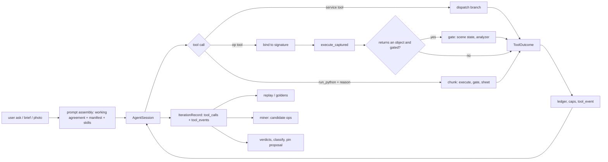

# blended — Specification and Requirements

**Date:** 2026-09-10
**Repository state reviewed:** baseline `main` @ `5764504` (clean tree, morning); **revised the same day at `8450842`** after backlog items OT-1 through OT-17 landed (`BACKLOG_DONE.md`). Every `path:line` was re-resolved against the revised tree; every count below was re-measured.
**Revised 2026-10-07** (branch `review/full-repo-2026-10-07`) after the in-Blender chat client was deleted (`184095f`, `22e1d87`) and the project moved to the `blended` MCP server in `blender_mcp/`: the client's requirements are retired in place (§3.15, AGT-10, AGT-12, AGT-16, PRM-13), the MCP server's own rows are new (§3.15), the BEN, AGT-27 and NFR-27 rows follow the code through OT-38, `path:line` evidence was re-resolved against the tree of that date (§8.4), and the counts marked 'measured 2026-10-07' were re-measured. Rows citing files that other work edits constantly cite symbols instead of lines.
**Scope:** the whole repository — `src/blended/`, `blender_mcp/`, `scripts/`, `tests/`, `docs/`, `bench_sets/`, `_evaluate/`.
**Basis:** direct reading of the source at the commit above. Every requirement carries an evidence reference, a `path:line` resolved from the file or, for files that change constantly, a path with the symbols that hold the behaviour.

## How to read this document

- **Specification** (§1–§2) states what the system *is*: its commitments, decomposition, interfaces, and file contracts.
- **Requirements** (§3–§4) states what it *must do*, one normative statement per row, each with evidence and the mechanism that verifies it.
- `MUST` / `MUST NOT` / `SHOULD` / `MAY` are RFC 2119. **A requirement with no verification mechanism is marked `(unverified)`; the six of them are listed in §6.2.**
- Requirement IDs are stable: `AREA-n`. Areas: `EXE` execution, `GATE` mesh gate, `SCENE` scene-state gate, `FORM` acceptance gate, `REL` relations, `CAP` capture, `EXP` export, `ING` ingest, `OPS` ops vocabulary, `AGT` agent loop, `PRM` prompt system, `VIS` visual instruments, `CNV` convergence loop, `BEN` benchmark, `MCP` the MCP server. Platform-wide rules are the `NFR-n` rows.
- Where a constant's value matters to a requirement, the value is quoted from its definition line and additionally listed in the register (§5).

## Measured state at this revision

| Fact | Value | Evidence |
|---|---|---|
| Blender series pin | `(5, 2)`, skew only via `BLENDED_ALLOW_VERSION_SKEW=1` | `src/blended/version.py` |
| Pure test layer | 1247 passed, 1 xfailed | `make test-pure`, measured 2026-10-07 at the end of the review follow-up (branch `fix/review-followup-2026-10-07`); the full-repo review closed at 1201 / 2 / 1, its baseline before its edits was 713 / 2 / 1, and it was 721 / 1 / 1 at the OT-25/OT-26 closing commit on 2026-09-10 |
| Blender test layer | 295 passed, 1 skipped, inside Blender 5.2.0 LTS | `make test-blender-app`, same measurement; the review closed at 288 / 1, its baseline was 247 / 1, and it was 330 / 3 on 2026-09-10, before `184095f` deleted the chat client's 87 Blender test functions |
| Test files | 69 pure, 46 blender (`test_*.py`), 2 bench-script (`tests/bench_scripts/`), 1 GUI check (`tests/gui/check_viewport_follow.py`), 6 MCP unit/live files (`blender_mcp/tests/`); measured 2026-10-07 | `tests/pure/`, `tests/blender/`, `tests/bench_scripts/`, `tests/gui/`, `blender_mcp/tests/` |
| The agent's tool surface | 8 hand-written service tools + 48 generated op tools = 56; 35 require a declared plan; 14 op tools are readers; tool-set fingerprint `t:fd10e7f510a8` pinned | `src/blended/agent/tools.py`, `_evaluate/golden/pinned_tool_schemas_fingerprint.txt` |
| Context per call | bmb qwen3.8-27b tokenizer, 2026-09-10, working agreement v14, 29 of 56 tools offered (OT-25): system prompt 4,482 (no operations section since OT-24); tools 4,164 on the OpenAI/Ollama lanes (op tools 2,823), 5,144 as the Claude Code envelope; static per call 8,646 / 9,626 before scene and history | `scripts/context_composition.py` |
| Writers, five briefs no-hatch at v14 on the disclosed surface | `claude-code:sonnet` 5 of 5 form-gate passes for $2.75 (iterations 87–92); `deepseek/deepseek-v4.1-flash` via OpenRouter 3 of 5 for $0.124, 22x cheaper, 92–95 % of input cached and 45–95 % of output spent on reasoning (iterations 118–122). The default writer is unchanged: cheap enough to iterate on, not yet good enough to gate on (OT-29) | `_evaluate/iterations.jsonl` |
| Prefix cache | Claude Code lane, v14, hatch withheld, whole set (81–86) → disclosed set (87–92): cache-read fraction fell on all five briefs (mean −0.050; planter 0.829 → 0.791, stool 0.729 → 0.647) while tokens per API call fell (planter 24,933 → 17,833); cache writes per call moved −104 on average (rose on three briefs by 48–447). The fraction is a ratio of the static prefix; writes per call is the order's number (AGT-24, OT-26) | `scripts/cache_read_report.py --before 81-86 --after 87-92` |
| The ops facade | 48 ops under the OPS-21 contract: 21 return an object (`ObjectName`), 18 of those are gated on every call, 3 are the unlinked constructors (`add_box`, `add_cylinder`, `add_lathe`); 3 typed selectors | `src/blended/ops/__init__.py`, `src/blended/ops/_contract.py`, `tests/pure/test_ops_signature_contract.py` |
| Briefs | 5 (`planter_box`, `three_leg_stool`, `uv_crate`, `ribbed_column`, `crate_with_lid`); `validate_briefs() == []`; every one passes both deterministic gates with `run_python` withheld (iterations 75, 76, 78, 79, 80) | `src/blended/evaluate/briefs.py`, `_evaluate/iterations.jsonl` |
| Mistake-memory records | 146 (`len(MISTAKES)`, measured 2026-10-07); `validate_memory() == []`; `tests/pure/test_review_mistake_memory.py` resolves every `guarded_by` against the tree | `src/blended/evaluate/mistake_memory.py` |
| Prompt pins | working agreement `v10:b6627b38f4c1` (pinned = active = 10); assembled prompt `a10:c16070bc954b`; 14 revisions registered (measured 2026-10-07), `validate_revisions() == []`; v12 (`v12:aec80122bbb2`, op tools first) is a candidate with its outcome measured once | `_evaluate/golden/pinned_identity.txt`, `_evaluate/golden/pinned_assembled_fingerprint.txt`, `src/blended/agent/prompt_versions.py` |
| Golden snapshots | v10: three_leg_stool 47, uv_crate 49, crate_with_lid 51, planter_box 66, ribbed_column 67 (66/67 re-converged under OPS-21 and signed off by the user 2026-09-10) | `tests/blender/test_golden_convergence.py`, `_evaluate/golden/*_v10/` |
| Transcript schema | 2: every tool call is a structured `tool_event`; `IterationRecord.tool_events` carries the sequence | `src/blended/agent/tool_event.py`, `src/blended/agent/transcript.py` |
| Examiner licence | **NOT licensed.** `_evaluate/eye_calibration.json`, identity `claude-code:sonnet+examiner:4bc67293e36c`; `problems()` returns one failure: cross-run control specificity 0.75 < 1.0 | measured 2026-09-10 (both readings); `src/blended/evaluate/examiner.py` |
| Pixel visual gate licence | `_evaluate/visual_gate_calibration.json` present: `minimum_silhouette_iou 0.998`, `maximum_shading_rmse 0.01`, capture 512 px, Blender series `5.2`, revision 10 | `_evaluate/visual_gate_calibration.json` |
| Benchmark | incumbent group `deepseek-v10`: 6 rolls, 120/120 exec, `cd_pca` mean 0.0252; no roll of the ops surface has ranked: the OT-9/OT-10 rolls were stopped void on 2026-09-10 (OT-20, OT-21, OT-22), OT-27's disclosed-surface rolls were 18/20, 18/20 and 13/20, the second set had a 16/20 roll, and the third set's roll 1 closed at 14/20 when the cloud credits ran out, so each set is void under §P8a (`BACKLOG.md` OT-9, OT-10, OT-27, OT-37) | `docs/2026-09-06-bench-panel-preregistration.md`, `outputs/bench/logs/` |
| Escape-hatch demand | first mining report: rename-an-object was the top candidate (4/4 gate-passing hatch calls) and is now an op; 3.00 hatch calls per gate-passing brief on the one v12 roll with the hatch offered | `docs/candidate_ops/2026-09-10-candidate-ops.md` |

---

# 1. Specification

## 1.1 What the system is

`blended` is a harness for **agentic modeling of game assets inside Blender**. Its artifact is not a mesh but a **program** — a `*Parameters` dataclass plus a `*Builder` class, or a chunk of agent-written bpy code — which is executed, measured, and judged.

The harness's stated job is to **make the environment tell the truth**: structured tracebacks annotated with known API-drift fixes, a deterministic mesh analyzer as the hard acceptance gate, and multi-view captures for inspection. Rendered critique advises; the analyzer decides (`README.md:1-11`, `src/blended/harness.py`).

## 1.2 Design commitments

These are the fixed premises the rest of the document is written against.

| # | Commitment | Where enforced |
|---|---|---|
| D1 | **Program-as-artifact**: the agent emits Python, never a bare mesh. Programs are deterministic, diffable, editable, re-runnable. | `docs/2026-08-21-harness-roadmap.md:10` |
| D2 | **One core, two frontends**: identical behavior headless (`blender --background`) and in a live GUI, behind one interface. | `docs/2026-08-21-harness-roadmap.md:11` |
| D3 | **The environment is the teacher**: effort goes into feedback fidelity (tracebacks, measurements, framed renders), not into making the agent smarter. | `docs/2026-08-21-harness-roadmap.md:12` |
| D4 | **The mesh analyzer is the hard gate; render critique is advisory.** A screenshot critic is never an acceptance gate. | `src/blended/harness.py:8-10`, `src/blended/evaluate/examiner.py` |
| D5 | **Version pinned, drift cataloged**: the pin is asserted before any geometry; every instructive traceback lands in the catalog. | `src/blended/version.py:1-12`, `src/blended/drift/catalog.py:30` |
| D6 | **Bounded iteration, then the human**: refinement is capped and escalates with the contact sheet. | `src/blended/task.py:28` |
| D7 | **`bpy` imports live inside functions**: the pure layer (config, budgets, reports, drift catalog, briefs, examiner logic) imports and tests with no Blender present. | `src/blended/__init__.py:3-5`; 69 test files under `tests/pure/` (measured 2026-10-07) |
| D8 | **Data API over `bpy.ops`**: operators are context-dependent and drift; the data API is deterministic and headless-safe. Two exceptions are documented, not hidden. | `src/blended/manifest.py:54` (`CONVENTIONS`), `src/blended/ops/uv.py:3-6`, `src/blended/ops/rigging.py:9-11` |
| D9 | **A gate must be able to fail**: every validator ships with a fixture that trips it. | `docs/2026-08-21-harness-roadmap.md:18`; e.g. `scripts/calibrate_visual_gate.py:182` |
| D10 | **No unmeasured claim as doctrine**: a decision earns a row only with a DOI and a code path, and a measured outcome. | `CLAUDE.md:15`, `docs/harness_design.md` (31 rows), rule text at its foot |

## 1.3 Architecture

### Layers

| Layer | What lives there | Proven by |
|---|---|---|
| Pure | everything that imports without Blender: contracts, schemas, records, plans, the ledger, the miner, briefs, budgets, drift catalog, prompt registry | `tests/pure/` (69 files; 1247 passed, 1 xfailed, measured 2026-10-07) on any machine |
| Blender | everything whose body touches `bpy`, always inside a function, never at import (D7) | `tests/blender/` (46 files; 295 passed, 1 skipped, measured 2026-10-07) inside the installed Blender |
| Frontends | `blender_mcp/` (the `blended` MCP server a client such as Claude Code spawns, and the Blender add-on whose socket runs each call on Blender's main thread through `dispatch_tool`) and `scripts/` (host Python plus `blender --background` drivers) | `make test-mcp`, `make test-mcp-blender`, `make test-viewport-gui`, `make chat-e2e`, `make converge`, `make bench-3dcode` |
| Lanes | the transports a session may use: Ollama native, Ollama Cloud, OpenAI-protocol llama-swap on `bmb` and `big`, a llama-server on this machine (the fine-tune experiment's two checkpoints), OpenRouter (the one metered lane: window read from its catalogue, price recorded per call, run capped — NFR-27, OT-28), the Claude Code CLI with a `oneOf`-per-tool structured envelope | `make provider-smoke`, `tests/pure/test_claude_code_lane.py` |

Two structural rules hold across every layer: `bpy` imports live inside functions, and every feature has exactly one execution path — no fallback, no legacy branch, no stub (NFR-13). Where a second path was found during OT-1–OT-17 (a manifest search beside the schema search, an id-based and a positional way to answer pending tool calls, a tuple and an object across the dispatch seam) it was deleted, not kept.

### Package map

| Package | Modules | Responsibility | Needs `bpy` |
|---|---|---|---|
| `blended.ops` | 16 op modules (`primitives`, `booleans`, `lathe`, `legs`, `arrays`, `modifiers`, `heal`, `transforms`, `materials`, `material_nodes`, `uv`, `rigging`, `weights`, `animation`, `canonical_orientation`, `selectors`); private plumbing `_contract` (the OPS-21 contract, the `@op` markers), `_objects` (`ObjectName`, the one name resolver) | the sanctioned construction vocabulary: 48 ops, every one re-exported by the facade `__init__`; object references are names in and names out | yes (inside functions) |
| `blended.builders` | `crate`, `barrel`, `pallet` | three `Parameters`+`Builder` pairs, importing the facade only | yes |
| `blended.agent` | `tools` (service tools, the generated op tools, the dispatch door), `tool_schemas` (the generator), `op_call` (binding, capture, gate), `outcome`, `intermediates` (the ledger), `tool_event` (the schema-2 record), `loop` (`AgentSession`: transports, plan enforcement, caps, budget, events), `claude_code` (CLI lane, envelope, `TurnCost`), `plan`, `system_prompt` / `prompt_templates` / `prompt_versions` / `skill_modules` / `prompt_search`, `transcript` | the agent-computer interface and the session loop | mixed: `tools` and `op_call` reach `bpy` only through the op bodies and the service branches |
| `blended.harness`, `blended.stages`, `blended.run` | `harness` (chunk execution, `GateVerdict` / `gate_object`, capture and export back half), `stages` (the one stage vocabulary), `run.executor` (`execute_captured`, the one capture path), `run.retry`, `run.session_log` | execute → locate → gate → export, for a chunk and for an op call alike | yes |
| `blended.analyze` | `mesh_checks` (the analyzer), `pair_checks`, `metamorphic` | the hard gate and its relations | mixed |
| `blended.evaluate` | `briefs`, `acceptance` (form gate), `replay`, `iteration_log`, `examiner`, `visual_diff`, `digest`, `object_identity`, `mistake_memory` (146 records), `candidate_ops` (the miner) | scoring, evidence, replay, memory | mixed (examiner, miner, memory pure) |
| `blended.capture`, `blended.export`, `blended.ingest` | views, contact sheets, UV layout, reference photos; glTF export with welded round trip; GLB import and bounded cleanup | pictures in and out; files in and out | yes |
| `blender_mcp` (outside `src/blended`) | `mcp/blmcp` (the stdio server; `tools_helpers/blended_bridge.py` serves `TOOL_SCHEMAS`, the plan gate, the session log, the source watcher and the handoff; `blended_bridge_toolcode.py` is the body that runs inside Blender), `addon/blender_mcp_addon` (the socket server in Blender) | the MCP frontend; Blender Lab's code, vendored as a subtree and extended | the toolcode and the add-on, yes; the server, no |
| `blended.manifest`, `blended.drift`, `blended.version`, `blended.reset`, `blended.task`, `blended.viewport_follow` | the generated manifest the prompt carries; API-drift catalog; series pin; wipe-to-canonical scene; the 3-round task loop; framing of what a scene-changing MCP call touched in the user's 3D viewport | support | mixed |
| `scripts/` | `run_agent_task` (converge), `replay_iteration`, `pin_*`, `calibrate_*`, `chat_e2e`, `sweep_3dcode` / `run_3dcode_instance` / `diagnose_3dcode` / `bench_panel` / `paired_bench_delta`, `mine_candidate_ops`, `converge_auto`, `photo_to_model`, `provider_smoke` | operational entry points | host Python, or `blender --background` |

### One tool call, end to end

1. The transport returns a reply; the loop checks the token budget at this seam (AGT-9) and, for each tool call, whether the tool is withheld (AGT-22) and whether a plan was declared (AGT-5).
2. `dispatch_tool`, on the main thread (AGT-2), is the door: a service tool goes to its branch; an op tool goes to `op_call` with `plan_step` stripped; any other name is refused before `bpy` is touched (AGT-21).
3. `op_call.bind_arguments` converts the JSON arguments against the op's own type hints — the hints the schema was generated from — and fails loud on an unknown, missing or mistyped parameter; the op runs through `execute_captured`, the same capture path a Python chunk takes.
4. If the op's return names an object and the op is gated, `gate_named_object` runs scene state then the analyzer (`GateVerdict`); the result speaks the stage vocabulary of `blended.stages` (EXE-6).
5. The `ToolOutcome` carries the text the model reads, the images to attach, and the structure the model never sees: ok, stage, validated arguments, gate verdicts, intermediates created and resolved, and for the hatch the reason and source hash.
6. The loop debits and credits the intermediate ledger (OT-5), counts consecutive gate failures per object (AGT-20), emits the `tool_event` record (AGT-17), and appends the tool message. An answer is refused while an intermediate is unresolved; the turn stops at the gate-failure cap, the tool-call cap or the token budget.

### Evidence artifacts

| Artifact | Minted by | Read by |
|---|---|---|
| `_evaluate/golden/pinned_identity.txt`, `pinned_assembled_fingerprint.txt`, `pinned_tool_schemas_fingerprint.txt` | `make pin`; the fingerprint files from their own generators | the pure pin tests: a prompt or schema change is visible or the suite is red |
| `_evaluate/golden/<brief>_v<n>/` views and `manifest.json` | `make pin-golden-views` from replayed clean runs; signed off by a person | the golden tests and the pixel gate |
| `_evaluate/iterations.jsonl` (`tool_calls`, `tool_events`), `_evaluate/verdicts.jsonl` | `scripts/run_agent_task.py` | replay, the golden tests, the miner, the exporter (OT-18) |
| `docs/candidate_ops/<date>-candidate-ops.md` | `make mine-ops FROM=n` | whoever grows the vocabulary next |
| `outputs/bench/diagnose_*.json`, `outputs/bench/logs/` | the bench chains | `scripts/bench_panel.py` |

## 1.4 Data flow

```mermaid
flowchart LR
  A[user ask / brief / photo] --> B[prompt assembly: working agreement + manifest + skills]
  B --> C[AgentSession]
  C --> D{tool call}
  D -->|service tool| E[dispatch branch]
  D -->|op tool| F[bind to signature]
  F --> G[execute_captured]
  G --> H{returns an object and gated?}
  H -->|yes| I[gate: scene state, analyzer]
  H -->|no| J[ToolOutcome]
  I --> J
  E --> J
  J --> K[ledger, caps, tool_event]
  K --> C
  D -->|run_python + reason| L[chunk: execute, gate, sheet]
  L --> J
  C --> M[IterationRecord: tool_calls + tool_events]
  M --> N[replay / goldens]
  M --> O[miner: candidate ops]
  M --> P[verdicts, classify, pin proposal]
```

Two lanes converge on the same gates: the **program lane** (prompt → op tools or a Parameters+Builder → executed bpy) and the **ingest lane** (image/text → generated GLB → import + cleanup → executed bpy). Everything downstream of "executed bpy" is lane-agnostic (`docs/2026-08-21-harness-roadmap.md:20-40`). The escape hatch is a third path only in the sense that it is measured: every `run_python` call carries a `reason` and a source hash, and the miner turns those into the next ops (OT-7, OT-12).

## 1.5 Instrument hierarchy and licensing

| Tier | Instrument | Authority | Licence to act |
|---|---|---|---|
| 1 | Deterministic structural gate (`analyze_object`, `MeshBudget`) | decides pass/fail, blocks export | none needed |
| 2 | Deterministic form gate (`evaluate_brief` against an `AssetBrief`) | decides pass/fail for a specified asset | none needed |
| 3 | Deterministic relations (`probe`, `NoInterpenetrationSpec`, `DistinctMaterialSpec`) | decides pass/fail with no reference artefact in some cases | none needed |
| 4 | Pixel visual gate (`compare_view_files` vs pinned golden) | decides drift against the pinned revision | `_evaluate/visual_gate_calibration.json` |
| 5 | VLM examiner (`examine_asset`) | **describes**; produces tags, never a pass | `_evaluate/eye_calibration.json`, `problems()` must be empty |
| 6 | Human | applies a pin; is the judge when no machine is licensed | `make pin` |

The examiner *describes* rather than adjudicates (D4). Its tags are split into those a deterministic probe already owns (`MEASURED_DEVIATION_TAGS`, `src/blended/evaluate/examiner.py:72`) and those that halt the loop and demand a new numeric probe (`HALTING_DEVIATION_TAGS`, `:82`).

## 1.6 Two references, two questions

The visual gate asks "did the render move from the accepted state?" and compares against the **pinned** revision. The examiner asks "does this deliver the brief?" and compares against an **exemplar of the configuration under test**. Pointing the examiner at the pinned reference returned every incidental choice of that writer as a deviation (`scripts/run_agent_task.py:169-179`, `docs/harness_design.md` row 28).

## 1.7 Design philosophy

The commitments in §1.2 say what the system is. These are the working rules that produced the code as it stands, each with the place it bit hardest today.

1. **One path per feature.** A feature has one execution path; when it cannot produce a usable result it fails with the cause named. No fallbacks, no legacy shims, no compatibility branches — two paths give results that take hours to trace. When the transcript record changed shape (OT-8), the replay kept reading one encoding for old and new records rather than growing a second reader; the old records were not migrated into fields nobody measured.
2. **The environment is the teacher.** Effort goes into feedback fidelity, not into making the model smarter: a binding error names the parameter, a boolean that changed nothing raises `BooleanNoOp`, a rename onto a taken name raises `NameTaken` instead of minting `.001`, and a gate verdict comes back with every op call that returns an object.
3. **The vocabulary is the interface; the hatch is a signal.** Construction goes through op tools generated from the facade; `run_python` stays, because a vocabulary that cannot be exceeded cannot grow, but every use must say what was missing, and the miner ranks those reasons by how often they passed the gate. The first report's top candidate became an op the same day.
4. **The signature carries the meaning the model gets.** Units in names, `ObjectName` for a return that names an object, a `Literal` enum for a selector's kind, and — measured twice on the planter — the summary line, because that line is all the manifest and the schema carry. What is in the docstring body does not reach the model.
5. **Nothing is written twice.** The manifest, the tool schemas, the plan-required set, the readers, the gated set and both fingerprints are derived from the code; a hand-written copy drifts, so there is none.
6. **Gates before eyes, and the human mints the reference.** The deterministic gates decide; renders and the examiner describe; a golden view is minted from a replayed clean run and signed off by a person. When the pixel gate says "the render moved" against a fresh run, that is the instrument working, not a failure of the surface.
7. **Write the number, and the wrong number too.** A claim enters as a measurement with its evidence, and a falsified one is corrected in place with the mechanism recorded: the 750k token budget was derived on an 8-tool lane and stopped an honest 50-tool turn at call 16; the constant now carries both numbers and the 2.25× that OT-13's decision reads.
8. **Cost is bounded, not just measured.** A turn stops at the tool-call cap, at three consecutive gate failures on one object, and at the per-turn token budget, at a seam where every pending call still gets a result.
9. **Small steps, each with its assertion.** Every item in `BACKLOG_DONE.md` closed only with its gating test in the tree and both layers green, with the spec rows it amends in the same change; a closed entry is never edited — a correction is recorded beside it.
10. **Evidence is append-only and replayable.** A scored run rebuilds from its own recorded calls with no model present; a signature change that breaks recorded model code fails the golden replays, which is the point of keeping them.

---

# 2. Interfaces

## 2.1 Python API (the library front door)

| Entry point | Signature | Effect |
|---|---|---|
| `run_builder` | `(builder, settings=HarnessSettings()) -> HarnessResult` | build via a Parameters+Builder object, then gate, capture, optionally export (`src/blended/harness.py:538`) |
| `run_chunk` | `(source_code, object_name, fix_source=None, settings=..., chunk_label="<agent>") -> HarnessResult` | execute agent source with the drift-annotated retry loop, then gate (`src/blended/harness.py:482`) |
| `run_agent_task` | `(task: AgentTask, write_code, settings=None, maximum_rounds=3) -> TaskResult` | 3-round loop with agent-shaped failure feedback (`src/blended/task.py:179`) |
| `analyze_object` | `(blender_object) -> MeshReport` | measure the evaluated mesh (`src/blended/analyze/mesh_checks.py:599`) |
| `analyze_pair` | `(first_object, second_object) -> PairReport` | interpenetration and separation (`src/blended/analyze/pair_checks.py:139`) |
| `probe` | `(build, parameters, relations) -> MetamorphicReport` | the reference-free gate (`src/blended/analyze/metamorphic.py:225`) |
| `evaluate_brief` / `refine_brief` | `(brief) -> AcceptanceReport` / `(brief, step) -> AssetBrief` | the form gate and its refinement step (`src/blended/evaluate/acceptance.py:578,851`) |
| `export_glb` | `(blender_object, output_path) -> ExportReport` | export and re-import verification (`src/blended/export/gltf.py:133`) |
| `build_manifest` | `(include_drift_catalog=True) -> str` | the agent capability manifest, generated from live code (`src/blended/manifest.py:112`) |
| `build_system_prompt` | `(revision=None, lane=None) -> str` | assembled system prompt (`src/blended/agent/system_prompt.py:41`) |

`blended.ops.__init__` re-exports the sanctioned construction vocabulary; callers build through it rather than raw `bpy` (`src/blended/ops/__init__.py`).

## 2.2 Agent tool surface (the ACI)

`TOOL_SCHEMAS` (`src/blended/agent/tools.py`) is the eight hand-written **service tools** below plus one **generated op tool per facade op** (48 at this revision, 56 tools in all; 35 require a declared plan, 14 are readers) (`OP_TOOL_SCHEMAS`, built by `blended.agent.tool_schemas.build_tool_schemas()` from the OPS-21 signatures: parameters are the signature, quantities carry their unit in the name, object references are names, config dataclasses become object schemas). The whole set is fingerprinted `t:{hex12}` (`TOOL_SCHEMAS_FINGERPRINT`), pinned in `_evaluate/golden/pinned_tool_schemas_fingerprint.txt`, and written into every `IterationRecord`. Service tools are executed by `dispatch_tool`'s own branches; an op tool is bound, run and — when its return names an object — gated by `blended.agent.op_call.call_op` (AGT-21, AGT-3), and any other name is refused before bpy is touched. Every tool returns a `ToolOutcome` (text, images, and the scene effects the loop's intermediate ledger reads).

| Tool | Parameters | Purpose |
|---|---|---|
| `run_python` | `source`, `reason` (both required), `object_name`, `plan_step` | the escape hatch: execute a chunk for what the op tools cannot express and gate the named object; omitting `object_name` runs ungated; a blank `reason` is refused |
| `inspect_object` | `object_name` (required), `plan_step` | the analyzer report for one object |
| `inspect_domain` | `object_name`, `domain` in `rig`/`weights`/`animation`/`material` | non-mesh state |
| `render_views` | `object_name`, `xray`, `look_for`, `plan_step` | contact sheet of the named views |
| `search_ops` | `query` | closest ops by signature |
| `list_scene` | — | mesh objects with triangle counts and dimensions |
| `export_asset` | `object_name`, `path`, `plan_step` | .glb export with re-import verification |
| `declare_plan` | `steps: [str]` | declare the numbered plan once per scene-changing turn |

## 2.3 Model transport lanes

| Lane | Model-id form | Endpoint | Timeout |
|---|---|---|---|
| local Ollama daemon | bare id | `LOCAL_ENDPOINT` = `http://localhost:11434` (`src/blended/agent/loop.py`) | 300 s (`REQUEST_TIMEOUT_SECONDS`) |
| Ollama cloud | `:cloud` suffixed | `CLOUD_ENDPOINT` = `https://ollama.com` (`src/blended/agent/loop.py`) | 300 s |
| bmb llama-swap | ids in `BMB_MODEL_IDS` | `BMB_ENDPOINT`, port 9292 (`src/blended/agent/loop.py`) | 2000 s (`LLAMA_SWAP_REQUEST_TIMEOUT_SECONDS`; was 900) |
| big llama-swap | `qwen3-vl` (`BIG_MODEL_IDS`) | `BIG_ENDPOINT`, port 8081 (`src/blended/agent/loop.py`) | 2000 s |
| llama-server on this machine | `qwen2.5-coder-7b-instruct`, `blenderllm` (`LOCAL_LLAMA_SERVER_MODEL_IDS`, the fine-tune decision experiment's two checkpoints) | `LOCAL_LLAMA_SERVER_ENDPOINT` = `http://127.0.0.1:8091` (`src/blended/agent/loop.py`) | 2000 s (`LONG_CEILING_ENDPOINTS`) |
| OpenRouter | `vendor/model` | `OPENROUTER_ENDPOINT` = `https://openrouter.ai/api` (`src/blended/agent/loop.py`) | 300 s |
| Claude Code CLI | `claude-code:opus`, `:sonnet`, `:haiku` (`CLAUDE_CODE_MODEL_IDS`, `src/blended/agent/claude_code.py`) | `claude-code://cli` | 900 s (`CLAUDE_CODE_REQUEST_TIMEOUT_SECONDS`) |

Routing is by model id (`_implied_endpoint` in `src/blended/agent/loop.py`); credentials come from files, not the shell environment, because a Finder-launched Blender inherits none (`_read_bmb_api_key`, `_read_openrouter_api_key`). The LAN endpoint addresses are the constants' values and are not restated here.

## 2.4 CLI / Make targets

| Target | Runs | Proves |
|---|---|---|
| `make test` | `test-pure` + `test-blender-app` + `test-mcp` | the three layers |
| `make test-pure` | `.venv/bin/python -m pytest tests/pure -q` | the Blender-free layer |
| `make test-blender-app` | installed Blender + `scripts/run_tests_in_blender.py` | the environment blended runs in over MCP |
| `make test-blender` | `pytest tests/blender` against a pip `bpy` wheel | nothing in practice: the repo `.venv` is Python 3.11 and Blender 5.2's wheel is cp313, so a bare run collects nothing and exits 5 (§7.4) |
| `make test-mcp` | the five `blender_mcp/tests/test_*.py` unit files (server, tool listing, bridge, RST parse and search) | the MCP server and the blended bridge, without Blender |
| `make test-mcp-blender` | `blender_mcp/tests/test_blender_mcp_with_blender.py TestBackgroundServer` | MCP client → server → socket → add-on main-thread exec → `dispatch_tool`, in a real background Blender |
| `make test-viewport-gui` | `tests/gui/check_viewport_follow.py` in a factory-startup GUI Blender with throwaway user resources | the framing against Blender's own projection; a window opens for a few seconds; the verdict is Blender's exit code |
| `make install-mcp-addon` | symlinks `blender_mcp/addon/blender_mcp_addon` into Blender as extension `mcp`, enables it, allows online access | the add-on the server talks to; snapshots `userpref.blend` first |
| `make test-repro` | `scripts/rebuild_twice.py` | two fresh Blenders, different `PYTHONHASHSEED`, identical digests |
| `make converge` | `scripts/run_agent_task.py --brief --revision --iteration` | one gated, rendered, logged iteration; `ARGS="--no-hatch"` withholds `run_python` (OT-13) |
| `make converge-local` | same driver, local writer+eye, `outputs/local_pair` | the fully local pair, kept out of `_evaluate/` |
| `make converge-auto` | `scripts/converge_auto.py --revision` | the unattended loop; ends in a pin proposal or a halt report |
| `make pin` | `scripts/pin_revision.py --revision` | the one human act: applying a pin |
| `make replay` | `scripts/replay_iteration.py --iteration` | rebuild a scored iteration from its own log |
| `make calibrate-eye` | `scripts/calibrate_examiner.py` | writes the eye licence |
| `make calibrate-visual-gate` | `scripts/calibrate_visual_gate.py --revision` | writes the pixel-gate thresholds |
| `make pin-golden-views` | `scripts/pin_golden_views.py --revision` | mints per-view golden references |
| `make bench-3dcode` | `scripts/sweep_3dcode.py --bench-root --instances-file` | the external benchmark sweep |
| `scripts/freeze_worktree.sh` | one frozen checkout per COMMIT under `~/blended-worktrees`, reused if it exists; `--list` shows each with in-use state, `--prune` removes the idle ones | a roll must not read a tree that is being edited, and the freezes must not accumulate: six appeared in one evening (839 MB, ~700 MB dead) when they were made ad hoc and never removed |
| `scripts/bench_chain.sh` | sweep → `scripts/bake_3dcode.py` → the bench's scorers → `diagnose_3dcode.py`, from a frozen worktree | one rankable roll; the scorers run only after a complete bake (OT-21) |
| `make chat-e2e` | `scripts/chat_e2e.py` | six scenarios (object, rig, weights, animation, material, iterative edit) through `AgentSession`, hard-asserted; `ARGS="--no-hatch"` withholds `run_python` and lists missing-op evidence (OT-11) |
| `make mine-ops` | `scripts/mine_candidate_ops.py --from-iteration` | the candidate-op report from v2 records (OT-12) |
| `scripts/context_composition.py` | the assembled prompt and the tool set split into parts and counted with bmb's tokenizer; `--spec` rewrites the "Context per call" row | what one call is made of, per lane (OT-23); refuses to estimate when the tokenizer is unreachable |
| `scripts/derive_core_tools.py` | derives `CORE_OPS` from the gate-passing records of `_evaluate/iterations.jsonl` and writes `src/blended/agent/core_tools.py`; `--check` exits 2 on drift | the disclosed core op set (OT-25), never listed by hand |
| `scripts/bench_fscore.py` | F-score, precision and recall at four a-priori thresholds beside `cd_pca`, plus the reference audit; reuses the scorer's own sampling and normalisation | whether the metric can see what CD cannot (OT-33, DOI 10.1109/cvpr.2019.00352); runs under the bench venv, no model time |
| `scripts/cache_read_report.py` | cache-read fraction and cache writes per call per run from the records, `--before A-B --after C-D` pairs each brief's latest run on each side | whether the cached prefix held across a change (OT-26) |
| `make photo-to-model` | `scripts/photo_to_model.py` | photo in, gated model out |
| `make provider-smoke` | `scripts/provider_smoke.py` | one text + one image call per lane |

## 2.5 File and artifact contracts

| Path | Role | Committed? |
|---|---|---|
| `_evaluate/iterations.jsonl` | append-only record of every iteration (`src/blended/evaluate/iteration_log.py:20`); since OT-8 each record carries `tool_events`, the structured tool sequence | yes — the golden tests replay from it |
| `_evaluate/verdicts.jsonl` | judgements, separate from measurements (`src/blended/evaluate/iteration_log.py:21`) | yes |
| `_evaluate/golden/` | pinned per-view references and their `manifest.json` | yes |
| `_evaluate/golden/pinned_identity.txt`, `pinned_assembled_fingerprint.txt`, `pinned_tool_schemas_fingerprint.txt` | the three pins: working-agreement identity, assembled-prompt fingerprint, tool-set fingerprint (PRM-7, AGT-1) | yes — each is compared by a pure test |
| `docs/candidate_ops/<date>-candidate-ops.md` | the miner's dated report (CNV-14) | yes |
| `src/blended/agent/core_tools.py` | GENERATED: `CORE_OPS`, the disclosed core op set derived from `_evaluate/iterations.jsonl` by `scripts/derive_core_tools.py` (AGT-1, OT-25); never edited by hand, `--check` exits 2 on drift | yes — `tests/pure/test_tool_disclosure.py` compares it with the derivation |
| `outputs/bench/logs/` | the bench chains' scripts and logs (OT-9, OT-10) | **no** — operational |
| `_evaluate/eye_calibration.json`, `_evaluate/visual_gate_calibration.json` | the two licences (`src/blended/evaluate/examiner.py:121`; `src/blended/evaluate/visual_diff.py:156`) | yes |
| `_evaluate/pin_proposal.json` / `_evaluate/halt_report.md` | the loop's two terminal artifacts (`scripts/converge_auto.py:43,44`) | yes |
| `_evaluate/renders/**/*.png`, `**/*.glb` | per-iteration renders and exports | **no** — regenerated by `make replay` (`.gitignore`) |
| `outputs/` | local-model run artifacts | **no** — regenerable, large (`.gitignore`) |
| `logs/*` | session transcripts: the MCP server's `logs/mcp-<timestamp>.jsonl` (schema 2), its watcher handoff `logs/mcp-handoff-<client pid>.json`, and the `AgentSession` drivers' transcripts (`src/blended/agent/transcript.py`) | **no** (`.gitignore`) |
| `_renders/harness/` | default contact-sheet directory (`DEFAULT_OUTPUT_DIRECTORY` in `src/blended/harness.py`) | **no** — scratch; `_renders/` is gitignored |

The benchmark checkout (`/Users/ladvien/3dcodebench`) is **read-only** except `results/text_to_3D_agent/<new dirs>`; benchmark runs MUST NOT write to `_evaluate/` (`scripts/run_3dcode_instance.py:23`).

---

# 3. Functional requirements

Each row is one normative statement with its evidence and the mechanism that verifies it. `(unverified)` marks a requirement with no automated check in the tree.

## 3.1 Execution, retry, and session logging (`EXE`)

| ID | Requirement | Evidence | Verified by |
|---|---|---|---|
| EXE-1 | The harness MUST execute agent source **in-process** against the live `bpy` and return a `RunResult` carrying the full traceback on failure. | `src/blended/run/executor.py:121` | `tests/blender/test_executor.py` |
| EXE-2 | A chunk's returned stdout MUST be bounded to `MAXIMUM_STDOUT_CHARACTERS` (2000), keeping the tail. | `src/blended/run/executor.py:29` | `tests/blender/test_executor.py` |
| EXE-3 | A failed traceback MUST be matched against the drift catalog and the matched entries attached to the result. | `src/blended/run/executor.py` (`run_source_in_process`), `src/blended/drift/catalog.py:30` | `tests/pure/test_drift_catalog.py` |
| EXE-4 | The retry loop MUST cap at `MAXIMUM_RETRIES_DEFAULT` (2) and MUST NOT retry past it. | `src/blended/run/retry.py:23,78` | `tests/blender/test_retry.py` |
| EXE-5 | The retry prompt MUST contain the exact source that ran, the full traceback, and every matched drift fix. | `src/blended/run/retry.py:51` | `tests/pure/test_retry_prompt.py` |
| EXE-6 | `run_chunk` and an op-tool call MUST report `stage_reached` as one of `execute`, `locate`, `gate`, `export`, `done` — defined once in `blended.stages` — and MUST NOT claim success past the stage that failed. | `src/blended/stages.py`, `src/blended/harness.py` (`HarnessResult`), `src/blended/agent/op_call.py` | `tests/blender/test_harness.py`, `tests/pure/test_agent_dispatch.py` |
| EXE-7 | `run_builder` MUST report a builder exception as `stage_reached="execute"` with the traceback, and MUST NOT apply the retry loop (no `fix_source` exists on that path). | `src/blended/harness.py:538` | `tests/blender/test_harness.py` |
| EXE-8 | The session log MUST be append-only JSONL, one line per attempt, at `LOG_SCHEMA_VERSION` 1, with a 12-character source hash. | `src/blended/run/session_log.py:19,20` | `tests/pure/test_session_log.py` |
| EXE-9 | **RETIRED 2026-10-07 (dead code removed).** Was: The subprocess executor MUST time out at `SUBPROCESS_TIMEOUT_SECONDS` (240) and MUST take the Blender binary from the `BLENDER` environment variable. | — | — |
| EXE-10 | **RETIRED 2026-10-07 (dead code removed).** Was: `run_batch` MUST factory-reset the scene between items so results stay independent, and MUST evaluate every item even when one fails. | — | — |
| EXE-11 | The Blender series MUST be asserted against `TARGET_BLENDER_SERIES` (5, 2) before any geometry is built; skew MUST be allowed only via `BLENDED_ALLOW_VERSION_SKEW=1` and MUST print a warning. | `src/blended/version.py:18,23,37` | `tests/blender/test_reset.py`, `tests/pure/test_import_integrity.py` |
| EXE-12 | A rebuild MUST start from a wiped scene, and the wipe MUST be asserted, listing leftover datablocks by name (capped at `LEFTOVER_NAMES_REPORTED` = 10). | `src/blended/reset.py:45,69,74,111,157` | `tests/blender/test_reset.py`, `tests/blender/test_rebuild_in_session.py` |
| EXE-13 | The clean-scene assertion MUST NOT require materials or images to be empty, because a live GUI holds an unremovable `Render Result` / `Viewer Node` image. | `src/blended/reset.py:69` | `tests/blender/test_reset.py` |
| EXE-14 | `CANONICAL_FPS` MUST be 24 and MUST be restored around any import that rewrites `scene.render.fps`. `reset_scene` MUST also restore, and `assert_clean_scene` MUST assert, the frame range (1-250) and current frame (1), the unit system, scale and length unit (METRIC, 1.0, METERS) and the render resolution (1920x1080 at 100%). | `src/blended/reset.py:30` | `tests/blender/test_reset.py`, `tests/blender/test_review_followup.py` |
| EXE-15 | A metamorphic or digest rebuild MUST call the assertion, not only the wipe. | `src/blended/reset.py` | `tests/blender/test_metamorphic.py` |

## 3.2 The structural gate (`GATE`)

The analyzer is the hard gate. It measures the **evaluated** mesh (modifiers applied) and reports each failure as a measurement, never a bare boolean.

| ID | Requirement | Evidence | Verified by |
|---|---|---|---|
| GATE-1 | A mesh MUST be rejected when its triangle count exceeds `MeshBudget.maximum_triangle_count` (default `DEFAULT_PROP_TRIANGLE_BUDGET` = 2000). | `src/blended/analyze/mesh_checks.py:31,35` | `tests/blender/test_analyzer_fixtures.py` |
| GATE-2 | With `require_manifold` (default true), non-manifold edges MUST fail the gate: an edge shared by more than two faces, or by none (a wire edge), the definition of Blender's Select Non-Manifold. | `src/blended/analyze/mesh_checks.py:35` | `tests/blender/test_analyzer_fixtures.py` |
| GATE-3 | With `allow_boundary_edges` false (default), an open mesh MUST fail. | `src/blended/analyze/mesh_checks.py:35` | `tests/blender/test_analyzer_fixtures.py` |
| GATE-4 | Zero-area faces (below `ZERO_AREA_EPSILON_M2` = 1e-9) and non-finite coordinates MUST fail **unconditionally**, with no budget flag. | `src/blended/analyze/mesh_checks.py:24` | `tests/blender/test_analyzer_fixtures.py` |
| GATE-5 | Connected-component count MUST be gated by `maximum_component_count` (default 1). | `src/blended/analyze/mesh_checks.py:35` | `tests/blender/test_analyzer_fixtures.py` |
| GATE-6 | Duplicate vertex pairs within `DUPLICATE_VERTEX_DISTANCE_M` (1e-5 m) MUST fail. | `src/blended/analyze/mesh_checks.py:27` | `tests/blender/test_analyzer_fixtures.py` |
| GATE-7 | Self-intersecting face pairs MUST fail unless `allow_self_intersections`, counted by BVH self-overlap with pairs sharing a vertex excluded. | `src/blended/analyze/mesh_checks.py:35` | `tests/blender/test_pair_checks.py` |
| GATE-8 | Inward-facing triangles MUST be counted by **ray parity** (one epsilon step along the normal, crossings counted, odd = flipped), capped at `PARITY_MAXIMUM_CASTS` (64) casts per triangle; the count is meaningful only on a closed manifold. | `src/blended/analyze/mesh_checks.py:224,225` | `tests/blender/test_flipped_normals.py` |
| GATE-9 | Inverted facets — a triangle disagreeing with its own vertex normals — MUST be counted unconditionally, with no epsilon (a zero-area facet is not counted). | `src/blended/analyze/mesh_checks.py:55` | `tests/pure/test_inverted_facets.py`, `tests/blender/test_analyzer_fixtures.py` |
| GATE-10 | UV checks MUST run when `require_uv_layer`: layer presence, overlapping pairs, out-of-bounds faces, island count against `maximum_uv_island_count`. | `src/blended/analyze/mesh_checks.py:35` | `tests/blender/test_uv.py` |
| GATE-11 | UV overlap MUST be counted with a uniform-grid broadphase at resolution `UV_BROADPHASE_GRID_RESOLUTION` (32), because `BVHTree.overlap` silently returns nothing for exactly-coplanar triangles. | `src/blended/analyze/mesh_checks.py:438` | `tests/blender/test_analyzer_fixtures.py` |
| GATE-12 | `uv_coverage_fraction` MUST be the **sum** of UV triangle areas over the unit square, so a value near 1.0 with non-zero overlap reads as stacking, not packing. | `src/blended/analyze/mesh_checks.py:55` | `tests/blender/test_uv.py` |
| GATE-13 | `MeshReport` MUST carry `volume_m3` (signed) and `surface_area_m2`; nothing MUST gate on volume, which is meaningful only on a closed manifold. | `src/blended/analyze/mesh_checks.py:55` | `tests/blender/test_metamorphic.py` |
| GATE-14 | The gate MUST produce a **contact sheet on FAIL as well as PASS** — a failure you cannot review is a failure you will repeat. | `src/blended/harness.py:8-10,401` | `tests/blender/test_harness.py` |
| GATE-15 | Export MUST run only on a gate-passing mesh. | `src/blended/harness.py:401` | `tests/blender/test_export_round_trip.py` |
| GATE-16 | A pair's `intersecting_face_pair_count` MUST be reported only when the AABB penetration depth exceeds `CONTACT_DEPTH_TOLERANCE_M` (0.002 m), so resting contact reads zero; the residual MUST be exposed as `aabb_penetration_depth_m` and gated opt-in by `NoInterpenetrationSpec.maximum_aabb_penetration_depth_m`. | `src/blended/analyze/pair_checks.py:42,46,139` | `tests/blender/test_pair_checks.py` |
| GATE-17 | Pair separation MUST be measured vertex-to-**surface** in both directions and reported as the minimum, sampling at most `PAIR_SEPARATION_SAMPLE_LIMIT` (512) vertices per direction; it MUST be documented as an upper bound, not the true separation. | `src/blended/analyze/pair_checks.py:36,139` | `tests/blender/test_pair_checks.py` |
| GATE-18 | Every check MUST have a fixture that trips it and a clean fixture that does not. | `docs/2026-08-21-harness-roadmap.md:18` | `tests/blender/test_analyzer_fixtures.py` |

## 3.3 The scene-state gate (`SCENE`)

The analyzer reads the mesh datablock, so it cannot see an object nobody can see, or a transform that poisons every world-space number.

| ID | Requirement | Evidence | Verified by |
|---|---|---|---|
| SCENE-1 | The view layer MUST be synchronised (`bpy.context.view_layer.update()`) before any evaluated state is read, because a freshly linked object and a freshly assigned scale are otherwise absent from `view_layer.objects` / `matrix_world`. | `src/blended/harness.py:345` | `tests/blender/test_harness.py` |
| SCENE-2 | An object MUST fail when it is unlinked, in an excluded collection, hidden, or `hide_render`; the message MUST name the cause to fix, walking coarsest to finest. | `src/blended/harness.py:255` | `tests/blender/test_harness.py` |
| SCENE-3 | A non-finite object transform MUST fail, because every world-space measurement printed from it is meaningless and glTF export raises. | `src/blended/harness.py:324` | `tests/blender/test_harness.py` |
| SCENE-4 | A collapsed transform MUST be detected by **scale-length anisotropy** below `COLLAPSED_SCALE_RATIO` (1e-6), not by determinant, so a legitimately tiny uniformly-scaled object passes. | `src/blended/harness.py:342` | `tests/blender/test_harness.py` |
| SCENE-5 | The scene-state check MUST run before the analyzer, because with a NaN matrix "can it be seen" is not a meaningful question. | `src/blended/harness.py:390,401` | `tests/blender/test_harness.py` |
| SCENE-6 | `world_extents_m` MUST be carried on every result from the gate onward, including the gate-FAIL result, and MUST NOT gate anything. | `src/blended/harness.py` (`HarnessResult`, `_gate_capture_export`) | `tests/blender/test_observation_channel.py` |

## 3.4 The form gate (`FORM`)

The form gate answers "does the object deliver the brief", deterministically, before any visual token is spent.

| ID | Requirement | Evidence | Verified by |
|---|---|---|---|
| FORM-1 | Dimensions MUST be measured against the brief's `DimensionSpec` within `DIMENSION_TOLERANCE_M` (0.02 m), and every failure MUST be reported as measurement + delta. | `src/blended/evaluate/briefs.py:49`, `src/blended/evaluate/acceptance.py:578` | `tests/blender/test_acceptance_gate.py` |
| FORM-2 | A solidity probe MUST count surface crossings by ray parity (odd = inside) and MUST raise when a probe crosses more than `PARITY_MAXIMUM_CROSSINGS` (128) surfaces. | `src/blended/evaluate/acceptance.py:41,45` | `tests/blender/test_acceptance_gate.py` |
| FORM-3 | A through-hole MUST be verified as an unobstructed line of sight along the axis, not by a single parity ray. | `src/blended/evaluate/acceptance.py:578` | `tests/blender/test_acceptance_gate.py` |
| FORM-4 | Ground contact MUST be measured as the area of faces within `SOLE_PLANARITY_TOLERANCE_M` (0.0005 m) of z=0 near each foot, and MUST require at least `MINIMUM_SOLE_CONTACT_AREA_M2` (1e-4 m²). | `src/blended/evaluate/briefs.py:61,70` | `tests/blender/test_acceptance_gate.py` |
| FORM-5 | Foot placement MUST be checked against `FOOT_SEARCH_RADIUS_M` (0.07 m), `FOOT_RADIUS_TOLERANCE_M` (0.01 m) and `FOOT_ANGLE_TOLERANCE_DEG` (5.0°). | `src/blended/evaluate/briefs.py:66,77,78` | `tests/blender/test_acceptance_gate.py` |
| FORM-6 | A part with `require_base_at_ground` MUST sit within the brief's `grounding_tolerance_m` (`GROUNDING_TOLERANCE_M` = 0.002 m) of z=0. | `src/blended/evaluate/briefs.py:53` | `tests/blender/test_acceptance_gate.py` |
| FORM-7 | With `require_material` true, every part MUST have at least one **assigned** material slot; slots and assigned materials MUST be counted separately. | `src/blended/evaluate/acceptance.py:247` | `tests/blender/test_acceptance_gate.py` |
| FORM-8 | Any MESH object in the scene not named by the brief MUST be reported as a stray and MUST fail the gate. | `src/blended/evaluate/acceptance.py:578` | `tests/blender/test_acceptance_gate.py` |
| FORM-9 | A `DistinctMaterialSpec` MUST fail when two parts' linear-RGB base colours are closer than `minimum_colour_distance_rgb` (`CRATE_LID_MINIMUM_COLOUR_DISTANCE_RGB` = 0.10) — a contrast requirement, never a pinned hue. | `src/blended/evaluate/briefs.py:176` | `tests/blender/test_acceptance_gate.py` |
| FORM-10 | A refinement MUST land its named dimensions on their new targets **and** leave every unnamed dimension within `PRESERVED_DIMENSION_TOLERANCE_M` (0.001 m) and every foot bearing within `PRESERVED_SOLE_BEARING_TOLERANCE_DEG` (1.0°). | `src/blended/evaluate/acceptance.py:847,848,885` | `tests/blender/test_acceptance_gate.py` |
| FORM-11 | The brief registry MUST hold exactly the five briefs, and an unknown name MUST raise rather than default. | `src/blended/evaluate/briefs.py:1097,1110` | `tests/pure/test_briefs_provenance.py` |
| FORM-12 | Every brief's provenance MUST validate: source in `SOURCES`, a citation for `literature`/`reference` rows, a symbol resolving to a module constant holding the claimed value within `PROVENANCE_VALUE_REL_TOL` (1e-9), a phrase that is a verbatim substring of the prompt text, ISO dates, and registry key equal to `brief.name`. | `src/blended/evaluate/briefs.py:424,430,1203` | `tests/pure/test_briefs_provenance.py`, `tests/pure/test_prompt_citations.py` |
| FORM-13 | A probe whose invariant set is read off the artefact under test MUST NOT be used — an invariant MUST be anchored outside the artefact. | `src/blended/analyze/metamorphic.py:1-60` | `tests/blender/test_metamorphic.py` |

## 3.5 Reference-free relations (`REL`)

| ID | Requirement | Evidence | Verified by |
|---|---|---|---|
| REL-1 | Every `Relation` MUST carry a non-blank `justification`, and `probe` MUST refuse to run one without it. | `src/blended/analyze/metamorphic.py:82,225` | `tests/blender/test_metamorphic.py` |
| REL-2 | `probe` MUST reset the scene before **every** build, source and follow-up alike. | `src/blended/analyze/metamorphic.py:225` | `tests/blender/test_metamorphic.py` |
| REL-3 | A relation that raises MUST be recorded as an error making the report not-ok; nothing may be swallowed. | `src/blended/analyze/metamorphic.py:73` | `tests/blender/test_metamorphic.py` |
| REL-4 | `all_of` MUST evaluate every outcome and MUST NOT short-circuit. | `src/blended/analyze/metamorphic.py:180` | `tests/blender/test_metamorphic.py` |
| REL-5 | Shipped relations MUST include: uniform scale scales every extent and changes no topology; a higher segment count adds triangles and does not resize; topology counts are scale-invariant. | `src/blended/analyze/metamorphic.py:126-163` | `tests/blender/test_metamorphic.py` |
| REL-6 | A relation's tolerance MUST be named at the call site or a module constant (`EXACT_REL_TOL` 1e-9, `STRICT_MARGIN` 1e-6); an absolute offset relation MUST express its offset (e.g. `grew_by(before*factor, after, BOOLEAN_EMBED_M)`), never a loosened tolerance. | `src/blended/analyze/metamorphic.py:65,69,139` | `tests/blender/test_metamorphic.py` |
| REL-7 | `measure_build` MUST be the only measurement path a relation speaks through, and MUST carry `volume_m3` / `surface_area_m2` so "same solid, different triangulation" is expressible. | `src/blended/analyze/metamorphic.py:190` | `tests/blender/test_metamorphic.py` |

## 3.6 Capture (`CAP`)

| ID | Requirement | Evidence | Verified by |
|---|---|---|---|
| CAP-1 | Capture MUST render the named views (front, right, top, three-quarter) and return a mapping of view name to path. | `src/blended/capture/views.py:47,93` | `tests/blender/test_capture_v2.py` |
| CAP-2 | Framing MUST use a named margin (`FRAME_MARGIN_FACTOR` 1.2) and perspective distance factor (`PERSPECTIVE_DISTANCE_FACTOR` 3.0); the capture camera MUST be a named, disposable object. | `src/blended/capture/views.py:18,39,40` | `tests/blender/test_capture_v2.py` |
| CAP-3 | The contact sheet MUST be composed without Pillow when Pillow is absent (numpy grid), and MUST degrade rather than fail. | `src/blended/capture/compose.py:23,50` | `tests/blender/test_capture_v2.py` |
| CAP-4 | The contact sheet MUST stamp the gate verdict taken from the analyzer, never from how the render looks. | `src/blended/capture/contact_sheet.py:26,90` | `tests/blender/test_harness.py` |
| CAP-5 | A UV atlas image MUST be renderable at `UV_IMAGE_SIZE_PX` (512) with per-island colour, and MUST raise when Pillow is unavailable. | `src/blended/capture/uv_layout.py:13,30` | `tests/blender/test_uv.py` |
| CAP-6 | A reference photo MUST be re-encoded to PNG capped at `MAXIMUM_PHOTO_EDGE_PX` (1024) on the long edge, MUST reject unsupported suffixes and undecodable images, and MUST remove the loaded datablock afterwards. | `src/blended/capture/reference_photo.py:24,28,36` | `tests/blender/test_reference_photo.py` |
| CAP-7 | A reference photo's EXIF orientation is NOT honoured — a sideways phone photo stays sideways. (Known limitation, §7.) | `src/blended/capture/reference_photo.py:1-30` | `(unverified)` |

## 3.7 Export (`EXP`)

| ID | Requirement | Evidence | Verified by |
|---|---|---|---|
| EXP-1 | Export MUST re-import the file it wrote and run the analyzer on what came back; the shipped file MUST be judged on position-welded topology. | `src/blended/export/gltf.py:31,133` | `tests/blender/test_export_round_trip.py` |
| EXP-2 | The round trip MUST fail on: pre-export gate failure; welded re-import gate failure; triangle-count drift; any dimension drift beyond `EXPORT_DIMENSION_TOLERANCE_M` (1e-4 m); file triangle count differing from the scene; boundary-edge disagreement between file and welded re-import; inverted facets when disallowed; root node name differing from the exported object name. | `src/blended/export/gltf.py:26,31` | `tests/blender/test_export_round_trip.py`, `tests/pure/test_export_report.py` |
| EXP-3 | A `.glb` MUST be inspectable without Blender: the pure reader MUST fail loudly on bad magic or length, on sparse accessors, on a POSITION accessor lacking min/max, and on any non-triangle primitive mode. | `src/blended/export/glb_report.py:49,415` | `tests/pure/test_glb_report.py`, `tests/blender/test_glb_file_report.py` |
| EXP-4 | Skin weights in the file MUST be checked against `WEIGHT_SUM_TOLERANCE_PER_INFLUENCE` (2e-7); more than one weight set MUST be reported as a portability risk, not a validity error. | `src/blended/export/glb_report.py:60` | `tests/pure/test_glb_report.py` |

## 3.8 Ingest and cleanup (`ING`)

| ID | Requirement | Evidence | Verified by |
|---|---|---|---|
| ING-1 | A GLB MUST be flattened into ONE mesh with world transforms baked, identity matrix, base at z=0, centred on X/Y, deterministically named; a missing file or a file with no mesh MUST raise. | `src/blended/ingest/import_glb.py:19` | `tests/blender/test_ingest_cleanup.py` |
| ING-2 | Cleanup MUST run in order: weld doubles (`DEGENERATE_DISSOLVE_DISTANCE_M` 1e-6), dissolve degenerate, delete loose, fill holes only up to `maximum_hole_perimeter_m` (0.15 m), recalc normals, decimate to budget in at most `MAXIMUM_DECIMATE_PASSES` (3) passes with `DECIMATE_UNDERSHOOT_FACTOR` 0.98. | `src/blended/ingest/cleanup.py:26,27,28,32,84` | `tests/blender/test_ingest_cleanup.py` |
| ING-3 | A hole fill that makes the mesh worse (introducing non-manifold edges or inverted facets) MUST be reverted, leaving the hole open and reported. | `src/blended/ingest/cleanup.py:84-187` | `tests/blender/test_ingest_cleanup.py` |
| ING-4 | Every cleanup MUST deliver a before/after `MeshReport` diff plus the list of actions, and MUST NOT blind-fill. | `src/blended/ingest/cleanup.py:32,84` | `tests/blender/test_ingest_cleanup.py` |

## 3.9 The ops vocabulary and builders (`OPS`)

| ID | Requirement | Evidence | Verified by |
|---|---|---|---|
| OPS-1 | All sanctioned construction MUST go through `blended.ops`; callers MUST NOT be handed raw `bpy`. The facade MUST re-export every public op defined under `src/blended/ops/*.py`, and builders MUST import from the facade only (OT-1). | `src/blended/ops/__init__.py` | `tests/pure/test_one_path_ops.py::test_every_public_op_is_reachable_from_the_facade`, `::test_builders_import_only_the_facade` |
| OPS-2 | Primitives MUST be built with the bmesh/data API, not `bpy.ops`. | `src/blended/ops/primitives.py:1-15,26` | `tests/pure/test_one_path_ops.py` |
| OPS-3 | Every constructor MUST be idempotent by name: remove any existing object and its data before rebuilding. | `src/blended/ops/primitives.py:26` | `tests/blender/test_transform_ops.py` |
| OPS-4 | Every created object MUST be linked into the scene before use, or the depsgraph has no instance and measurements silently return stored values. `link_into_scene` MUST be idempotent (a second link is a no-op), because the gate makes linking the first measured step (OT-5). | `src/blended/ops/primitives.py:64` | `tests/blender/test_transform_ops.py` |
| OPS-5 | A boolean MUST raise `UnlinkedOperand` when either operand is unlinked, and `BooleanNoOp` when it changes nothing. | `src/blended/ops/booleans.py` (`_require_linked`) | `tests/blender/test_csg_ops.py` |
| OPS-6 | A boolean MUST consume its operand, heal its output (`weld_and_dissolve`), and use the EXACT solver by default (`BOOLEAN_SOLVER_DEFAULT`). | `src/blended/ops/booleans.py:17,124` | `tests/blender/test_csg_ops.py` |
| OPS-7 | Parts that will be unioned MUST overlap by a named embed before the boolean, never sit exactly coplanar (`BOOLEAN_EMBED_M` = 0.0005 in the pallet). | `src/blended/builders/pallet.py:16` | `tests/blender/test_pallet.py` |
| OPS-8 | Material assignment MUST set the Principled base colour **and** `diffuse_color` (Workbench), MUST be idempotent by name, and MUST reuse the datablock. | `src/blended/ops/materials.py:1-79` | `tests/blender/test_material_op.py` |
| OPS-9 | Weight assignment MUST reject weights outside `[MINIMUM_WEIGHT, MAXIMUM_WEIGHT]` (0.0–1.0). | `src/blended/ops/weights.py:20,21,78` | `tests/blender/test_rigging_ops.py` |
| OPS-10 | A rig report MUST count a mesh as bound only when its Armature modifier points at the armature **and** is enabled in viewport and render. | `src/blended/ops/rigging.py:265` | `tests/blender/test_rigging_ops.py` |
| OPS-11 | A bone shorter than `MINIMUM_BONE_LENGTH_M` (1e-6) MUST be rejected. | `src/blended/ops/rigging.py:22,67` | `tests/blender/test_rigging_ops.py` |
| OPS-12 | `set_frame_range` MUST reject an inverted or degenerate range, and pose-bone keyframing MUST force `rotation_mode='XYZ'`. | `src/blended/ops/animation.py:60,123` | `tests/blender/test_animation_ops.py` |
| OPS-13 | UV unwrap MUST clear existing UVs first for determinism, MUST restore the prior mode and selection, and MUST return an overlap count. | `src/blended/ops/uv.py:39,44,90` | `tests/blender/test_uv.py` |
| OPS-14 | Transform ops MUST refresh the depsgraph before anything reads `matrix_world`. | `src/blended/ops/transforms.py:23` | `tests/blender/test_transform_ops.py` |
| OPS-15 | A builder MUST validate its `Parameters` in its constructor, own the objects it creates, and expose a named build step. | `src/blended/builders/crate.py:16`, `src/blended/builders/barrel.py:14`, `src/blended/builders/pallet.py:16` | `tests/pure/test_crate_parameters.py`, `tests/pure/test_barrel_parameters.py`, `tests/pure/test_pallet_parameters.py` |
| OPS-16 | `Parameters` MUST be frozen, validated, bpy-free dataclasses with units in field names (`_m`, `_deg`). | `src/blended/builders/crate.py:16-60` | `tests/pure/test_import_integrity.py` |
| OPS-17 | The harness MUST orient the middle extent onto the depth axis (Blender +Y) using **world** extents, and `apply_canonical_depth_axis` MUST assert its own postcondition. | `src/blended/ops/canonical_orientation.py` (`DEPTH_AXIS_EXTENT_RANK`, `apply_canonical_depth_axis`) | `tests/blender/test_canonical_orientation_op.py`, `tests/pure/test_canonical_orientation.py` |
| OPS-18 | The orientation reading MUST be a fact reported during the turn and MUST NOT gate anything. It MUST be computed from the same world extents `apply_canonical_depth_axis` reads (`matrix_world @ bound_box` through `ops/transforms._world_extents_m`), never from `object.dimensions` — amended 2026-09-11 (OT-34): a 0.9 × 0.3 × 0.6 m box turned a quarter turn about X read (0.9, 0.3, 0.6), "middle extent on z", while occupying (0.9, 0.6, 0.3) and the op composed identity. | `src/blended/ops/canonical_orientation.py:144`, `src/blended/ops/transforms.py` (`_world_extents_m`), `src/blended/harness.py` (`gate_object`), `src/blended/agent/tools.py` (`inspect_object`, `list_scene`) | `tests/pure/test_canonical_orientation.py`, `tests/blender/test_harness.py::test_the_reading_and_the_op_measure_the_same_box`, `::test_inspect_object_and_list_scene_read_the_world_box` |
| OPS-19 | `bpy.ops` MUST appear in exactly two documented places — the UV unwrap solvers and heat-map skinning — each wrapped once with a documented `temp_override`. | `src/blended/ops/uv.py:1-10`, `src/blended/ops/rigging.py:1-23` | `tests/pure/test_one_path_ops.py` |
| OPS-20 | Every CSG result MUST be re-analyzed before it is treated as an asset; through the op tools this is automatic — `boolean_*` return `ObjectName` and are gated (OT-5). | `src/blended/ops/booleans.py:1-20`, `src/blended/agent/op_call.py` | `tests/blender/test_csg_ops.py`, `tests/blender/test_agent_loop.py::test_a_gate_failure_on_an_op_result_is_reported_at_gate` |
| OPS-21 | Every facade op MUST satisfy a machine-checkable signature contract: every parameter annotated, an explicit return annotation, a unit suffix on every numeric quantity (NFR-8) unless the name is in the declared unitless allowlist, a one-line docstring summary, and no `bpy` type anywhere in the signature — object references travel as names (`str`) and are resolved through `blended.ops._objects.object_by_name`, which raises `UnknownObject` / `WrongObjectType` rather than letting a bad reference surface as whichever attribute error bpy hits first (OT-2). | `src/blended/ops/_objects.py`, `src/blended/ops/primitives.py:28,53` | `tests/pure/test_ops_signature_contract.py::test_facade_op_satisfies_the_signature_contract`, `::test_the_contract_trips_on_a_seeded_defect` (NFR-15) |
| OPS-22 | An op that acts on a subset of geometry MUST take a typed selector, never indices: `EdgeSelector` (dihedral angle, material slot, vertex-group name pattern, all), `FaceSelector` (axis-aligned normal, material slot, vertex-group pattern, all), `VertexSelector` (vertex-group pattern, height range, all). Each is a frozen dataclass whose `kind` is a `Literal` enum, validated in `__post_init__` (`InvalidSelector`), mapped by the schema generator to an object with an enum and bound back from JSON; `select_edges` / `select_faces` / `select_vertices` resolve one to sorted indices and are readers (OT-14). | `src/blended/ops/selectors.py`, `src/blended/ops/weights.py` (`assign_vertex_group_weights` takes a `VertexSelector`) | `tests/blender/test_selectors.py`, `tests/pure/test_tool_schemas.py::test_a_selector_round_trips_as_an_object_with_an_enum_of_kinds`, `::test_the_select_ops_are_readers_with_selector_parameters` |
| OPS-23 | `rename_object(object_name, new_name)` MUST rename the object and its data, MUST be idempotent on its own name, and MUST raise `NameTaken` on a collision rather than let Blender mint `.001` (OT-13, measured demand: four hatch calls on the stool). | `src/blended/ops/primitives.py` | `tests/blender/test_vocabulary_ot13.py::test_rename_object_refuses_a_taken_name_instead_of_minting_dot_001` |
| OPS-24 | `world_bounds(object_name)` MUST refresh the depsgraph (OPS-14) and return the world-space `min_m`, `max_m` and `extents_m` of the evaluated bounds; it is a reader (OT-13, measured demand: five measurement chunks). | `src/blended/ops/transforms.py` | `tests/blender/test_vocabulary_ot13.py::test_world_bounds_reads_the_placed_box` |
| OPS-25 | `mark_uv_seams(object_name, edges: EdgeSelector)` MUST mark seams on exactly the selected edges and MUST raise `NoEdgesSelected` when the selector matches nothing (OT-13, measured demand: the uv_crate hatch call). | `src/blended/ops/uv.py` | `tests/blender/test_vocabulary_ot13.py::test_mark_uv_seams_by_selector_and_refuses_an_empty_selection` |

## 3.10 The agent loop and its tools (`AGT`)

| ID | Requirement | Evidence | Verified by |
|---|---|---|---|
| AGT-1 | The tool surface MUST be `TOOL_SCHEMAS` = the hand-written service tools (`SERVICE_TOOL_SCHEMAS`: `run_python`, `inspect_object`, `inspect_domain`, `render_views`, `search_ops`, `list_scene`, `export_asset`, `declare_plan`) plus one generated tool per facade op (`OP_TOOL_SCHEMAS`, OT-3); no other tool may exist, service and op names MUST be disjoint, and the set MUST be fingerprinted `t:{hex12}` and pinned. The set the model is SHOWN per call (OT-25) MUST be the service tools + every `reads_only` op + the derived core set (`CORE_OPS`, generated into `src/blended/agent/core_tools.py` from gate-passing iteration records: scene-changing ops used successfully in ≥ `MINIMUM_BRIEFS_USING_OP` briefs) minus withheld tools — 29 of 56 today, fingerprint `t:6b6093efb569` — and every other facade op MUST remain callable by name after `search_ops` (the door never shrinks); every `ToolEvent` and `IterationRecord` MUST carry `offered_tools_fingerprint`, and the generated module MUST equal the derivation (`scripts/derive_core_tools.py --check`). | `src/blended/agent/tools.py` (`TOOL_SCHEMAS`, `SERVICE_TOOL_SCHEMAS`, `OP_TOOL_SCHEMAS`), `src/blended/agent/tool_schemas.py`, `src/blended/agent/tool_disclosure.py`, `src/blended/agent/core_tools.py`, `src/blended/agent/loop.py` (`offered_tools`) | `tests/pure/test_tool_schemas.py::test_tool_schemas_is_the_service_tools_plus_every_facade_op`, `::test_the_tool_set_has_not_drifted`, `tests/pure/test_prompt_citations.py::test_every_other_registered_tool_is_a_facade_op`, `tests/pure/test_tool_disclosure.py`, `tests/blender/test_agent_loop.py::test_an_undisclosed_op_found_by_search_ops_runs_through_the_real_dispatcher` |
| AGT-2 | `dispatch_tool` MUST run on the main thread and MUST raise when called elsewhere. | `src/blended/agent/tools.py:418` | `tests/pure/test_agent_dispatch.py` |
| AGT-3 | `run_python` is the ESCAPE HATCH (OT-7): it MUST require a non-blank `reason` naming what the op vocabulary could not express, refused at the door before bpy (`RUN_PYTHON_REASON_REFUSAL`), and its outcome MUST carry the reason and a source hash for the candidate_op record (OT-8). It MUST gate the named object and return the gate verdict; omitting `object_name` MUST run ungated. Every op tool whose return names an object (`-> ObjectName`, OT-5) MUST run the same gate on that object — `gate_named_object`: scene state, then the analyzer for a mesh — and return the verdict in the result; a constructor marked `@op(gated=False)` (`add_box`, `add_cylinder`, `add_lathe`: unlinked intermediates) is exempt, the marker MUST appear in its schema description, and the loop MUST refuse to end the turn with an answer while such an intermediate is unresolved (`IntermediateLedger`). | `src/blended/agent/tools.py` (`RUN_PYTHON_REASON_REFUSAL`, `dispatch_tool`), `src/blended/harness.py` (`GateVerdict`, `gate_object`), `src/blended/agent/op_call.py`, `src/blended/agent/intermediates.py` | `tests/blender/test_agent_loop.py`, `tests/blender/test_agent_loop.py::test_a_brief_reaches_gate_pass_with_op_tools_only`, `::test_an_unresolved_intermediate_blocks_the_answer_until_resolved`, `::test_a_gate_failure_on_an_op_result_is_reported_at_gate`, `tests/pure/test_intermediates.py`, `tests/pure/test_agent_dispatch.py::test_run_python_without_a_reason_is_refused_before_bpy`, `::test_the_run_python_schema_requires_the_reason` |
| AGT-4 | `declare_plan` MUST be handled without touching `bpy` and MUST echo the numbered plan back. | `src/blended/agent/tools.py` (`dispatch_tool`), `src/blended/agent/plan.py:32` | `tests/pure/test_turn_plan.py` |
| AGT-5 | A turn that changes the scene MUST declare a plan first: with `require_plan` on, `run_python` and every scene-changing op tool without a plan MUST be refused with the same refusal text. `PLAN_REQUIRED_TOOLS` is `run_python` plus every facade op not marked `@op(reads_only=True)` (the reports, readings and pure computations), derived from the facade, never listed by hand (OT-6). | `src/blended/agent/plan.py` (`PLAN_REQUIRED_TOOLS`), `src/blended/ops/_contract.py` (`op`, `changes_scene`) | `tests/pure/test_turn_plan.py::test_plan_required_tools_are_run_python_and_every_scene_changing_op`, `::test_an_op_tool_without_a_plan_is_refused_with_the_same_text`, `::test_a_reader_op_needs_no_plan` |
| AGT-6 | A plan MUST hold at most `MAXIMUM_PLAN_STEPS` (8) non-empty steps; a malformed plan MUST raise rather than truncate. | `src/blended/agent/plan.py:39,131` | `tests/pure/test_turn_plan.py` |
| AGT-7 | Plan progress MUST be reported as a clamped 0.0–1.0 fraction plus `step n/total`, and MUST survive an out-of-range step index without raising. Every plan-requiring tool — the service action tools and every generated scene-changing op tool — MUST accept `plan_step` (`PLAN_STEP_SCHEMA`, defined once); for an op tool it is stripped before binding, so the op never sees it (OT-6). | `src/blended/agent/plan.py` (`PLAN_STEP_SCHEMA`), `src/blended/agent/tool_schemas.py`, `src/blended/agent/tools.py` | `tests/pure/test_turn_plan.py`, `::test_an_op_tool_call_with_plan_step_reports_progress`, `::test_dispatch_strips_plan_step_before_binding`, `tests/pure/test_tool_schemas.py::test_the_parameter_set_equals_the_signature` |
| AGT-8 | `AgentSession.send` MUST run one turn to completion, executing tool calls until an answer is reached or the tool-call budget is exhausted. | `src/blended/agent/loop.py` (`AgentSession.send`) | `tests/blender/test_agent_loop.py` |
| AGT-9 | A turn MUST be capped at `maximum_tool_calls_per_turn` (24) and at `maximum_turn_tokens` (`MAXIMUM_TURN_TOKENS`, 1,700,000 tokens billed since the turn started: input including cache reads and writes, plus output), checked at the seam after every model reply; a reply that wants more tool calls over either budget is refused (its calls answered `TOKEN_CAP_TOOL_RESULT`) and the exhaustion MUST be reported as text asking the user to narrow the task; a reply that already answers ends the turn whatever it cost (OT-17). | `src/blended/agent/loop.py` (`MAXIMUM_TURN_TOKENS`, `_tokens_since`) | `tests/blender/test_agent_loop.py`, `tests/pure/test_turn_token_budget.py::test_the_turn_stops_at_the_seam_when_the_token_budget_is_exceeded`, `::test_an_answer_over_budget_is_still_returned`, `::test_the_budget_is_per_turn_not_per_session` |
| AGT-10 | **RETIRED 2026-09-26 (MCP cutover, `22e1d87`).** `AgentSession.cancel()` was deleted with the in-Blender chat client; the MCP client interrupts a turn. The seam rule it shared with AGT-9 stands: a turn that stops at a cap still answers every tool call it issued. | `src/blended/agent/loop.py` (`_stop_at_gate_cap`, the token-budget seam) | `tests/pure/test_turn_caps.py`, `tests/pure/test_turn_token_budget.py` (the token-budget tests) |
| AGT-11 | `AgentSession.send` MUST report progress as typed events through `on_event(kind, text)`: `thinking`, `tool`, `result`, `answer`, `vision`, `plan`, `step`, `render`, `reference`, `preflight`. Token-by-token delivery (`content_delta`, `thinking_delta`, `stream_replies`) was deleted with the chat client (`22e1d87`): a reply arrives whole. | `src/blended/agent/loop.py` (`send`) | `tests/pure/test_reference_images.py`, `tests/pure/test_context_preflight.py`, `tests/pure/test_intermediates.py` |
| AGT-12 | **RETIRED 2026-09-26 (MCP cutover, `22e1d87`).** A half-received tool call existed only on the streamed transports, which were deleted with the chat client; every lane now reads one whole reply. | — | `tests/pure/test_openai_transport.py` |
| AGT-13 | Multi-image delivery MUST use one labelled `[img]` placeholder per image **separated by text**, because consecutive same-size bitmaps are fused into a "video" by the qwen-vl renderer. | `src/blended/agent/loop.py` (`_image_placeholders`), `src/blended/agent/claude_code.py:218` | `tests/pure/test_vision_transport.py`, `tests/pure/test_reference_images.py` |
| AGT-14 | The Claude Code lane MUST constrain tool calls with a JSON-schema envelope built from the OFFERED set (`oneOf` per offered tool, `name` pinned by `const`, plus one catch-all variant whose `name` is an enum of the undisclosed facade ops with free-form `arguments`, validated at the door — OT-25) and MUST give the model no tools of its own; the connection preflight MUST send the same envelope. | `src/blended/agent/claude_code.py:297,762` | `tests/pure/test_claude_code_lane.py`, `tests/pure/test_tool_disclosure.py::test_the_cli_envelope_admits_an_undisclosed_op_by_name` |
| AGT-15 | The eye MUST describe, not adjudicate; a render-eye failure is recoverable with a named note, while a reference-photo eye failure MUST be fatal. | `src/blended/agent/loop.py` (`VISION_DESCRIBE_PROMPT`, `EYE_UNREACHABLE_NOTE`) | `tests/pure/test_vision_transport.py`, `tests/blender/test_reference_photo.py` |
| AGT-16 | **RETIRED 2026-09-26 (MCP cutover, `184095f`).** The `[scene]` block (`src/blended/agent/scene_context.py`) was deleted with the chat client; the MCP client reads the scene on demand (`list_scene`, `get_objects_summary`). | — | — |
| AGT-17 | A session MUST be transcribed append-as-you-go to both JSONL (full fidelity, `TRANSCRIPT_SCHEMA_VERSION` 2) and Markdown (truncated at `MARKDOWN_TRUNCATE_CHARACTERS` = 1200). Every tool call the loop dispatches or refuses MUST also be emitted as a structured `tool_event` (`agent.tool_event.ToolEvent`, schema 2): tool name, validated arguments (bound to the op signature, plan_step stripped), plan step, ok, `stage_reached`, gate verdicts with the analyzer fields when gated, wall time, images, and for `run_python` the reason and source hash; the JSONL row stores it decoded under `data`, the Markdown does not repeat it, and `IterationRecord.tool_events` carries the sequence (OT-8). | `src/blended/agent/transcript.py`, `src/blended/agent/tool_event.py`, `src/blended/agent/loop.py`, `src/blended/evaluate/iteration_log.py` | `tests/pure/test_transcript.py::test_schema_two_stores_the_tool_event_under_data`, `tests/pure/test_tool_event.py` |
| AGT-18 | `list_scene` MUST cap its listing at `MAXIMUM_SCENE_OBJECTS_LISTED` (40), `search_ops` at `MAXIMUM_SEARCH_RESULTS` (8), and a returned traceback at `MAXIMUM_TRACEBACK_CHARACTERS` (1500). `search_ops` MUST search the generated op tools (name, module, description), return each hit with its generated parameters schema as compact JSON, rank a tool whose name carries every query word first (shorter names first among those, facade order after), and run without bpy (OT-15). | `src/blended/agent/tools.py:38,39,44` (`search_ops`) | `tests/pure/test_agent_dispatch.py::test_search_ops_returns_each_hit_with_its_generated_schema`, `::test_search_ops_spans_the_underscore_and_word_order`, `tests/blender/test_transform_ops.py` |
| AGT-19 | The session MUST NOT volunteer work: no proactive suggestions and no auto-continuation; a turn runs only from an explicit user act. | `docs/harness_design.md` row 22 | `(unverified)` |
| AGT-20 | The loop MUST stop a turn after `MAXIMUM_GATE_FAILURES_PER_OBJECT` (3) consecutive gate verdicts on the same object that did not reach `done` (a passing verdict resets the count), rendering that object's contact sheet, answering every queued tool call with `GATE_CAP_TOOL_RESULT`, and reporting `GATE_CAP_ANSWER` as the turn's text — the working agreement's "three honest attempts" as code (OT-16). | `src/blended/agent/loop.py` (`MAXIMUM_GATE_FAILURES_PER_OBJECT`, `_stop_at_gate_cap`) | `tests/pure/test_turn_caps.py`, `tests/blender/test_agent_loop.py::test_a_builder_that_always_fails_the_gate_trips_the_cap` |
| AGT-21 | `dispatch_tool` MUST route a generated op tool to its facade function on the main thread (AGT-2); MUST bind the JSON arguments against the signature's type hints — the hints the schema was generated from — failing loud on an unknown, missing or mistyped parameter (NFR-13); MUST refuse a name that is neither a service tool nor a facade op before touching bpy; MUST run the op through the executor's one capture path; and MUST report `stage_reached` from `blended.stages` (`execute` on failure, `done` on return; gating is OT-5). (OT-4) | `src/blended/agent/op_call.py`, `src/blended/agent/tools.py` (`OP_FUNCTIONS`, `SERVICE_TOOL_NAMES`), `src/blended/run/executor.py` (`execute_captured`) | `tests/pure/test_agent_dispatch.py::test_an_op_tool_call_binds_runs_and_reports_done`, `::test_an_unregistered_tool_is_refused_at_the_door_without_bpy`, `::test_a_mistyped_argument_fails_at_execute_with_the_cause_and_no_traceback`, `::test_an_op_tool_off_the_main_thread_is_refused_like_any_tool`; `tests/blender/test_agent_loop.py::test_a_brief_reaches_gate_pass_with_op_tools_only` |
| AGT-22 | A session MAY withhold tools (`AgentSession.disabled_tools`): a withheld tool MUST NOT be offered to the model and a call to it anyway MUST be refused with `DISABLED_TOOL_REFUSAL`, counted against the budget and recorded as a refused tool event. `scripts/chat_e2e.py --no-hatch` withholds `run_python` and MUST list every scenario that failed or reached for the hatch as missing-op evidence (OT-11). | `src/blended/agent/loop.py` (`disabled_tools`), `scripts/chat_e2e.py` | `tests/pure/test_turn_caps.py::test_a_disabled_tool_is_neither_offered_nor_dispatched`, `make chat-e2e ARGS="--no-hatch"` |
| AGT-23 | Every lane MUST expose the model context it serves (`ModelConfig.context_tokens`: the served `-c` per model on the llama-swap lanes; on the Ollama lanes the window the daemon reports for the model (`/api/show` → `model_info.<family>.context_length`), read by `OllamaClient.discover_context` inside `check_connection` for the writer and its separate eye and sent back as `num_ctx`; `max_completion_tokens` is the headroom the preflight keeps on that lane, never sent as `num_predict` (a cap cut deepseek-v4-pro's planning turn at 16,384 tokens); on OpenRouter the window AND the completion reservation come from the PINNED PROVIDER's endpoint (`GET /v1/models/{id}/endpoints` → that provider's `context_length` and `max_completion_tokens`, the latter bounded by `MAXIMUM_RESERVED_COMPLETION_TOKENS` so the reservation cannot eat the window the prompt must fit in, read by `check_connection`; a provider that does not serve the id is refused with the list of those that do). The lane MUST name its provider and send it (`provider.order`, `allow_fallbacks: false`), because windows and prices differ per upstream for one id — 262,144 to 1,048,576 and 1× to 2× across the eight serving `deepseek-v4.1-flash` — so the id's headline context is a maximum, not the window whoever answers actually has — never a constant: a fixed 32,768 refused OT-27's first cloud instance at its third call on a 1,048,576-token model, and a chat before discovery is refused (`ContextUndiscovered`); the documented 200k on the Claude Code lane; `None` where no measured number exists). Before every model call the loop MUST estimate the request (characters / `CHARS_PER_TOKEN_ESTIMATE`, the measured ratio) and refuse to send when the estimate plus the reserved completion exceeds the context, naming every number; a lane with no measured context MUST be reported once per turn, not checked silently. After every reply, a completion cut at the ceiling (`finish_reason`/`done_reason` = `length`), a `truncated` flag, or a reported prompt larger than the context MUST be an error, never a result. The llama-swap request ceiling MUST be derived from a measured turn (OT-22). | `src/blended/agent/context_preflight.py`, `src/blended/agent/loop.py` (`CONTEXT_TOKENS_BY_MODEL`, `context_tokens`, the seam in `send`, `check_reply_fits` in `chat`) | `tests/pure/test_context_preflight.py` |
| AGT-26 | On the OpenAI-protocol lanes the request MUST carry the assistant's own `tool_calls` alongside the tool results that answer them, with `arguments` as the JSON string the protocol specifies and each result's `tool_call_id` matching a call in the same request. A tool result answering a call the request never made is invalid: lenient servers infer it, a strict upstream returns HTTP 400 on the second call of every run. | `src/blended/agent/loop.py` (`_to_openai_messages`, `_openai_tool_arguments`) | `tests/pure/test_openai_transport.py::test_the_assistant_tool_calls_travel_with_their_results` |
| AGT-27 | A gateway's "not now" (HTTP 408/429/500/502/503/504) or the transport's (`RETRYABLE_TRANSPORT_ERRORS`: a read timeout, a refused or reset connection, an unresolved name) MUST be retried — the SAME request, the same endpoint, the same provider — on the measured backoff `RETRY_BACKOFF_SECONDS` (5, 15, 45, 90 s; 155 s total), and MUST then be raised as it stands. A permanent status (400/401/403/404) MUST NOT be retried, and neither MUST a 429 whose body says the account's usage credits are spent (`exhausted_credits_error`): it is raised at once, and the bench sweep stops on it (`LANE_EXHAUSTED_EXIT`) instead of burning the backoff on every remaining instance (measured 2026-09-11, OT-37's third set: six instances in a row each spent the full backoff, 45 retried calls in the roll). Retries MUST be counted on `TurnCost.retried_calls` so an unhealthy lane shows in the record and not only on the wall clock. Every `chat` call MUST go through the one socket opener `_open` (OT-35: until then only `_request` retried; the streamed path that lacked the retry was deleted with the chat client, `22e1d87`). | `src/blended/agent/loop.py` (`RETRYABLE_HTTP_STATUSES`, `RETRYABLE_TRANSPORT_ERRORS`, `RETRY_BACKOFF_SECONDS`, `exhausted_credits_error`, `_open`, `_request`), `scripts/sweep_3dcode.py` | `tests/pure/test_metered_lane.py::test_a_rate_limited_call_is_retried_then_succeeds`, `::test_a_permanent_error_is_not_retried`, `::test_a_window_that_never_lifts_fails_loudly`, `::test_an_exhausted_credit_lane_is_not_retried`, `::test_a_socket_timeout_on_open_is_retried_then_succeeds`, `::test_a_connection_that_never_answers_fails_loudly`, `tests/pure/test_sweep_stops_on_exhausted_lane.py` |
| AGT-25 | An assistant reply carrying neither content nor a tool call MUST be an error (`EmptyReply`), never the turn's answer: the loop hands the reply back as the final word, so an empty one ends the run on whatever geometry happens to exist and the gate scores an accident. The error MUST name the reasoning-token count and the finish reason, and the thinking channel MUST be read under both spellings the lanes use (`reasoning_content` on llama-swap, `reasoning` on OpenRouter). | `src/blended/agent/context_preflight.py` (`check_reply_is_a_turn`), `src/blended/agent/loop.py` (`_assistant_message_from_openai`, both `chat` paths) | `tests/pure/test_context_preflight.py::test_an_empty_reply_is_a_dropped_turn_not_an_answer`, `::test_both_spellings_of_the_thinking_channel_are_read` |
| AGT-24 | On a lane with prefix caching the static content (system prompt: working agreement, conventions, protocol note; the tool envelope) MUST precede everything that changes per turn, the fold MUST be append-only, and every run MUST record `input_tokens`, `cache_read_tokens`, `cache_write_tokens` (`TurnCost`, `IterationRecord`); the cache-read fraction MUST be derived in one place (`TurnCost.cache_read_fraction`) and reported per run (the `spent` line, `scripts/cache_read_report.py`), never stored beside the counts. A change of prefix order is judged by cache writes per call, because the fraction falls whenever the static prefix shrinks (OT-26). | `src/blended/agent/claude_code.py` (`render_call`, `TurnCost`), `src/blended/evaluate/cache_report.py` | `tests/pure/test_claude_code_lane.py::test_the_system_prompt_is_byte_stable_across_builds`, `::test_a_growing_transcript_keeps_the_previous_turn_as_its_prefix`, `tests/pure/test_cache_report.py` |

## 3.11 The prompt system (`PRM`)

| ID | Requirement | Evidence | Verified by |
|---|---|---|---|
| PRM-1 | The system prompt MUST be assembled from the versioned working agreement, the generated manifest (conventions + operations + gate fields + drift catalog), and optionally one lane's skill modules. The manifest's operations section MUST NOT be rendered into the prompt: the generated tool schemas are the one description of each op (OT-24, measured 3,074 duplicate tokens per call on bmb's tokenizer); conventions, the gate's fields and budget, and the drift catalog stay. | `src/blended/agent/system_prompt.py:41`, `src/blended/manifest.py:112` | `tests/pure/test_prompt_templates.py`, `tests/pure/test_manifest.py` |
| PRM-2 | The manifest MUST be **generated from live code** (introspecting the ops modules, `MeshBudget`/`MeshReport` fields, the drift catalog), never hand-written prose; the op tool schemas MUST be generated the same way from the facade signatures (`build_tool_schemas()`, OT-3), so prose and schema cannot drift apart. | `src/blended/manifest.py:22,46,112`, `src/blended/agent/tool_schemas.py` | `tests/pure/test_manifest.py`, `tests/pure/test_tool_schemas.py::test_adding_an_op_to_the_facade_adds_a_tool`, `::test_the_parameter_set_equals_the_signature`, `tests/pure/test_prompt_templates.py::test_the_prompt_describes_no_op_twice` |
| PRM-3 | The manifest MUST state the pinned Blender series and that gate-passing, not error-free execution, is success. | `src/blended/manifest.py:112` | `tests/pure/test_manifest.py` |
| PRM-4 | The working agreement MUST be versioned as `PromptRevision` entries, each naming the one element it changed, a hypothesis **stated before the run**, and an outcome filled from measurement. | `src/blended/agent/prompt_versions.py:39,67` | `tests/pure/test_prompt_search.py` |
| PRM-5 | `validate_revisions` MUST flag: revisions not consecutive from 1; a template that fails to render; a revision identical to its predecessor; a revision changing more than one hunk (`MAXIMUM_CHANGED_HUNKS_PER_REVISION` = 1); a missing hypothesis; a superseded revision with no recorded outcome. | `src/blended/agent/prompt_versions.py:642,660` | `tests/pure/test_prompt_search.py` |
| PRM-6 | An unknown revision MUST raise, never fall back to the pinned one. | `src/blended/agent/prompt_versions.py:710` | `tests/pure/test_prompt_search.py` |
| PRM-7 | The prompt the model actually reads MUST be fingerprinted as `a{revision}:{hex12}` (sha256 of the assembled text), distinct from the working-agreement body's `v{revision}:{hex12}` identity. | `src/blended/agent/system_prompt.py:111,114` | `tests/pure/test_prompt_templates.py` |
| PRM-8 | The active revision MUST remain the pinned one until a pin is applied; a candidate revision MUST NOT be activated by a code edit alone. | `src/blended/agent/prompt_versions.py:580,632` | `tests/pure/test_prompt_search.py` |
| PRM-9 | A lane MUST load at most `MAXIMUM_MODULES_LOADED` (3) skill modules, each at most `MAXIMUM_MODULE_LINES` (60) lines, each with a hypothesis and evidence, no name registered twice, and every registered module MUST be reachable from a lane. | `src/blended/agent/skill_modules.py:254,260,264,311` | `tests/pure/test_skill_modules.py` |
| PRM-10 | No lane MUST be selected by default: `build_system_prompt()` with no arguments MUST render exactly the pinned text and no module. | `src/blended/agent/skill_modules.py:293` | `tests/pure/test_skill_modules.py` |
| PRM-11 | A prompt body MUST NOT contain Jinja delimiters, undefined variables MUST raise (`StrictUndefined`), and whitespace MUST be treated as content (`keep_trailing_newline`, no block trimming). | `src/blended/agent/prompt_templates.py` | `tests/pure/test_prompt_templates.py` |
| PRM-12 | Every prompt claim that cites evidence MUST carry a resolvable DOI so a later reader can re-look it up. | `docs/harness_design.md` foot; `src/blended/agent/prompt_versions.py:67` | `tests/pure/test_prompt_citations.py` |
| PRM-13 | **RETIRED 2026-09-26 (MCP cutover, `184095f`).** The prompt templates and the Jinja dependency no longer ship in an add-on zip: `scripts/package_addon.py` was deleted with the chat client, and the MCP server imports `blended` from the checkout. | — | — |
| PRM-14 | Lane selection exists in the registry but **nothing selects lanes at runtime yet**; the loop passes no lane. (Gap, §7.) | `src/blended/agent/skill_modules.py:264` | `tests/pure/test_skill_modules.py` |
| PRM-15 | A change to the tool surface that changes how the writer is told to work MUST be registered as a prompt revision with its hypothesis BEFORE any run (PRM-4), one hunk (PRM-5): v12 rewrites the 'How you work' opening — a step is an op-tool call, `run_python` is the escape hatch with a required `reason` — with the hypothesis that escape-hatch calls per gate-passing brief fall below 1.0 on the five briefs within three paired rolls. v12 is a candidate; `ACTIVE_PROMPT_REVISION` stays at the pin until measured. (OT-7) | `src/blended/agent/prompt_versions.py` (revision 12), `src/blended/agent/prompts/working_agreement_v12.md.j2` | `tests/pure/test_prompt_templates.py::test_the_revision_history_is_disciplined`, `::test_each_revision_changes_exactly_one_place[12]` |

## 3.12 Visual instruments and their licences (`VIS`)

| ID | Requirement | Evidence | Verified by |
|---|---|---|---|
| VIS-1 | A machine visual verdict MUST be refused unless the calibration's `problems()` is empty: identity match, sensitivity ≥ `MINIMUM_FIXTURE_SENSITIVITY` (0.6), control specificity equal to `REQUIRED_CONTROL_SPECIFICITY` (1.0) and cross-run control specificity ≥ `CROSS_RUN_CONTROL_MINIMUM_SPECIFICITY`. | `src/blended/evaluate/examiner.py:96,100,116,200` | `tests/pure/test_examiner.py` |
| VIS-2 | The calibration file's own hash MUST be bound into every machine verdict, so an unlicensed verdict cannot be written as if licensed. | `src/blended/evaluate/examiner.py:292` | `tests/pure/test_examiner.py` |
| VIS-3 | The examiner identity MUST bind the model name **and** the examiner prompt hash; switching eyes or editing the prompt MUST invalidate the licence and require recalibration. | `src/blended/evaluate/examiner.py:358` | `tests/pure/test_examiner.py` |
| VIS-4 | Each of the five views MUST be examined twice (reference-first and test-first) and only order-consistent tags kept. | `src/blended/evaluate/examiner.py` (`EXAMINED_VIEW_NAMES`, `examine_view`) | `tests/pure/test_examiner.py` |
| VIS-5 | The examiner MUST be restricted to the closed tag vocabulary, and any tag outside it or any malformed reply MUST raise rather than be salvaged. | `src/blended/evaluate/examiner.py:35,324` | `tests/pure/test_examiner.py` |
| VIS-6 | A tag a deterministic probe already owns (`wrong_proportion`, `material_missing`) MUST NOT be re-litigated by the eye; the remaining eight tags halt the loop. | `src/blended/evaluate/examiner.py:72,82` | `tests/pure/test_examiner.py` |
| VIS-7 | Order-consistent `cannot_tell` on any view MUST be recorded as an abstention, not a pass. | `src/blended/evaluate/examiner.py:449` | `tests/pure/test_examiner.py` |
| VIS-8 | The golden reference MUST be verified against its manifest (brief name + per-view sha256) before any comparison; a missing or mismatched reference MUST raise. | `src/blended/evaluate/examiner.py:404` | `tests/pure/test_examiner.py` |
| VIS-9 | The pixel gate MUST read its thresholds from `_evaluate/visual_gate_calibration.json` and MUST raise `VisualGateNotCalibrated` when the file is absent — no hardcoded thresholds. | `src/blended/evaluate/visual_diff.py:156` | `tests/pure/test_visual_gate_verdict.py` |
| VIS-10 | A frame whose subject pixel fraction falls outside `[MINIMUM_SUBJECT_FRACTION, MAXIMUM_SUBJECT_FRACTION]` (0.005–0.90) MUST raise `EmptyFrame` rather than score. | `src/blended/evaluate/visual_diff.py:37,38` | `tests/pure/test_visual_gate_verdict.py` |
| VIS-11 | Calibration of the pixel gate MUST include a control (golden vs itself = IoU 1.0, RMSE 0.0) and a Decimate mutation at `MUTATION_DECIMATE_RATIO` (0.25) that MUST fall outside the derived thresholds; either failure MUST abort non-zero. | `scripts/calibrate_visual_gate.py:55,57,58,182` | `scripts/calibrate_visual_gate.py` (self-checking) |
| VIS-12 | Determinism MUST be measured on quantized semantics, never on bytes or raw floats: positions on `POSITION_GRID_M` (1e-4), UV and matrix on 1e-5, weights on 1e-4, every component hashed separately so a failure names what drifted. | `src/blended/evaluate/digest.py:34,39,40,44,190` | `tests/blender/test_rebuild_in_session.py` |
| VIS-13 | Two fresh Blenders under different `PYTHONHASHSEED` MUST produce identical semantic digests, and a run that crashes or prints no digest MUST fail loudly rather than read as reproducible. | `scripts/rebuild_twice.py:62,66,68` | `make test-repro` |
| VIS-14 | An edit MUST be distinguishable from a rebuild by a UUID stamped on the object, and locality MUST remain evidence, never a gate. | `src/blended/evaluate/object_identity.py:38,55,119` | `tests/pure/test_object_identity.py` |

## 3.13 The convergence loop and its evidence (`CNV`)

| ID | Requirement | Evidence | Verified by |
|---|---|---|---|
| CNV-1 | One iteration MUST run a brief through the agent in a fresh scene, gate it structurally and by form before rendering, render it, and append exactly one `IterationRecord`. | `scripts/run_agent_task.py` | `tests/blender/test_golden_convergence.py` |
| CNV-2 | An iteration record MUST count as passed only when the structural, form and refinement gates passed, `visual_inspected` is true, and there are no visual deviations. | `src/blended/evaluate/iteration_log.py:70` | `tests/pure/test_convergence_rule.py` |
| CNV-3 | A machine verdict MUST name its `calibration_identity`; a machine verdict without one MUST be rejected. | `src/blended/evaluate/iteration_log.py:196` | `tests/pure/test_convergence_rule.py` |
| CNV-4 | Every failure MUST be classified into exactly one of `prompt`, `harness_code`, `harness_critique`, `bad_brief`, with a fixed classifier order (tool-raised → harness_code; gates passed with deviations → harness_critique; abstention → harness_critique; oscillation across ≥ 2 identities → bad_brief; only a clean-tool-call gate failure → prompt). | `src/blended/evaluate/iteration_log.py:49` | `tests/pure/test_convergence_rule.py` |
| CNV-5 | Only a `prompt`-class failure MUST be allowed to edit the prompt text. | `src/blended/evaluate/iteration_log.py:49` | `tests/pure/test_convergence_rule.py` |
| CNV-6 | The loop MUST end in exactly one of two states: `_evaluate/pin_proposal.json` (exit 0) or `_evaluate/halt_report.md` (non-zero), and the halt report MUST name the class, the evidence, and one concrete next action. | `scripts/converge_auto.py:43,44` | `_evaluate/halt_report.md` (produced artifact) |
| CNV-7 | The loop MUST refuse to run (preflight, exit 2) when the revision under test is not the latest registered revision, a writer or eye is unreachable, a golden reference is incomplete, or the examiner's `problems()` is non-empty. | `scripts/converge_auto.py` | `scripts/converge_auto.py` (self-checking) |
| CNV-8 | Oscillation MUST be detected at `OSCILLATION_REPEAT_LIMIT` (3) repeats across `OSCILLATION_IDENTITY_LIMIT` (2) identities, and a run MUST stop after `DEFAULT_MAXIMUM_RUNS` (30). | `scripts/converge_auto.py:50,51,52` | `scripts/converge_auto.py` (self-checking) |
| CNV-9 | A pin MUST be applied only by a human (`make pin`), and the proposal MUST match the registry on revision, prompt identity and a recorded outcome or be refused. | `scripts/pin_revision.py` (`PinRefused`, `main`) | `scripts/pin_revision.py` (self-checking) |
| CNV-10 | A golden reference MUST NOT be minted from a run that did not execute the revision being stamped, or from the wrong text. | `scripts/pin_golden_views.py` | `scripts/pin_golden_views.py` (self-checking) |
| CNV-11 | A scored iteration MUST be replayable from its own recorded call sequence — `run_python` sources re-executed, op-tool calls re-bound and re-run through `call_op` with plan_step stripped, the non-changing service tools skipped — and a replay that leaves no named object MUST raise (OT-8); the bench bridge (BEN-1) reads the same call sequence and the same inclusion rule. | `src/blended/evaluate/replay.py` (`calls_from`, `replay_record`) | `tests/blender/test_replay_op_calls.py`, `tests/blender/test_golden_convergence.py`, `scripts/replay_iteration.py` |
| CNV-12 | The mistake memory MUST be consulted before an adjustment, and every record MUST carry failure, cause, fix, a guarding assertion, and a scope from `SCOPES`. | `src/blended/evaluate/mistake_memory.py` (`SCOPES`, `MistakeRecord`, `consult`) | `tests/pure/test_object_identity.py`, `validate_memory()` |
| CNV-13 | A gap discovered by an instrument MUST be closed by a **numeric probe** in `briefs.py` + `acceptance.py`, never by tuning the prompt to satisfy the instrument. | `_evaluate/halt_report.md` | `_evaluate/halt_report.md` |
| CNV-14 | `scripts/mine_candidate_ops.py` MUST read v2 iteration records and schema-2 chat transcripts, MUST refuse a record without structured tool events rather than read it as empty, MUST group hatch calls by normalized reason and by source shape (the API the chunk called, literals and builtins excluded), rank each group by frequency × gate-pass rate, and report hatch calls per gate-passing brief — the v12 hypothesis metric — as a dated Markdown report (OT-12). | `src/blended/evaluate/candidate_ops.py`, `scripts/mine_candidate_ops.py` | `tests/pure/test_candidate_ops.py` |

## 3.14 The external benchmark (`BEN`)

| ID | Requirement | Evidence | Verified by |
|---|---|---|---|
| BEN-1 | The benchmark MUST emit one standalone `<inst>.py` per instance for 3DCodeBench's own unmodified scorers to bake and measure. The script MUST be assembled from the recorded call SEQUENCE — every `run_python` chunk and every op-tool call whose Python ran (stage `locate`, `gate`, `export` or `done`), in order, op calls bound at bake time through `bind_arguments` from their validated arguments — and blended's own gate MUST NOT veto a call that executed (OT-20) — PLUS every call that RAISED after changing the scene, emitted inside a `try` that reports the same failure, because the rest of the recorded conversation was written against what it left behind (OT-31). Whether a call changed the scene MUST be measured from `bpy.data` either side of the dispatch, never inferred from the outcome, and a call that raised and changed nothing MUST stay out. Measured 2026-09-10: the chunk-only bridge dropped 34 op calls on Bottle and 37 on Pillar; and Spoon_seed0's first chunk built the handle before raising, so dropping it baked to `UnknownObject: no object named 'Spoon'`. | `src/blended/evaluate/bench_bridge.py` (`include_call`), `scripts/run_3dcode_instance.py` (`scene_signature`) | `tests/pure/test_bench_bridge.py`, `tests/blender/test_bench_bridge.py::test_an_op_built_brief_re_bakes_from_the_standalone_script`, `::test_a_chunk_that_built_then_raised_is_replayed_so_later_calls_find_its_object` |
| BEN-2 | A benchmark run MUST NOT write to `_evaluate/`, and MUST write only inside the bench's `results/text_to_3D_agent/<new dir>` area and `outputs/bench/`. | `scripts/run_3dcode_instance.py:23` | `.gitignore:20-21` |
| BEN-3 | The sweep MUST be serial, resumable, skip an instance that already has a script unless `--overwrite`, and time out a single instance at `SWEEP_TIMEOUT_SECONDS` (1500). | `scripts/sweep_3dcode.py` (`SWEEP_TIMEOUT_SECONDS`) | `scripts/sweep_3dcode.py` (self-checking) |
| BEN-4 | Ranking MUST be on F-score at `PRIMARY_FSCORE_THRESHOLD` (0.05 of the unit-sphere radius) on the pose-normalized cloud, higher is better (`RANKING_METRIC` = `fscore_005`, amended 2026-09-11, OT-36, as the OT-33 pre-registration registered for the next roll set; DOI 10.1109/cvpr.2019.00352). Precision and recall at the same threshold, `cd_pca`, `cd_yawmin` and `delta_orient` MUST be reported on every panel and MUST rank nothing. Which way is better MUST be read from `bench_thresholds.higher_is_better` / `worsening_sign` by every consumer that sorts, signs a delta or names a target. F-score, precision and recall MUST be computed from ONE implementation (`scripts/bench_surface_metrics.py`) on the same aligned cloud `cd_pca` was measured on. The ranking axis MUST NOT be changed on a roll already seen: the disclosed rolls 1–3 stayed on `cd_pca` (and are void under BEN-6 regardless), because choosing the metric that flatters a result after reading it is selection on the test set. | `scripts/bench_thresholds.py` (`RANKING_METRIC`, `REPORTED_METRICS`, `higher_is_better`), `scripts/bench_surface_metrics.py`, `scripts/diagnose_3dcode.py` | `tests/pure/test_bench_panel.py::test_the_ranking_axis_is_f_score_and_higher_ranks_first`, `tests/pure/test_paired_bench_delta.py::test_the_ranking_metric_is_f_score_at_the_registered_threshold`, `::test_a_falling_f_score_is_a_regression_and_a_rising_one_is_not` |
| BEN-6b | The panel MUST carry an audit of the REFERENCES: face count, world-axis and OWN-FRAME extent ratios, watertightness. Degeneracy MUST be judged in the object's own frame — a world-axis box describes the axes, not the object. Measured 2026-09-10: `Nautilus_seed0`'s reference reads 0.977/0.898 on world axes and 0.222/0.074 in its own frame, being a needle along the box diagonal, and a world-axis test misses exactly the instance it must catch. A flagged reference makes its instance's score a statement about the reference, and MUST be reported rather than averaged in silently. | `scripts/bench_fscore.py` (`own_frame_extents`, `reference_audit`) | `scripts/bench_fscore.py::self_test` — the bench scripts run under the bench venv (trimesh, scipy), which the repo venv does not have, so they self-test in process and exit non-zero rather than emit a wrong report, as `scripts/diagnose_3dcode.py` does |
| BEN-6c | The proportion oracle in `scripts/shape_error_decompose.py` takes its target ratios from WORLD-axis extents, which is wrong for an off-axis reference and MUST be reported as a known limit until fixed. Measured 2026-09-10: for `Nautilus_seed0` the oracle returns `cd_pca` 0.1858 against an actual 0.0679 — it makes the instance worse, which a true oracle cannot do, because it instructs a writer to build a near-cube to match a needle. | `scripts/shape_error_decompose.py`, `scripts/bench_fscore.py` | the decomposition report's own per-instance table |
| BEN-5 | Executability MUST be lexicographically first: a group with lower executability MUST NOT rank above another, however good its `cd_pca`. | `docs/2026-09-06-bench-panel-preregistration.md` | `tests/pure/test_bench_panel.py` |
| BEN-6 | A candidate MUST be a mean over at least `MINIMUM_PAIRED_ROLLS` (3) paired rolls of the same set, each attempting at least `MINIMUM_INSTANCES_FOR_RANKING` (20) instances **and executing every one of them** (§P8a, "executability 20/20 on every roll"); an under-sized roll, or a roll with any failed instance, MUST be reported and never ranked, and the panel MUST refuse the group by naming the roll and its executability. Amended 2026-09-11 (OT-36): until then the panel checked only the scored-row count, and OT-27's disclosed rolls (18/20, 18/20, 13/20) would have been refused for their row counts rather than for the rule. | `scripts/bench_thresholds.py` (`MINIMUM_PAIRED_ROLLS`, `MINIMUM_INSTANCES_FOR_RANKING`), `scripts/bench_panel.py` (`is_rankable`, `refuse_unrankable_groups`) | `tests/pure/test_bench_panel.py::test_a_roll_that_failed_one_instance_cannot_rank`, `::test_a_worse_executability_cannot_rank_first` |
| BEN-7 | The target MUST be relative (`TARGET_RELATIVE_IMPROVEMENT` = 0.15 of the incumbent's own measured mean), and a regression MUST be a one-sided move beyond `REGRESSION_SIGMA` (2.0) of the ranking metric's standard error. No literal may be hardcoded. | `scripts/bench_thresholds.py:94,96` | `tests/pure/test_paired_bench_delta.py` |
| BEN-8 | The instance sets MUST be a frozen 20-instance holdout and a 145-instance dev set, with policies derived on dev only and the holdout touched for ranking. | `bench_sets/instances_holdout.txt`, `bench_sets/instances_dev_all.txt` | `scripts/bench_split.py` (self-checking) |
| BEN-9 | A roll MUST retain `glb/` and `renders/` so an unmeasured axis (image similarity) can be added later without a full re-sweep. | `docs/2026-09-06-bench-panel-preregistration.md` | `(unverified)` |
| BEN-10 | A single roll MUST NOT be used to claim an improvement: the per-roll noise band (`ORIENT_ARTIFACT_THRESHOLD` = 0.02, and the measured SDs) exceeds any single-roll delta. | `scripts/bench_thresholds.py` (`ORIENT_ARTIFACT_THRESHOLD`), `docs/2026-09-06-bench-panel-preregistration.md` | `tests/pure/test_bench_panel.py` |
| BEN-11 | A benchmark roll MUST be baked by the bench's own `core/render.py` and `core/export_glb.py` before its scorers run, and MUST NOT be scored while any instance with a script lacks `renders/render_log.json` or `glb/<inst>.glb` (`scripts/bake_3dcode.py` exits 2 naming them; `scripts/bench_chain.sh` stops there). Measured 2026-09-10: an unbaked dir scored 0/20 with the fingerprint "no render_log.json", which reads as a model failure (OT-21). | `scripts/bake_3dcode.py`, `scripts/bench_chain.sh` | `scripts/bake_3dcode.py` (self-checking) |
| BEN-12 | A roll MUST run from a freeze named by its commit: `scripts/bench_chain.sh` MUST refuse (exit 2) a `WORKTREE` outside `$FREEZE_ROOT` and one that is not a git checkout, and MUST write the frozen commit as the first line of the chain log. Measured 2026-09-11: OT-27's roll 3 ran from a hand-made worktree that predated the bounded retry and lost 7 of 20 instances to HTTP 502 with zero retries (OT-37). | `scripts/bench_chain.sh`, `scripts/freeze_worktree.sh` | `tests/pure/test_bench_chain_guard.py::test_a_worktree_outside_the_freeze_root_is_refused_before_anything_runs`, `::test_a_freeze_that_is_not_a_git_checkout_is_refused`, `::test_a_real_freeze_logs_its_commit_first` |
| BEN-13 | The image-to-3D track's reference views MUST have ONE definition — the four turntable frames `Image_005.png`, `Image_015.png`, `Image_025.png`, `Image_035.png` under `<root>/<instance>/images/` (`blended.evaluate.bench_reference_views`); a missing view MUST raise naming every absent file rather than fall back to text; and `scripts/bench_chain.sh` with `REFERENCE_IMAGES` set MUST refuse (exit 2) before the sweep when any instance lacks one, because an instance run without its views would be scored beside instances run with them (OT-38). | `src/blended/evaluate/bench_reference_views.py`, `scripts/bench_render_references.py`, `scripts/run_3dcode_instance.py` (`--reference-images-root`), `scripts/bench_chain.sh` | `tests/pure/test_bench_reference_views.py`, `tests/pure/test_bench_chain_guard.py::test_a_reference_root_missing_a_view_is_refused_before_the_sweep` |

## 3.15 The MCP server (`MCP`)

The in-Blender chat client (`blender_addon/`, `blended.ui`) was deleted on 2026-09-26 (`184095f`, `22e1d87`). The client is now Claude Code, or any MCP client, over the `blended` server in `blender_mcp/` (README.md "Chat (Claude Code over MCP)"; `docs/2026-10-02-mcp-viewport-head-restart-plan.md`). The rows below are what the server itself owns; the tool surface and the gates behind it are §2.2, §3.2, §3.3 and §3.10.

| ID | Requirement | Evidence | Verified by |
|---|---|---|---|
| MCP-1 | The server MUST list every `TOOL_SCHEMAS` entry beside the upstream tools and MUST raise when a name belongs to both; every blended call MUST reach Blender through `dispatch_tool` and come back as MCP content: the outcome's text, its renders as image content, and an error result when the outcome is not ok. | `blender_mcp/mcp/blmcp/tools_helpers/blended_bridge.py` (`BLENDED_TOOLS`, `BlendedFastMCP`, `BlendedSession.call`) | `blender_mcp/tests/test_blended_bridge.py::TestBlendedBridge`, `blender_mcp/tests/test_mcp_server.py::TestMCPServer::test_tool_names_unique`, `make test-mcp-blender` (`test_blended_tools_dispatch_through_blender`) |
| MCP-2 | A scene-changing call (`plan_required_for`) MUST be refused with `MISSING_PLAN_REFUSAL`, without touching Blender and recorded as a refused `tool_event`, until `declare_plan` has succeeded; a declared plan MUST hold until the next `declare_plan` (AGT-5 at the bridge). | `blender_mcp/mcp/blmcp/tools_helpers/blended_bridge.py` (`BlendedSession`) | `blender_mcp/tests/test_blended_bridge.py::TestBlendedBridge::test_scene_changing_tool_before_plan_is_refused_without_blender`, `::test_declared_plan_opens_the_gate` |
| MCP-3 | Every call MUST be recorded in the session's schema-2 JSONL (`ChatTranscript`, `logs/mcp-<timestamp>.jsonl`) with a structured `tool_event` for a refusal and for a dispatch (AGT-17), so `scripts/mine_candidate_ops.py` reads MCP sessions as it reads iteration records. | `blender_mcp/mcp/blmcp/tools_helpers/blended_bridge.py` (`BlendedSession.call`) | `blender_mcp/tests/test_blended_bridge.py::TestHandoff::test_next_server_keeps_the_plan_and_the_log` |
| MCP-4 | The served instructions MUST open with `MCP_INSTRUCTIONS_HEAD`, at most `CLAUDE_CODE_INSTRUCTIONS_LIMIT_CHARACTERS` (2,048) long, because Claude Code delivers no more than that; the head MUST condense the active working-agreement revision (`MCP_INSTRUCTIONS_HEAD_CONDENSES_REVISION` equals `ACTIVE_PROMPT_REVISION`, so moving the revision fails a test until the head is re-read) and MUST name a tool the server registers. Measured 2026-10-07: head 1,823 characters, whole instructions 24,721. | `blender_mcp/mcp/blmcp/tools_helpers/blended_bridge.py` (`MCP_INSTRUCTIONS_HEAD`, `blended_instructions`) | `blender_mcp/tests/test_blended_bridge.py::TestInstructionsHead`, `blender_mcp/tests/test_mcp_server.py::TestMCPServer::test_instructions_lead_with_the_must_read_head` |
| MCP-5 | After every scene-changing call, whether or not it succeeded, the outcome's text MUST end with a `viewport:` line saying what was framed in how many 3D viewports, or why nothing was (background Blender, no 3D viewport, nothing touched is in the scene yet). Framing MUST set only each `VIEW_3D` region's `view_location` and `view_distance` — a region in camera view is switched to perspective first — fitted from Blender's own `RegionView3D.window_matrix` with `ViewportFollowConfig.margin_factor` (1.15), and MUST NOT change selection, the active object, the mode or the view rotation. | `src/blended/viewport_follow.py` (`frame_target_names`, `frame_in_viewports`, `ViewportFollowConfig`), `blender_mcp/mcp/blmcp/tools_helpers/blended_bridge_toolcode.py` | `tests/pure/test_viewport_follow.py`, `make test-viewport-gui` (`tests/gui/check_viewport_follow.py`: all 8 bounding-box corners project inside the region), `make test-mcp-blender` (the `viewport:` line) |
| MCP-6 | Every call MUST carry `source_fingerprint()` (path, mtime and size of every file under `src/blended` and `blmcp`, `data/api` and `data/manual` skipped), and Blender MUST purge and re-import `blended` only when it differs from the last call's; a `blended` imported from another checkout MUST be refused before anything is purged. | `blender_mcp/mcp/blmcp/tools_helpers/blended_bridge.py` (`source_fingerprint`), `blended_bridge_toolcode.py` | `blender_mcp/tests/test_blended_bridge.py::TestSourceFingerprint`, `::TestToolcodeReimport::test_only_a_changed_fingerprint_reimports`, `::test_another_checkouts_copy_is_refused_and_left_loaded` |
| MCP-7 | The server MUST NOT restart itself unless started with `--exit-on-source-change` (stdio only; with HTTP it is an argument error). With it, the server MUST exit (`SOURCE_CHANGED_EXIT_CODE`) only once the sources changed and held still for `SOURCE_SETTLE_S` (2 s), no call is in flight and the last one returned at least `SOURCE_RESPONSE_DRAIN_S` (2 s) ago, and MUST write `logs/mcp-handoff-<client pid>.json` first. The client's next server MUST resume the declared plan and the session log from that file only when it is for the same client pid and younger than `HANDOFF_MAX_AGE_S` (60 s); an expired or malformed file MUST be discarded or refused on stderr and the session start fresh; a failed handoff write MUST still exit. | `blender_mcp/mcp/blmcp/__init__.py` (`--exit-on-source-change`), `blender_mcp/mcp/blmcp/tools_helpers/blended_bridge.py` (`exit_on_source_change`, `write_handoff`, `BlendedSession.resume`), `.omp/mcp.json` | `blender_mcp/tests/test_blended_bridge.py::TestWatcherIsOptIn`, `::TestSourceWatcher`, `::TestHandoff`, `make test-mcp-blender` (`test_a_watcher_restart_keeps_the_declared_plan`) |
| MCP-8 | The HTTP transport (`--host`) and the add-on's socket (its `host` preference and its CLI `--host`) MUST bind loopback addresses only: a host that resolves to anything else is refused, and the HTTP transport MUST reject every `Host` and `Origin` header that is not loopback (DNS-rebinding protection), because the tools run arbitrary Python in Blender with no authentication. | `blender_mcp/mcp/blmcp/__init__.py` (`_require_loopback_host`, `loopback_transport_security`), `blender_mcp/addon/blender_mcp_addon/mcp_to_blender_server.py` (`_require_loopback_host`, `start`) | `tests/pure/test_review_followup.py`, `tests/blender/test_review_mcp_addon.py` |

### Retired with the chat client (UI-1 to UI-20)

The twenty `UI-n` requirements described the deleted in-Blender client. They are not live; IDs stay unused so a reference to one resolves here.

| ID | What it required | Disposition |
|---|---|---|
| UI-1, UI-2, UI-3, UI-11, UI-18, UI-19 | two sidebar panels, the composer first, key hints, collapsed per-event sub-panels, no prompt-engineering fields, `_panel_rows` | deleted with `blender_addon/` (`184095f`); the client's own prompt box is the one text box (`docs/harness_design.md` row 11) |
| UI-4, UI-5, UI-6, UI-7, UI-8, UI-20 | the GPU transcript overlay: layout, wheel scroll, failure alerts, derived colours | deleted with `blended.ui` (`docs/harness_design.md` row 24) |
| UI-9 | one undo step per turn, `revert_turn` | deleted: an MCP call is not a turn Blender can see (`docs/harness_design.md` row 19) |
| UI-10 | worker-thread turn, main-thread tool queue | replaced: the MCP add-on's socket runs each call on Blender's main thread (NFR-5) |
| UI-12 | paired `before`/`now` render thumbnails | deleted: renders return to the client as MCP image content (`docs/harness_design.md` row 18) |
| UI-13 | the live selection as a `[scene]` block in the prompt | deleted (AGT-16 retired) |
| UI-14 | a reference photo normalised before the turn starts | the panel's send path is gone; `normalize_reference_photo` and `AgentSession.send(reference_images=)` remain for `scripts/photo_to_model.py` and the bench (CAP-6, AGT-15) |
| UI-15 | hot-reload that keeps the conversation | replaced by the source fingerprint (MCP-6) |
| UI-16 | the plan shown with a progress bar | the display is deleted; the plan gate survives (AGT-5, MCP-2) |
| UI-17 | the `blended` workspace split | deleted with `blended.ui.workspace` |

---

# 4. Non-functional requirements

## 4.1 Layering and testability

| ID | Requirement | Evidence | Verified by |
|---|---|---|---|
| NFR-1 | `bpy` MUST be imported inside functions, never at module top level, so the pure layer imports and tests with no Blender present. | `src/blended/__init__.py:3-5` | `tests/pure/test_import_integrity.py`; `make test-pure` runs with no Blender |
| NFR-2 | The pure layer MUST carry only harness concerns — config, budgets, reports, the drift catalog, briefs, examiner logic — and MUST import with no Blender present. | `src/blended/__init__.py:3-5` | `tests/pure/test_import_integrity.py`; 60 files under `tests/pure/` (measured 2026-10-07) |
| NFR-3 | A Blender-tier test MUST run inside the installed Blender (bundled numpy, no Pillow, no pip), not only against a bpy wheel. | `Makefile:25` | `make test-blender-app` |
| NFR-4 | A test that collects nothing MUST NOT be reported as a pass (a bare `pytest tests/blender` with no bpy collects nothing and exits 5). | `README.md` (the `make test-blender` paragraph under "Run"), the `Makefile` comment above `test` | `Makefile` `test` target |
| NFR-5 | Every operation that touches bpy MUST run on the main thread; the agent's tool dispatch MUST refuse otherwise. | `src/blended/agent/tools.py:418` (`dispatch_tool`); the MCP add-on runs each call on Blender's main thread (`blender_mcp/addon/blender_mcp_addon/mcp_to_blender_server.py`) | `tests/pure/test_agent_dispatch.py`, `make test-mcp-blender` |

## 4.2 Configuration discipline

| ID | Requirement | Evidence | Verified by |
|---|---|---|---|
| NFR-6 | All parameters MUST live in a serializable config dataclass; construction code MUST NOT define values. | `src/blended/builders/crate.py:16-60` | `tests/pure/test_crate_parameters.py` |
| NFR-7 | No magic numbers: every dimension, count, angle and tolerance MUST be a module-level named constant or a config field carrying the reason for its value. | `src/blended/manifest.py:54` (`CONVENTIONS`), repro recall in `src/blended/evaluate/mistake_memory.py` (`MISTAKES`) | §5 register; `(partially unverified — see §7)` |
| NFR-8 | Quantities MUST carry unit suffixes (`_m`, `_deg`, `_rad`, `_px`, `_s`); units MUST NOT be converted implicitly. | `src/blended/manifest.py:54` | `tests/pure/test_import_integrity.py` |
| NFR-9 | Assertions MUST reference named tolerance constants, never inline numbers. | `src/blended/evaluate/acceptance.py:847,848` | `tests/blender/test_acceptance_gate.py` |
| NFR-10 | Every step MUST declare a terminal state (names, dimensions, dependencies) and the next step's precondition MUST be the previous step's asserted terminal state. | `src/blended/harness.py` (`HarnessResult`) | `tests/blender/test_task_loop.py` |
| NFR-11 | Every assembly MUST declare its origin and frame; coordinate transforms MUST be asserted, not assumed. | `src/blended/ops/canonical_orientation.py:196` | `tests/blender/test_canonical_orientation_op.py` |
| NFR-12 | Code, identifiers and file names MUST use `snake_case`. | repository-wide convention (`CLAUDE.md`) | `(unverified)` |

## 4.3 Failure behavior

| ID | Requirement | Evidence | Verified by |
|---|---|---|---|
| NFR-13 | Fail loud: no fallbacks, no stubs, no legacy branches. When the primary path fails, it fails with the cause named. The transports are no exception: a request that would not fit is refused before it is sent and a reply that was cut is an error (AGT-23). | `CLAUDE.md:11`, `src/blended/agent/loop.py` (`_read_bmb_api_key`, `_read_openrouter_api_key`) (key readers), `src/blended/export/glb_report.py:415` (loud parse) | `tests/pure/test_import_integrity.py`, `tests/pure/test_glb_report.py` |
| NFR-14 | One execution path per feature; a shipped feature's flag MUST be deleted rather than flipped. | `CLAUDE.md:11`, `docs/harness_design.md` row 24 (the overlay's flag was deleted rather than flipped; the overlay itself was retired later, `184095f`) | `tests/pure/test_one_path_ops.py` |
| NFR-15 | A gate MUST be able to fail, proven by a seeded-defect fixture; a control that cannot fail is not evidence. | `docs/2026-08-21-harness-roadmap.md:18`, `scripts/calibrate_visual_gate.py:182` | `scripts/calibrate_visual_gate.py` (self-checking), `tests/blender/test_analyzer_fixtures.py` |
| NFR-16 | Ground truth MUST come from outside the thing being gated; an instrument MUST be shown to vary before its readings are interpreted. | `CLAUDE.md:12`, `src/blended/evaluate/examiner.py:200` (`problems()`), `scripts/calibrate_examiner.py` | `make calibrate-eye`, `tests/pure/test_examiner.py` |
| NFR-17 | After every fix, the error + cause + fix MUST be captured in the in-package failure log, and that log MUST be consulted before the next adjustment. | `CLAUDE.md:10,33`, `src/blended/evaluate/mistake_memory.py` (`MISTAKES`, `consult`) | `validate_memory()`; 79 records |
| NFR-18 | A surface that cannot be verified headlessly MUST be verified in a real session (live Blender, real viewport) before it is called shipped. | `docs/2026-10-02-mcp-viewport-head-restart-plan.md` (§A verifies the framing in a GUI Blender; its status section records the live sign-off as still open) | `make test-viewport-gui`, `make test-mcp-blender`, `make chat-e2e`, `make photo-to-model` |
| NFR-19 | After a behavior is signed off in the viewport, it MUST be captured as a regression test immediately. | `CLAUDE.md:9` | `tests/blender/`, `_evaluate/golden/` |
| NFR-20 | A render settles art direction; a metric does not. Where a gate passes and a human says it looks wrong, the gate is wrong until proven otherwise. | `CLAUDE.md:13`, `docs/2026-09-06-gpu-transcript-overlay.md` | `(unverified)` |

## 4.4 Determinism, reproducibility and cost

| ID | Requirement | Evidence | Verified by |
|---|---|---|---|
| NFR-21 | Determinism MUST be measured on quantized semantics, never on `.blend` bytes or raw float positions. | `src/blended/evaluate/digest.py:34` | `make test-repro` |
| NFR-22 | A pinned prompt MUST carry both identities: the working-agreement body hash and the assembled-prompt fingerprint, recorded next to the golden references. | `_evaluate/golden/pinned_identity.txt`, `_evaluate/golden/pinned_assembled_fingerprint.txt` | `tests/pure/test_prompt_templates.py` |
| NFR-23 | A prompt pin MUST NOT be applied without a reproducibility check first. | `Makefile` (the comment above `test-repro`: "a gate you run before a pin") | `make test-repro` |
| NFR-24 | Large, regenerable artifacts MUST live under `outputs/` (or `_evaluate/renders/`) and MUST be gitignored; logs, verdicts and goldens are source and MUST be committed. | `.gitignore:12-25` | `git status` |
| NFR-25 | Credentials MUST come from files with restrictive permissions, never from an inherited shell environment, and a malformed key MUST raise rather than be sent. | `src/blended/agent/loop.py` (`_read_bmb_api_key`, `_read_openrouter_api_key`) | `tests/pure/test_openai_transport.py` |
| NFR-26 | Request timeouts MUST be lane-specific: 300 s for the Ollama daemons and OpenRouter, 2000 s for the llama-swap lanes and the local llama-server (derived from a measured cold load, prefill and completion, OT-22; it was 900 s), 900 s for the Claude Code CLI, with a bounded preflight (`PREFLIGHT_TIMEOUT_SECONDS`, 90 s). | `src/blended/agent/loop.py` (`REQUEST_TIMEOUT_SECONDS`, `LLAMA_SWAP_REQUEST_TIMEOUT_SECONDS`, `ModelConfig.request_timeout_seconds`, `PREFLIGHT_TIMEOUT_SECONDS`), `src/blended/agent/claude_code.py` (`CLAUDE_CODE_REQUEST_TIMEOUT_SECONDS`) | `tests/pure/test_openai_transport.py::test_a_llama_swap_turn_gets_the_long_ceiling_and_the_cloud_keeps_the_short_one`, `scripts/provider_smoke.py` |
| NFR-27 | A metered lane (one that charges money per call, `ModelConfig.is_metered`; today only OpenRouter) MUST report the price of every call and MUST stop a run that passes `maximum_run_cost_usd` — loudly, naming spent, cap and model, because money already spent cannot be undone. The cap MUST be derived from a measured run, not chosen. Until OT-28 the rule was a prohibition ("a paid lane MUST NOT be used by the benchmark or the E2E suites"), which was unenforceable: the lane reported `cost_usd` 0 on every call, so nothing could tell whether it had been used or what it spent. (The streamed `chat` path that OT-35 once covered was deleted with the chat client, `22e1d87`.) | `src/blended/agent/loop.py` (`MAXIMUM_RUN_COST_USD`, `is_metered`, `_check_run_cost`, `_turn_cost_from_body`), `scripts/provider_smoke.py` | `tests/pure/test_metered_lane.py`, `scripts/provider_smoke.py` |
| NFR-28 | A script Blender hosts MUST exit non-zero when it dies of an uncaught exception. Blender does not propagate one to its process status — measured directly: `--python-expr "raise RuntimeError(...)"` exits 0 while `raise SystemExit(3)` exits 3 — so every Blender-hosted entry point MUST route its `main` through `run_script_main`, which returns `UNCAUGHT_EXCEPTION_EXIT_CODE` (70, `EX_SOFTWARE`) after printing the traceback, passes a deliberate `SystemExit` through with its own code, and keeps 130 for an interrupt. Gating any chain or commit on an exit status depends on this. | `src/blended/run/script_exit.py`, `scripts/run_agent_task.py`, `scripts/chat_e2e.py`, `scripts/calibrate_examiner.py`, `scripts/calibrate_visual_gate.py`, `scripts/pin_golden_views.py`, `scripts/replay_iteration.py`, `scripts/photo_to_model.py`, `scripts/run_3dcode_instance.py` | `tests/pure/test_script_exit.py` |
| NFR-29 | The analyzer SHOULD stay under ~1 s on a 15k-triangle mesh so the gate can run inside every agent turn. | `docs/2026-08-21-harness-roadmap.md` (Stage 3 acceptance) | `(unverified)` |
| NFR-30 | A design decision MUST name the DOI it rests on and the code path that implements it, with the DOI repeated in a comment at that code path. | `CLAUDE.md:15`, `docs/harness_design.md` (30 rows) | `tests/pure/test_prompt_citations.py` |

---

# 5. Constant and tolerance register

Every value below was resolved from its definition line in the tree at this revision.

## 5.1 Gates, tolerances and budgets

| Constant | Value | Defined at | Gates |
|---|---|---|---|
| `TARGET_BLENDER_SERIES` | `(5, 2)` | `src/blended/version.py:18` | every session |
| `COLLAPSED_SCALE_RATIO` | `1e-6` | `src/blended/harness.py:342` | transform anisotropy |
| `CANONICAL_FPS` | `24` | `src/blended/reset.py:30` | clean-scene assertion |
| `LEFTOVER_NAMES_REPORTED` | `10` | `src/blended/reset.py:74` | leftover report length |
| `DEFAULT_PROP_TRIANGLE_BUDGET` | `2000` | `src/blended/analyze/mesh_checks.py:31` | triangle budget default |
| `ZERO_AREA_EPSILON_M2` | `1e-9` | `src/blended/analyze/mesh_checks.py:24` | zero-area faces |
| `DUPLICATE_VERTEX_DISTANCE_M` | `1e-5` | `src/blended/analyze/mesh_checks.py:27` | duplicate vertices |
| `PARITY_MAXIMUM_CASTS` | `64` | `src/blended/analyze/mesh_checks.py:225` | flipped-normal parity |
| `UV_BROADPHASE_GRID_RESOLUTION` | `32` | `src/blended/analyze/mesh_checks.py:438` | UV overlap count |
| `PAIR_SEPARATION_SAMPLE_LIMIT` | `512` | `src/blended/analyze/pair_checks.py:36` | pair separation sampling |
| `CONTACT_DEPTH_TOLERANCE_M` | `0.002` | `src/blended/analyze/pair_checks.py:42` | face-pair count gate |
| `EXACT_REL_TOL` | `1e-9` | `src/blended/analyze/metamorphic.py:65` | exact relations |
| `STRICT_MARGIN` | `1e-6` | `src/blended/analyze/metamorphic.py:69` | strict increase |
| `EXPORT_DIMENSION_TOLERANCE_M` | `1e-4` | `src/blended/export/gltf.py:26` | exporter round trip |
| `POSITION_WELD_DECIMALS` | `6` | `src/blended/export/glb_report.py:49` | file-side welding |
| `WEIGHT_SUM_TOLERANCE_PER_INFLUENCE` | `2e-7` | `src/blended/export/glb_report.py:60` | skin weight sanity |
| `MAXIMUM_DECIMATE_PASSES` | `3` | `src/blended/ingest/cleanup.py:27` | decimate to budget |
| `DECIMATE_UNDERSHOOT_FACTOR` | `0.98` | `src/blended/ingest/cleanup.py:28` | decimate target |
| `maximum_hole_perimeter_m` | `0.15` | `src/blended/ingest/cleanup.py:34` | hole fill limit |

## 5.2 Form gate (briefs and acceptance)

| Constant | Value | Defined at |
|---|---|---|
| `DIMENSION_TOLERANCE_M` | `0.02` | `src/blended/evaluate/briefs.py:49` |
| `GROUNDING_TOLERANCE_M` | `0.002` | `src/blended/evaluate/briefs.py:53` |
| `SOLE_PLANARITY_TOLERANCE_M` | `0.0005` | `src/blended/evaluate/briefs.py:61` |
| `FOOT_SEARCH_RADIUS_M` | `0.07` | `src/blended/evaluate/briefs.py:66` |
| `MINIMUM_SOLE_CONTACT_AREA_M2` | `1e-4` | `src/blended/evaluate/briefs.py:70` |
| `FOOT_RADIUS_TOLERANCE_M` | `0.01` | `src/blended/evaluate/briefs.py:77` |
| `FOOT_ANGLE_TOLERANCE_DEG` | `5.0` | `src/blended/evaluate/briefs.py:78` |
| `CRATE_LID_MINIMUM_COLOUR_DISTANCE_RGB` | `0.10` | `src/blended/evaluate/briefs.py:176` |
| `PROVENANCE_VALUE_REL_TOL` | `1e-9` | `src/blended/evaluate/briefs.py:430` |
| `PARITY_MAXIMUM_CROSSINGS` | `128` | `src/blended/evaluate/acceptance.py:41` |
| `PARITY_RAY_LENGTH_M` | `100.0` | `src/blended/evaluate/acceptance.py:45` |
| `PRESERVED_DIMENSION_TOLERANCE_M` | `0.001` | `src/blended/evaluate/acceptance.py:847` |
| `PRESERVED_SOLE_BEARING_TOLERANCE_DEG` | `1.0` | `src/blended/evaluate/acceptance.py:848` |

## 5.3 Visual instruments

| Constant | Value | Defined at |
|---|---|---|
| `DEVIATION_TAGS` | 10 tags, `missing_part` … `material_missing` | `src/blended/evaluate/examiner.py:35` |
| `MEASURED_DEVIATION_TAGS` | `(wrong_proportion, material_missing)` | `src/blended/evaluate/examiner.py:72` |
| `HALTING_DEVIATION_TAGS` | the other 8 | `src/blended/evaluate/examiner.py:82` |
| `EXAMINED_VIEW_NAMES` | front, right, top, bottom, three_quarter | `src/blended/evaluate/examiner.py:89` |
| `MINIMUM_FIXTURE_SENSITIVITY` | `0.6` | `src/blended/evaluate/examiner.py:96` |
| `REQUIRED_CONTROL_SPECIFICITY` | `1.0` | `src/blended/evaluate/examiner.py:100` |
| `CROSS_RUN_CONTROL_MINIMUM_SPECIFICITY` | `1.0` | `src/blended/evaluate/examiner.py:116` |
| `CALIBRATION_PATH` | `_evaluate/eye_calibration.json` | `src/blended/evaluate/examiner.py:121` |
| `SILHOUETTE_BACKGROUND_EPSILON` | `0.02` | `src/blended/evaluate/visual_diff.py:33` |
| `MINIMUM_SUBJECT_FRACTION` | `0.005` | `src/blended/evaluate/visual_diff.py:37` |
| `MAXIMUM_SUBJECT_FRACTION` | `0.90` | `src/blended/evaluate/visual_diff.py:38` |
| `POSITION_GRID_M` | `1e-4` | `src/blended/evaluate/digest.py:34` |
| `UV_GRID` | `1e-5` | `src/blended/evaluate/digest.py:39` |
| `MATRIX_GRID` | `1e-5` | `src/blended/evaluate/digest.py:40` |
| `WEIGHT_GRID` | `1e-4` | `src/blended/evaluate/digest.py:44` |
| `CLASSIFICATIONS` | `prompt`, `harness_code`, `harness_critique`, `bad_brief` | `src/blended/evaluate/iteration_log.py:49` |
| `SCOPES` | `prompt`, `harness_code`, `brief`, `process` | `src/blended/evaluate/mistake_memory.py:26` |
| pixel thresholds | IoU `0.998`, RMSE `0.01`, margins `0.002`/`0.010` | `_evaluate/visual_gate_calibration.json` (not in code) |

## 5.4 Agent loop and prompts

| Constant | Value | Defined at |
|---|---|---|
| `maximum_tool_calls_per_turn` | `24` | `src/blended/agent/loop.py` (`AgentSession`) |
| `MAXIMUM_GATE_FAILURES_PER_OBJECT` | `3` | `src/blended/agent/loop.py` |
| `MAXIMUM_TURN_TOKENS` | `1_700_000` (24 calls × 58,241 tokens per call measured with 50 tools on the Claude Code lane ≈ 1.40M, plus a fifth; the 8-tool figure was 25,851 per call, 750k) | `src/blended/agent/loop.py` |
| `DISABLED_TOOL_REFUSAL` | the loop's refusal of a withheld tool (OT-11) | `src/blended/agent/loop.py` |
| `REQUEST_TIMEOUT_SECONDS` | `300` | `src/blended/agent/loop.py` |
| `LLAMA_SWAP_REQUEST_TIMEOUT_SECONDS` | `2000` (cold load ~240 s + measured cold prefill 143 s + 16,384 completion tokens at the measured 10.5 tok/s ≈ 1,943 s; was 900) | `src/blended/agent/loop.py` |
| `CONTEXT_TOKENS_BY_MODEL` / `CLAUDE_CODE_CONTEXT_TOKENS` | bmb `-c` per model (65,536 for `qwen3.8-27b`, `qwen3.8-27b-q4xl` and `gpt-oss-20b`; 32,768 for `qwen3-32b`, `hermes-4-14b`, `gemma-4-26b-a4b` and `glm-ocr`) and 16,384 for the two local-llama-server checkpoints / `200_000` (documented); the Ollama lanes carry no constant — `ModelConfig.context_length` / `eye_context_length` are `None` until `check_connection` reads the daemon's `/api/show` (OT-27) | `src/blended/agent/loop.py` |
| `CHARS_PER_TOKEN_ESTIMATE` | `3.8` (measured: 29,064 chars / 7,569 tokens and 35,147 / 9,245 on bmb's tokenizer) | `src/blended/agent/context_preflight.py` |
| `PREFLIGHT_TIMEOUT_SECONDS` | `90` | `src/blended/agent/loop.py` |
| `MAXIMUM_SCENE_OBJECTS_LISTED` | `40` | `src/blended/agent/tools.py:38` |
| `MAXIMUM_SEARCH_RESULTS` | `8` | `src/blended/agent/tools.py:39` |
| `MINIMUM_BRIEFS_USING_OP` | `2` (a scene-changing op joins the disclosed core when ≥ 2 gate-passing briefs used it successfully; 7 of 34 today — OT-25) | `src/blended/agent/tool_disclosure.py` |
| `MAXIMUM_RESERVED_COMPLETION_TOKENS` | `65_536` — the ceiling the harness will reserve on a lane that publishes its own, however much higher. The 16,384 default (derived for bmb's 27B, where 4,096 starved it) cut a uv_crate turn on `deepseek-v4.1-flash`, which spends 79–88 % of its completion tokens reasoning; the provider publishes 943,717, but reserving that would leave ~105k of a 1,048,576 window for the prompt. 4× the ceiling measured to cut, under 7 % of the window (OT-29) | `src/blended/agent/loop.py` |
| `MAXIMUM_RUN_COST_USD` | `1.00` per run on a metered lane (the heaviest measured run, iteration 88's stool at 1,353,594 input + 24,615 output tokens, costs $0.436 through the reachable provider's $0.30/M and $1.20/M; the cap is 2.3× that. The wrong number is kept in the constant: $0.50, from DeepSeek's own $0.15/$0.60 — an endpoint this account's guardrail excludes — which would have sat at 1.15× the heaviest legitimate brief — NFR-27, OT-28) | `src/blended/agent/loop.py` |
| `OPENROUTER_ENDPOINTS_PATH` / `OPENROUTER_PINNED_PROVIDER` / `OPENROUTER_USAGE_EXTENSION` | `/v1/models/{model}/endpoints` (per-provider windows and prices) / `gmicloud` (the routing slug; chosen after unrouted calls hit Novita's 504 then 400, the vendor's own endpoint proved guardrail-excluded, and 3 of 5 remaining upstreams errored on a model published that day) / `{"include": true}` (the request that makes `usage.cost` come back) | `src/blended/agent/loop.py` |
| `MAXIMUM_TRACEBACK_CHARACTERS` | `1500` | `src/blended/agent/tools.py:44` |
| `MAXIMUM_PLAN_STEPS` | `8` | `src/blended/agent/plan.py:39` |
| `PLAN_STEP_SCHEMA` / `PLAN_REQUIRED_TOOLS` | `{type: integer}` / `run_python` + 34 scene-changing op tools = 35 (derived; measured 2026-10-07) | `src/blended/agent/plan.py` |
| `RUN_PYTHON_REASON_REFUSAL` / `SOURCE_DIGEST_CHARACTERS` | the door refusal for a reason-less hatch call / `12` | `src/blended/agent/tools.py` |
| `PINNED_PROMPT_REVISION` / `ACTIVE_PROMPT_REVISION` | `10` / `10` (candidates registered through v14) | `src/blended/agent/prompt_versions.py:580,632` |
| `MAXIMUM_CHANGED_HUNKS_PER_REVISION` | `1` | `src/blended/agent/prompt_versions.py:642` |
| `CONVERGENCE_WRITER_MODEL` | `deepseek-v4-pro:cloud` | `src/blended/agent/prompt_versions.py:604` |
| `CONVERGENCE_VISION_MODEL` | `claude-code:sonnet` | `src/blended/agent/prompt_versions.py:626` |
| `CONVERGENCE_TOOL_CALL_BUDGET` | `24` | `src/blended/agent/prompt_versions.py:627` |
| `MAXIMUM_MODULES_LOADED` / `MAXIMUM_MODULE_LINES` | `3` / `60` | `src/blended/agent/skill_modules.py:254,260` |
| `ASSEMBLED_FINGERPRINT_DIGEST_CHARACTERS` | `12` | `src/blended/agent/system_prompt.py:111` |
| `TOOL_SCHEMAS_FINGERPRINT_PREFIX` / `JSON_TYPE_FOR_SCALAR` | `"t"` / `{str, float, int, bool}` → `string, number, integer, boolean` | `src/blended/agent/tool_schemas.py` |
| `GATED_DESCRIPTION` / `UNGATED_DESCRIPTION` | the gating sentence appended to every object-returning op tool's description (OT-5) | `src/blended/agent/tool_schemas.py` |
| `UNRESOLVED_INTERMEDIATES_REFUSAL` | the message that blocks an answer while an unlinked intermediate is pending | `src/blended/agent/intermediates.py` |
| `TRANSCRIPT_SCHEMA_VERSION` / `TOOL_EVENT_SCHEMA_VERSION` | `2` / `2` | `src/blended/agent/transcript.py`, `src/blended/agent/tool_event.py` |
| `MARKDOWN_TRUNCATE_CHARACTERS` | `1200` | `src/blended/agent/transcript.py:31` |
| `CLAUDE_CODE_REQUEST_TIMEOUT_SECONDS` | `900` | `src/blended/agent/claude_code.py:81` |

## 5.5 Ops, builders and the MCP server

| Constant | Value | Defined at |
|---|---|---|
| `BOOLEAN_SOLVER_DEFAULT` | `"EXACT"` | `src/blended/ops/booleans.py:17` |
| `MAXIMUM_HEAL_PASSES` / `DEGENERATE_EDGE_DISTANCE_M` | `3` / `1e-6` | `src/blended/ops/heal.py:18,19` |
| `MINIMUM_BONE_LENGTH_M` | `1e-6` | `src/blended/ops/rigging.py:22` |
| `MINIMUM_WEIGHT` / `MAXIMUM_WEIGHT` | `0.0` / `1.0` | `src/blended/ops/weights.py:20,21` |
| `DEFAULT_LEG_SEGMENT_COUNT` | `12` | `src/blended/ops/legs.py:48` |
| `DEFAULT_SOLE_CLEARANCE_MARGIN_M` | `0.005` | `src/blended/ops/legs.py:53` |
| `ISLAND_MARGIN_FRACTION` | `1/512` | `src/blended/ops/uv.py:39` |
| `DEPTH_AXIS_EXTENT_RANK` | `1` (middle extent), `DEPTH_AXIS_INDEX` = Blender Y | `src/blended/ops/canonical_orientation.py` (`DEPTH_AXIS_EXTENT_RANK`) |
| `POST_CONDITION_TOLERANCE_RATIO` | `1e-6` | `src/blended/ops/canonical_orientation.py` (`POST_CONDITION_TOLERANCE_RATIO`) |
| `DEFAULT_MINIMUM_DIHEDRAL_ANGLE_DEG` / `DEFAULT_NORMAL_TOLERANCE_DEG` / `MAXIMUM_DIHEDRAL_ANGLE_DEG` | `30.0` / `5.0` / `180.0` | `src/blended/ops/selectors.py` |
| `UNIT_SUFFIXES` / `UNITLESS_NUMERIC_NAMES` / `FORBIDDEN_TYPE_TOKENS` / `MAXIMUM_SUMMARY_CHARACTERS` (OPS-21 contract) | `("_m", "_deg", "_rad", "_px", "_s", "_m2", "_m3")` / 14 names / `("bpy", "Object", "Mesh", "Scene", "Material", "Any")` / `120` | `tests/pure/test_ops_signature_contract.py` (`test_the_contract_trips_on_a_seeded_defect`, `test_typing_is_not_needed_at_import`) |
| `MAXIMUM_BEVEL_FRACTION_OF_SMALLEST_DIMENSION` | `0.25` | `src/blended/builders/crate.py:16` |
| `BOOLEAN_EMBED_M` / `STRINGER_COUNT` | `0.0005` / `3` | `src/blended/builders/pallet.py:16,17` |
| `HOOP_POSITION_FRACTIONS` | `(0.2, 0.8)` | `src/blended/builders/barrel.py:14` |
| `SOURCE_POLL_INTERVAL_S` / `SOURCE_SETTLE_S` / `SOURCE_RESPONSE_DRAIN_S` / `SOURCE_CHANGED_EXIT_CODE` | `1.0` / `2.0` / `2.0` / `0` | `blender_mcp/mcp/blmcp/tools_helpers/blended_bridge.py` |
| `HANDOFF_MAX_AGE_S` | `60.0` | `blender_mcp/mcp/blmcp/tools_helpers/blended_bridge.py` |
| `CLAUDE_CODE_INSTRUCTIONS_LIMIT_CHARACTERS` / `MCP_INSTRUCTIONS_HEAD_CONDENSES_REVISION` | `2048` / `10` | `blender_mcp/mcp/blmcp/tools_helpers/blended_bridge.py` |
| `ViewportFollowConfig.margin_factor` / `near_clearance_per_clip_start` | `1.15` / `2.0` | `src/blended/viewport_follow.py` |
| `DEFAULT_PORT` (the add-on's socket) | `9876` | `blender_mcp/addon/blender_mcp_addon/mcp_to_blender_server.py` |

## 5.6 Benchmark rule

| Constant | Value | Defined at |
|---|---|---|
| `ORIENT_ARTIFACT_THRESHOLD` | `0.02` | `scripts/bench_thresholds.py` (`ORIENT_ARTIFACT_THRESHOLD`) |
| `FSCORE_THRESHOLDS` / `PRIMARY_FSCORE_THRESHOLD` | `(0.01, 0.02, 0.05, 0.10)` / `0.05` (fractions of the unit-sphere radius, fixed a priori) | `scripts/bench_thresholds.py:41,42` |
| `RANKING_METRIC` | `"fscore_005"` (`metric_column("fscore", PRIMARY_FSCORE_THRESHOLD)`; higher is better) | `scripts/bench_thresholds.py:54` |
| `REPORTED_METRICS` | `("precision_005", "recall_005", "cd_pca", "cd_yawmin", "delta_orient")` | `scripts/bench_thresholds.py:60` |
| `MINIMUM_PAIRED_ROLLS` | `3` | `scripts/bench_thresholds.py:87` |
| `MINIMUM_INSTANCES_FOR_RANKING` | `20` | `scripts/bench_thresholds.py:90` |
| `TARGET_RELATIVE_IMPROVEMENT` | `0.15` | `scripts/bench_thresholds.py:94` |
| `REGRESSION_SIGMA` | `2.0` | `scripts/bench_thresholds.py:96` |
| `SWEEP_TIMEOUT_SECONDS` | `1500` | `scripts/sweep_3dcode.py` (`SWEEP_TIMEOUT_SECONDS`) |
| `CHILD_TIMEOUT_S` / `HASH_SEEDS` | `600` / `("0","1")` | `scripts/rebuild_twice.py:62,66` |
| `MUTATION_DECIMATE_RATIO` / `IOU_MARGIN` / `RMSE_MARGIN` | `0.25` / `0.002` / `0.010` | `scripts/calibrate_visual_gate.py:55,57,58` |
| `OSCILLATION_REPEAT_LIMIT` / `OSCILLATION_IDENTITY_LIMIT` / `DEFAULT_MAXIMUM_RUNS` | `3` / `2` / `30` | `scripts/converge_auto.py:50,51,52` |
| `MAXIMUM_RETRIES_DEFAULT` / `MAXIMUM_TASK_ROUNDS` | `2` / `3` | `src/blended/run/retry.py:23`, `src/blended/task.py:28` |
| `MAXIMUM_STDOUT_CHARACTERS` | `2000` | `src/blended/run/executor.py:29` |

---

# 6. Acceptance and verification

## 6.1 The gates, in the order they must be run

| Gate | Command | Passes when | Must be re-run |
|---|---|---|---|
| Pure layer | `make test-pure` | 1247 passed, 1 xfailed (2026-10-07) | every change |
| Blender layer | `make test-blender-app` | 295 passed, 1 skipped inside Blender 5.2.0 (2026-10-07) | every change touching bpy |
| Bench-script layer | `make test-bench-scripts` | 5 passed, 0 skipped (2026-10-07), in a throwaway env with numpy, scipy, trimesh and Pillow, which never enter `.venv` (Blender, on Python 3.13, puts its site-packages first on `sys.path`) | every change to `scripts/bench_*.py`, `blended.capture.contact_sheet` or `tests/bench_scripts/` |
| MCP unit layer | `make test-mcp` | the five `blender_mcp/tests` unit files pass | every change under `blender_mcp/`, to the bridge, or to what the bridge imports from `blended` |
| MCP live | `make test-mcp-blender` | the background-Blender class passes: the client reaches `dispatch_tool` and gets the `viewport:` line | after a change to the bridge, the toolcode or the add-on |
| Viewport framing | `make test-viewport-gui` | exit 0: every bounding-box corner projects inside the region, from a perspective, an ortho and a camera starting view, for a 0.05 m box and an 8 m box | after a change to `viewport_follow.py` |
| All three test layers | `make test` | pure + Blender app + MCP unit | before any pin |
| Reproducibility | `make test-repro ARGS="--builder barrel"` | two fresh Blenders, different `PYTHONHASHSEED`, identical semantic digests | before any pin (`NFR-23`) |
| Chat gate | `make chat-e2e` | six scenarios (object, rig, weights, animation, material, iterative edit) pass with hard assertions | before shipping an op or loop change |
| Vocabulary gate | `make converge BRIEF=<brief> REVISION=12 ARGS="--no-hatch"` and `make chat-e2e ARGS="--no-hatch"` | the brief or scenario passes both deterministic gates with `run_python` withheld (2026-09-10: 5/5 briefs, 6/6 scenarios) | when the vocabulary or the schema generator changes |
| Photo lane | `make photo-to-model ARGS="--photo …"` | a gated model plus contact sheet, with a separate eye; exit 2 if the eye is missing | before shipping a lane change |
| Provider matrix | `make provider-smoke` | one text and one image call pass per lane | after any transport change |
| Eye licence | `make calibrate-eye` | sensitivity ≥ 0.6, control specificity 1.0, cross-run specificity ≥ 1.0 | after any examiner prompt or eye change |
| Pixel-gate licence | `make calibrate-visual-gate REVISION=n` | control reads IoU 1.0/RMSE 0.0 and the Decimate mutation fails the derived thresholds | after re-minting goldens |
| Convergence | `make converge-auto REVISION=n` | ends in `pin_proposal.json` (exit 0) or `halt_report.md` (non-zero: 2 preflight, 3 caps, 4 classified failure) | on a prompt or harness change |
| External benchmark | `make bench-3dcode` | emits per-instance scripts; ranking is a ≥ 3-roll mean on F@0.05 (`RANKING_METRIC`, BEN-4) with executability first | on any change claiming quality |

## 6.2 What "verified" means here

The document holds **216 live requirements** (and six retired in place: `AGT-10`, `AGT-12`, `AGT-16`, `PRM-13`, `EXE-9`, `EXE-10`; the twenty `UI-n` rows are retired in §3.15), of which **6 have no automated check**: `CAP-7` (EXIF orientation), `AGT-19` (no proactive work), `NFR-12` (snake_case), `NFR-20` (a render settles art direction), `NFR-29` (analyzer latency), `BEN-9` (retain `glb/` and `renders/`). `CAP-7` and `BEN-9`'s missing axis are also recorded in §7.4; the other four are open requirements stated only in their rows. (`AGT-20`, the retry cap, moved from unverified to verified by OT-16.) Counts measured from the requirement tables on 2026-10-07.

- A requirement in §3 whose evidence names a test file is **covered**; the test is the verification.
- A row whose verification cell names a `scripts/*.py` entry as **self-checking** means that script performs its own invariant check and exits non-zero when it fails (for example `calibrate_visual_gate.py` aborts if the control or the mutation does not behave).

## 6.3 Traceability summary

| Area | Requirements | Backed by a test | Unverified |
|---|---|---|---|
| EXE | 13 | 13 | 0 |
| GATE | 18 | 18 | 0 |
| SCENE | 6 | 6 | 0 |
| FORM | 13 | 13 | 0 |
| REL | 7 | 7 | 0 |
| CAP | 7 | 6 | 1 |
| EXP | 4 | 4 | 0 |
| ING | 4 | 4 | 0 |
| OPS | 25 | 25 | 0 |
| AGT | 24 | 23 | 1 |
| PRM | 14 | 14 | 0 |
| VIS | 14 | 14 | 0 |
| CNV | 14 | 14 | 0 |
| BEN | 15 | 14 | 1 |
| MCP | 8 | 8 | 0 |
| NFR | 30 | 27 | 3 |

---

# 7. Known limitations and open requirements

These are states of the code as measured, not suggestions. Each is an open requirement for whoever takes the next step.

## 7.1 No machine visual verdict is licensed today

`_evaluate/eye_calibration.json` (identity `claude-code:sonnet+examiner:4bc67293e36c`, file hash `995eebffa3d4`) fails its own licence check: cross-run control specificity is **0.75** against the required 1.0 — the examiner flags clean runs when the reference comes from a *different* run, which is the only regime the loop uses. `Calibration.problems()` therefore returns a failure and `make converge-auto` halts at preflight (`src/blended/evaluate/examiner.py:200`; measured 2026-09-10). Consequence: the convergence loop cannot run with a machine eye until a stronger eye is calibrated, or `--examiner none` keeps the human as judge.

Note the doc drift: `src/blended/evaluate/visual_diff.py:1-9` states the reason is the *sensitivity floor*, which was true of the superseded kimi calibration; today's failing check is the **cross-run control**. The mechanism changed while the sentence did not.

## 7.2 Enforced limits that do not exist

Two of the three rows this section held at the baseline closed on 2026-09-10: the gate-failure cap (AGT-20, OT-16) and the per-turn token budget (AGT-9, OT-17). The third, missing context windows, narrowed as the lanes learned to ask their servers (AGT-23, OT-27, OT-28) and is one model now; the skill-module row is a separate gap.

| Gap | Evidence | Consequence |
|---|---|---|
| big's `qwen3-vl` has no measured context entry in `CONTEXT_TOKENS_BY_MODEL`, so `ModelConfig.context_tokens` is `None` on that lane, the preflight reports "context not checked" once per turn, and only the after-the-fact cut checks apply. | `src/blended/agent/loop.py` (`CONTEXT_TOKENS_BY_MODEL`, `ModelConfig.context_tokens`) | a provider-side truncation on that lane is caught only if the reply reports it |
| Lane skill modules are registered but never selected at runtime. | `src/blended/agent/skill_modules.py:264` | module evidence is not yet earning its place in the live prompt |

## 7.3 Two paths where the spec says one

| Gap | Evidence | Consequence |
|---|---|---|
| `run_builder` has no retry path at all: a builder exception is a single-shot failure. | `src/blended/harness.py:538` | by design (a builder is deterministic), but it means the library lane is strictly weaker than the agent lane |
| `run_chunk` with `fix_source=None` silently forces `maximum_retries = 0`, ignoring the setting. | `src/blended/harness.py:482` | a caller passing retries without a fix callback gets none, silently |

## 7.4 Measurement limits that are documented, not hidden

| Gap | Evidence | Why it stays |
|---|---|---|
| `minimum_separation_m` is an **upper bound** on surface separation; two crossing 1 mm plates sharing volume measure 0.999 m. | `src/blended/analyze/pair_checks.py:139` (docstring) | a signed distance field would be principled but is not implemented; the residual is mitigated by `aabb_penetration_depth_m` |
| `intersecting_face_pair_count` is reported only when AABB penetration exceeds 2 mm, so a genuine interpenetration whose boxes only graze reads 0 pairs **and** a healthy separation. | `src/blended/analyze/pair_checks.py:42,139` | documented residual limit; the opt-in `maximum_aabb_penetration_depth_m` gate is the answer, and the crate-with-lid brief sets it |
| `uv_coverage_fraction` double-counts overlapped area by design (a barrel atlas read 94.1% this way and 69.9% by rasterization). | `src/blended/analyze/mesh_checks.py:55` | a near-1.0 value with overlap means stacking, not packing |
| `single_influence_vertex_fraction` = 0.0 is ambiguous (nothing skinned vs worst-case multi-bone skinning). | `src/blended/export/glb_report.py` | only meaningful when `weight_set_count` is non-zero |
| Flipped-normal parity is only meaningful on a closed manifold; open or non-manifold meshes report 0. | `src/blended/analyze/mesh_checks.py:225` | such meshes already fail their own checks |
| Reference photos ignore EXIF orientation; HEIC is refused by name because Blender returns a 0×0 datablock indistinguishable from a corrupt PNG. | `src/blended/capture/reference_photo.py:24,28` | a phone photo may arrive sideways, and a HEIC must be converted first |
| `render_uv_layout` requires Pillow, which Blender does not bundle. | `src/blended/capture/uv_layout.py:13,30` | the UV atlas image is unavailable in the shipped Blender |
| `make test-blender` (venv bpy) is effectively unusable here: the repo `.venv` is Python 3.11 and Blender 5.2's wheel is cp313. | `README.md` (the `make test-blender` paragraph under "Run") | `test-blender-app` is the real gate; the venv path is legacy |
| Image similarity is not measured: neither venv has torch/transformers, and the bench checkout has no reference images. | `docs/2026-09-06-bench-panel-preregistration.md` (§Not measured) | the geometry is retained so the axis can be added without a re-sweep |
| `crate_with_lid` has no cross-run control: its only second v11 run failed the structural gate, so no independent pair exists. | `scripts/calibrate_examiner.py` | recorded rather than invented |
| A target below the holdout's orientation floor (0.0590) is unreachable through placement and must not be pre-registered again. | `docs/2026-09-04-chat-harness-plan.md` (§P8a) | measured, so it is not re-litigated |

## 7.5 Discipline violations of the repo's own rules

| Gap | Evidence | Rule broken |
|---|---|---|
| Node layout positions are bare literals: `(300.0, 300.0)`, `(0.0, 300.0)`, `(-400.0, 300.0)`. | `src/blended/ops/material_nodes.py` (`assign_procedural_material`, `assign_image_texture_material`) | `NFR-7` (no magic numbers) |
| Doc drift: the roadmap still says the version pin is 5.0; an old log claims "72 tests"; a superseded reason is quoted in `visual_diff.py`'s docstring. | `docs/2026-08-21-harness-roadmap.md`, `src/blended/evaluate/visual_diff.py:1-9` | `NFR-30` / "§7.1" |
| `validate_catalog()` exists but is only ever called from its own test. | `tests/pure/test_drift_catalog.py:7` | a validator with no production caller invites a stale catalog |

---

# 8. Maintenance

## 8.1 Adding a decision to the specification

1. Add the row to `docs/harness_design.md` with the decision, the DOI, and the code path, and repeat the DOI in a comment at that path (`NFR-30`).
2. If it changes behavior, add a requirement row here with its evidence and its verification.
3. If it changes an existing requirement, amend that row in place; never append a contradicting row below a live one.
4. If it changes a constant, update §5 in the same change.

## 8.2 Adding a revision to the prompt

Follow `src/blended/agent/prompts/README.md`: copy the current revision, change exactly one element, register a `PromptRevision` with a hypothesis stated before the run, run it, fill the outcome from measurement, and only then move `ACTIVE_PROMPT_REVISION` — via `make pin`, never by hand (`PRM-4`, `PRM-8`, `CNV-9`).

## 8.3 Proving a benchmark improvement

A candidate is a mean over at least three paired rolls of the same instance set, each of at least 20 instances, ranked on F@0.05 (`RANKING_METRIC`), with executability lexicographically first, against a relative 15% target on the incumbent's own measured mean, with regression at 2σ (`BEN-4`–`BEN-7`). A single roll is not a measurement.

## 8.4 How this document was produced and checked

- Seven read-only reconnaissance passes over the package, plus direct reading of the harness core, reset/version/manifest, the bench thresholds and preregistration, the Makefile, `.gitignore`, and the golden pins.
- Every `path:line` in §5 and every constant cited in §3 was resolved programmatically from the file at revision `5764504`; where a reconnaissance line number disagreed with the file, the file won.
- Both test layers were executed for this document: `make test-pure` → 425 passed / 1 skipped / 1 xfailed; `make test-blender-app` → 308 passed / 3 skipped in Blender 5.2.0 LTS.
- The licence state in the front-matter table and §7.1 was measured, not read: `Calibration.problems()` was called on the shipped calibration file.
- `validate_briefs()`, `validate_memory()` and `validate_revisions()` were each executed and returned no problems; the mistake-memory count (79) was counted, not quoted.
- No file outside this document was modified.

Revision of 2026-09-10 (`8450842`):

- Every `path:line` reference was re-resolved by taking the text of the cited line at `5764504` and finding it in the revised file (136 moved, 235 unchanged, none lost); rows added during OT-1–OT-17 cite symbols rather than lines.
- Both layers were re-run at the revised tree: 690 / 1 / 1 and 328 / 3.
- `validate_briefs()`, `validate_memory()` (83 records), `validate_revisions()` (12 revisions) and `load_calibration().problems(examiner_identity("claude-code:sonnet"))` were executed; the licence failure is the same reading as the baseline.
- The tool, op, reader, gated and plan-required counts were computed from the live facade and registry, not quoted.
- §6.3 was recomputed from the requirement tables themselves.

Revision of 2026-10-07 (the review of branch `review/full-repo-2026-10-07`):

- The deletions of 2026-09-26 (`184095f`, `22e1d87`) were applied: the 20 `UI-n` rows, AGT-10, AGT-12, AGT-16 and PRM-13 are retired in place, the architecture and package map no longer list `blender_addon`, `blended.ui`, `scene_context`, `wrapping`, `devreload` or `package_addon`, and AGT-11, AGT-27 and NFR-27 lose their streamed-transport halves. `MCP-1` to `MCP-7` describe what `blender_mcp/` owns, each with the unit test or live check that guards it.
- Rows the code outran were brought to the code: AGT-27 (transport errors and the exhausted-credit 429, OT-37), BEN-4 and §5.6 (the ranking metric is `fscore_005`), BEN-12 and BEN-13 (the freeze guard, OT-37, and the reference views, OT-38), NFR-26 and §2.3 (the llama-swap ceiling is 2000 s; a llama-server lane exists), §2.1 (`build_system_prompt` has no `include_operations`), §5.4 (`PLAN_REQUIRED_TOOLS` is 35, not 33), the assembled-prompt fingerprint (`a10:c68237772de1` then, `a10:c16070bc954b` since the follow-up), the revision count (14), the mistake-record count (92 at that point; 23 guard-less records were then deleted and 63 added, 133 at the end of the review; the follow-up deleted 2 with `run_batch` and added 15, 146 now), the ops-module count (16) and `harness_design.md`'s row count (31). NFR-28 had two rows with one ID (the add-on zip and the script exit code); the dead one is gone and the script-exit row sits in §4.4.
- Every `path:line` was re-resolved by taking the text of the cited line at `8450842` and finding it in the working tree (147 cites moved), then each moved cite was checked against the symbol that encloses it; five cites that had already been wrong at `8450842` (OPS-2, OPS-4, OPS-10, OPS-12, OPS-14) and three that named an unrelated constant (AGT-1, AGT-3, AGT-4) were corrected by reading the file. Line cites move with every edit to the cited file: re-resolve them the same way after a change, or cite the symbol.
- Test counts are from the end of the review follow-up (1247 / 0 / 1 pure, 295 / 1 Blender, 5 / 0 bench-script; the full-repo review closed at 1201 / 2 / 1 and 288 / 1, its baseline before its edits was 713 / 2 / 1 and 247 / 1); file counts, op, tool, reader, plan-required and gated counts, and the requirement counts in §6.2 and §6.3 were measured on 2026-10-07 from the tree and the requirement tables.
- The review follow-up (2026-10-07, branch `fix/review-followup-2026-10-07`) changed these rows: EXE-9 and EXE-10 are retired in place with the dead code they described (`run_batch`, `run_script_subprocess`, `run/_bootstrap.py`); EXE-14 now lists the scene settings `reset_scene` restores; GATE-2 names wire edges; PRM-9 names the duplicate-name check; MCP-8 is new (loopback-only sockets, DNS-rebinding protection); the Prompt-pins row carries the moved assembled fingerprint (`a10:c16070bc954b`, after the drift catalog's `Action.fcurves` text was corrected); the measured-state rows and §6.2 and §6.3 were re-measured. `path:line` cites were re-resolved a second time against the final tree, by the same method as above.
